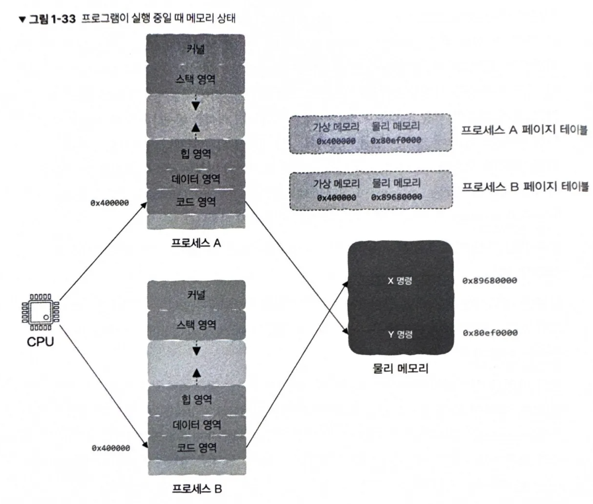

# 1. 프로그래밍 언어부터 프로그램 실행까지, 이렇게 진행된다.

프로그래머가 작성한 코드를 기반으로 컴파일러가 실행 파일을 생성하면 그 프로그램이 실행될 수 있다.  
→ 프로그래밍 언어는 어떻게 만들어지는지, 실행 파일은 어떻게 실행되는지, 실행되고 나면 어떤 형태를 갖추는지, 어떻게 더 효율적으로 실행할 수 있는지?

## 1.1 여러분이 프로그래밍 언어를 발명한다면?

CPU는 데이터를 한 곳에서 다른 곳으로 옮기고 간단히 연산한 후 다시 그 데이터를 또 다른 자리로 옮기는 작업 외에는 할 줄 모른다.  
하지만 CPU가 가진 장점이 있다면 바로 엄청나게 빠르다는 것이다.

초기 프로그래머는 CPU 관점에서 코드를 작성했다.  
CPU는 가산 명령어, 점프 명령어 등 겨우 몇 가지 명령어만 실행할 수 있다. 따라서 기계어와 해당 특정 작업을 간단하게 대응시켜 기계어를 인간이 읽고 이해할 수 있는 단어와 대응시켰다.  
이렇게 어셈블리어가 탄생했다.

어셈블리어는 기계어와 마찬가지로 여전히 저수준 언어이다.  
CPU는 데이터를 한곳에서 다른 곳으로 이동하고, 간단히 연산한 후 다른 곳으로 이동하는 것만 할 수 있다. 따라서 저수준 언어를 이용하여 프로그래밍을 하면 몇 가지 간단한 명령어를 사용하여 정렬 같은 복잡한 문제를 구현해야 한다.

인간의 추상적인 표현을 CPU가 이해할 수 있는 구체적인 구현으로 자동으로 변환할 수 있는 방법으로 **구문**을 도입했다.  
반복적으로 사용되는 명령어들의 흐름과 의미는 함수라는 단위로 묶고, 세부적인 차이는 매개변수로 분리하여 사용한다.

구문 안에는 구문이 중첩될 수 있는데, 이 경우 재귀를 사용해서 표현한다.  
컴퓨터는 프로그래밍 언어를 처리할 때 구문 정의에 따라 트리 형태로 구성해 트리의 리프 노드 표현이 매우 간단해져 기계 명령어로 번역할 수 있게 되었다.  
이 작업을 담당하는 프로그램을 **컴파일러**라고 부른다.

형식이 다른 CPU는 각각 자신만의 고유한 언어가 있다. (x86, ARM 등...) 이를 해결하기 위해 표준 명령어 집합을 정의해서 CPU의 기계 명령어 실행 과정을 모방하는 프로그램을 작성하여 사용한다. 
이 CPU 시뮬레이션 프로그램 가상 머신을 **인터프리터**라고 부른다. 

세상의 모든 프로그래밍 언어는 특정 구문에 따라 작성된다. 컴파일러는 언어 구문에 따라 코드 구문을 분석하여 구문 트리로 만들고, 이 구문 트리를 C언어처럼 기계 명령어로 번역하여 CPU로 직접 넘기거나 Java처럼 바이트 코드로 변환한 후 가상 머신으로 넘겨 실행한다. 이때 고급 언어는 추상적 표현이 뛰어나서 사용하기 쉽지만 저수준 계층에 대한 제어 능력이 떨어져 직접 저수준 계층의 세부 사항을 제어할 수 있어야 하는 운영 체제 중 일부분은 어셈블리어로 작성한다.

 

## 1.2 컴파일러는 어떻게 작동하는 것일까?

컴파일러는 고수준 언어를 저수준 언어로 번역하는 프로그램이다. 
프로그래머가 프로그래밍 언어의 구문 규칙에 따라 인간이 인식할 수 잇는 단어로 코드를 작성하면 코드는 일반적인 텍스트 파일 형태의 파일로 저장되는데, 이를 **소스 파일**이라고 한다. 
이 소스 파일을 컴파일러에게 주면 실행 파일이 생성되고, 이 파일에 저장된 것이 CPU가 실행할 수 있는 기계 명령어이다.

컴파일러는 다음의 과정을 거쳐 소스 코드를 실행 파일로 저장한다.
1. 어휘 분석: 소스 코드에서 토큰 추출
2. 구문 분석: 구문 규칙에 따라 토큰을 해석한 후 구문 트리 생성
3. 의미 분석: 구문 트리에 컴파일 오류가 없는지 확인
4. 중간 코드: 구문 트리를 탐색한 결과를 바탕으로 좀 더 다듬어진 형태
5. 어셈블리어 코드: 중간 코드를 어셈블리어 코드로 변환
6. 기계 명령어: 어셈블리어 코드를 기계 명령어로 변환

컴파일 과정을 거쳐 생성된 기계 명령어 데이터는 대상 파일(.o 파일)에 저장된다. 소스 파일이 여러 개이면 대상 파일도 여러 개이다. 
우리는 하나의 실행 파일을 원하기 때문에 이 대상 파일을 하나의 실행 파일로 합쳐야 하는데, 대상 파일을 병합하는 작업을 링크라고 하고, 링크를 담당하는 프로그램을 링커라고 한다.

 

## 1.3 링커의 말할 수 없는 비밀

링커는 컴파일러가 생성한 대상 파일 여러 개를 하나로 묶어 하나의 최종 실행 파일을 생성한다. 
특정한 소스 파일에서 다른 모듈에 정의되어 있는 함수를 참조할 때, 컴파일러가 이 소스 파일을 컴파일하는 시점에는 함수가 어느 메모리 주소에 위치할지 정확히 알 수 없다. 
따라서 컴파일러는 이 함수를 N으로 표시해 두고, 이후 링크 과정에서 링커가 실행 파일을 생성하는 과정에서 함수의 정확한 주소를 확인하고 N을 실제 메모리 주소로 대체한다.

심벌이란 전역 변수와 함수의 이름을 포함하는 모든 변수 이름을 의미한다. 지역 변수는 모듈 내에서만 사용되어 외부 모듈에서 참조할 수 없기 때문에 링커의 관심 대상이 아니다. 
이 단계에서 링커가 해야 할 일은 대상 파일에서 참조하고 있는 각각의 모든 외부 심벌마다 대상 정의가 반드시 존재하는지, 단 하나만 존재하는지 확인하는 것이다.

컴파일러가 기계 명령어를 생성할 때, 명령어를 실행시키기 위한 데이터도 생성한다. 이 데이터는 대상 파일에 반드시 포함되어야 하며 명령어 부분과 데이터 부분으로 구성된다.
- 명령어 부분: 기계 명령어가 저장되는 부분, 코드 영역
- 데이터 부분: 전역 변수가 저장되는 부분, 데이터 영역

 

컴파일러는 소스 파일마다 외부에서 참조 가능한 심벌(공급)이 어떤 것인지 정보를 기록하고, 어떤 외부 심벌을 참조하고 있는지(수요)도 기록한 **심벌 테이블**을 대상 파일에 저장한다. 
심벌 해석은 각 대상 파일에서 사용할 외부 심벌이 심벌 테이블에서 유일한 정의를 발견 가능한지 확인하는 작업이다. 
실제 코드를 작성할 때 공급이 수요를 초과해 실제로는 사용하지 않는 함수를 많이 정의할 수 있지만, 반대로 수요가 공급을 초과하는 상황이 발생하면 `undefined reference` 오류가 발생한다.

정적 라이브러리는 코드를 별도로 컴파일한 후 패키지로 묶고, 구현된 모든 함수의 선언을 포함하는 헤더 파일을 만드는 것이다. 
여기에서 중요한 점은 소스 파일마다 단독으로 컴파일을 한다. 이후 실행 파일을 생성할 때는 자신의 코드만 컴파일하며, 미리 컴파일이 완료된 정적 라이브러리는 다시 컴파일할 필요 없이 링크 과정에서 그대로 실행 파일에 복제돼 컴파일 속도가 빨라진다. 
정적 링크는 대상 파일을 한데 모아 각각의 대상 파일에서 데이터 영역과 코드 영역을 각각 결합하는 것으로 간단히 이해할 수 있다. 
실행 파일은 대상 파일과 매우 유사하나, `_start` 심벌 주소에서 프로그램을 실행하는 데 필요한 기계 명령어를 실행한 후 main 함수가 실행된다.

정적 링크는 라이브러리를 실행 파일에 직접 복사하기 때문에 많은 프로그램에 적용될수록 디스크와 메모리를 낭비하는데, 이 문제를 해결하기 위해 **동적 라이브러리**를 사용할 수 있다. 
정적 라이브러리는 코드 영역과 데이터 영역을 모두 한데 묶어 실행 파일에 복사하지만, 동적 라이브러리는 동적 라이브러리 이름, 심벌 테이블, 재배치 정보 등 필수 정보만 실행 파일에 포함시켜 파일의 크기를 줄인다. 
동적 라이브러리의 필수 정보는 실행 파일 내 저장되고, 동적 링크가 일어날 때 사용된다.

동적 링크에는 두 가지 방식이 있다.

첫 번째 방식은 **프로그램이 메모리에 적재될 때 동적 링크를 진행**하는 것이다. 
적재란 실행 파일을 실행하기 위해 디스크에서 읽어 메모리의 특정 영역으로 이동시키는 과정으로, 적재 도구(loader)라는 전용 프로세스가 실행된다.
실행 파일을 적재하고 나면 적재 도구는 실행 파일이 동적 라이브러리에 의존하는지 확인하고, 필요하다면 동적 링커를 실행해 참조하는 동적 라이브러리 존재 여부와 위치, 심벌의 메모리 위치 등을 확인하여 링크 과정을 마무리한다. 
동적 링크 과정이 정상적으로 완료되고 나면 프로그램이 시작된다. 
적재 중 동적 링크를 사용하기 위해서는 실행 파일이 어떤 동적 라이브러리를 참조하는지 컴파일러에 명시적으로 알려 줘야 한다.

두 번째 방식은 프로그램이 먼저 실행된 후, **프로그램의 실행 시간 동안 코드가 직접 동적 링크를 실행**하는 것이다. 
실행 시간이란 CPU가 프로그램을 실행하기 시작한 시점부터 실행이 완료되어 프로그램이 종료된 시점까지의 시간을 의미한다. 
런타임 동적 링크는 링크 과정을 프로그램이 실행된 이후로 미룬다. 
이 방식에서는 실행 파일을 생성하는 과정에서 실행 파일 내부에 동적 라이브러리 정보가 저장되지 않는다. 대신 프로그래머가 코드에 특정 API를 사용하여 필요할 때마다 동적 라이브러리를 직접 동적으로 적재할 수 있다.

동적 라이브러리의 장점은 다음과 같다.
- 리소스 절약: 모든 프로세스가 하나의 코드를 공유하므로 메모리 적재와 디스크 저장에 필요한 리소스 절약 가능
- 수정 간편화: 파일의 코드가 수정될 때 해당 동적 라이브러리만 컴파일하면 되므로 프로그램 업그레이드 및 버그 수정 간편화
- 플러그인: 프로그램 실행 시간에 플러그인을 적재하면 동적 라이브러리만 바꿔도 기능을 추가/변경 가능
- 언어 혼합: 높은 성능이 요구되는 부분은 C언어로, 나머지는 파이썬으로 작성하여 언어 혼합 개발 가능

 

하지만 동적 라이브러리는 다음과 같은 단점도 가진다.
- 성능 하락: 프로그램이 적재되는 시간 또는 실행 시간에 링크되기 때문에 정적 링크에 비해 성능이 약간 떨어짐
- 종속성: 종속된 동적 라이브러리를 제공하지 않거나 버전이 호환되지 않을 경우 프로그램 실행이 불가능함

여러 프로세스는 각자 독립적인 가상 주소 공간을 가지며, 동적 라이브러리는 각 프로세스의 가상 주소 공간 내에서 서로 다른 가상 주소에 매핑될 수 있다.  
이 때문에 라이브러리 코드 내부에 특정 가상 주소를 절대값으로 기록할 수 없고, 대신 라이브러리가 적재된 시작 주소를 기준으로 한 오프셋을 이용하는 위치 독립 코드(PIC)를 사용한다.  
이러한 방식이 없으면 동일한 동적 라이브러리를 여러 프로세스가 동시에 공유하는 것이 불가능해진다.

링커가 실행 파일을 생성할 때 프로그램이 실행되는 시점에 함수가 적재될 메모리 주소를 확정해야 한다. 
컴파일러는 컴파일을 통해 대상 파일을 생성할 때 메모리 주소를 알 수 없어 `0x00`로 지정해 호출한다는 사실만 기록하고, 메모리 주소를 확정할 수 없는 변수를 발견할 때마다 `relo.text`에 `foo 60`과 같이 해당 명령어와 시작 지점으로부터의 주소를 저장하고 `relo.data`에는 해당 명령어와 관련된 데이터를 저장한다. 
링커가 심벌 해석 단계에서 대상 파일의 동일한 유형의 영역끼리 병합을 완료하면 모든 기계 명령어와 전역 변수가 프로그램 실행 시간에 위치할 메모리 주소를 결정할 수 있다. 
링커는 `relo.text` 영역(segment)를 하나씩 읽어 심벌(명령어)와 위치(시작 지점 기준)을 확인하여 명령어를 찾고, 이동할 소스 주소를 수정한다. 
이와 같이 심벌의 메모리 주소를 수정하는 과정을 **재배치**라고 한다.

C언어를 공부하다 보면 다음과 같은 C언어 메모리 구조를 볼 수 있다.
 

프로그램이 실행되면 해당 프로그램의 프로세스가 메모리에 적재된다. 
메모리의 상위 주소에는 스택 영역, 비어 있는 공간(공유 라이브러리 영역), 힙 영역(malloc), 데이터 영역, 코드 영역 순으로 위치한다. 데이터 영역과 코드 영역에는 실행 파일의 내용이 메모리에 적재되는 곳이다. 
모든 프로그램은 실행된 후 코드 영역이 예외 없이 메모리 주소 `0x400000`에서 시작된다. 두 프로그램이 동시에 실행 중이어도 각 프로그램이 실행될 때 메모리 주소 `0x400000`에서 가져온 명령어는 각 프로그램에 속한다.

 

 

이런 일을 가능하게 하는 것은 운영 체제의 가상 메모리 기술이다. 가상 메모리 기술이란 말 그래도 물리적으로 존재하지 않는 가짜 메모리이다. 
가상 메모리는 각각의 프로그램이 실행 중일 때, 자기 자신이 모든 메모리를 모두 독점적으로 사용하고 있는 것처럼 착각하게 만든다. 이것이 모든 프로그램이 동일한 표준적인 메모리 구조를 가질 수 있는 이유이다. 
따라서 프로그래머는 표준 메모리 구조를 기반으로 프로그램을 작성할 수 있고, 링커도 실행 시 심벌의 메모리 주소를 결정할 수 있다.

CPU가 프로그램을 실행하면서 가상 메모리 주소 `0x400000`에 접근하면, 실제로 접근할 물리 메모리 주소는 가상 주소와 물리 주소 간의 사상(mapping) 관계를 통해 결정된다. 
운영체제는 메모리를 페이지 단위로 관리하며, 이러한 사상 관계를 페이지 테이블에 기록한다.  
각 프로세스는 자신만의 페이지 테이블을 가지며, CPU가 메모리 접근을 수행할 때 MMU(Memory Management Unit)가 해당 페이지 테이블을 참조하여 가상 주소를 물리 주소로 변환한 후 실제 메모리에 접근한다.

모든 프로세스의 가상 메모리는 표준화되어 있고 크기가 동일하다. 프로세스마다 각 영역의 크기가 다를 수는 있지만 영역이 배치되는 순서는 동일하다. 
실제 물리 메모리의 크기는 가상 메모리의 크기와는 무관하며 물리 메모리에는 힙 영역, 스택 영역 등 영역 구분이 존재하지 않는다. (운영 체제마다 다를 수 있음) 
모든 프로세스는 자신만의 페이지 테이블을 가지고 있으며, 같은 가상 메모리 주소라도 페이지 테이블을 확인하여 서로 다른 물리 메모리 주소를 획득한다. 따라서 CPU는 동일한 가상 메모리 주소에서 서로 다른 내용을 가져올 수 있다.

 

## 1.4 컴퓨터 과학에서 추상화가 중요한 이유

세부 사항을 모두 나열하지 않고도 추상화를 통해 의사소통을 할 수 있다. 추상화는 표현력을 크게 향상시키고 의사소통의 효율을 올려 줄 뿐만 아니라 세부 사항을 노출할 필요가 없으므로 보호할 수도 있다. 
프로그래머는 추상화를 통해 복잡도를 제어할 수 있다. 
모든 프로그래밍 언어는 추상화를 지원하기 위해 각자 자신만의 작동 방식을 제공한다. 예를 들어 객체 지향 언어는 다형성과 추상 클래스 등을 이용하여 추상화를 할 수 있다.

CPU의 하드웨어는 트랜지스터 여러 개로 구성되어 있지만, 명령어 집합이라는 개념으로 내부 구현 세부 사항을 보호한다. 
따라서 프로그래머는 명령어 집합에 포함된 기계 명령어를 사용하여 CPU에 작업을 지시하기만 하면 된다. 
이를 통해 프로그래밍의 질적 효율성이 크게 높아진다.

입출력 장치는 파일로 추상화되어 파일 저장 내용과 위치 등 세부 사항을 신경 쓸 필요가 없다. 
실행 중인 프로그램은 프로세스로 물리 메모리와 파일은 가상 메모리로, 네트워크 프로그래밍은 소켓으로, 프로세스는 컨테이너로 추상화된다. CPU, 운영 체제, 응용 프로그램은 가상 머신으로 묶여 추상화된다. 
추상화는 프로그래머를 저수준 계층에서 멀어지게 만들고, 저수준 계층의 세부 사항도 신경 쓸 필요가 없도록 만든다. 하지만 추상화 계층을 넘어가거나 자신만의 환경을 만들고 싶다면 필연적으로 저수준 계층에 대한 이해가 필요하다.