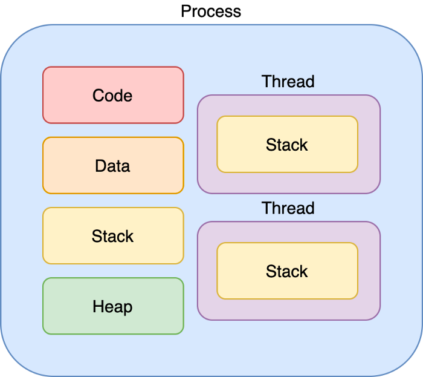
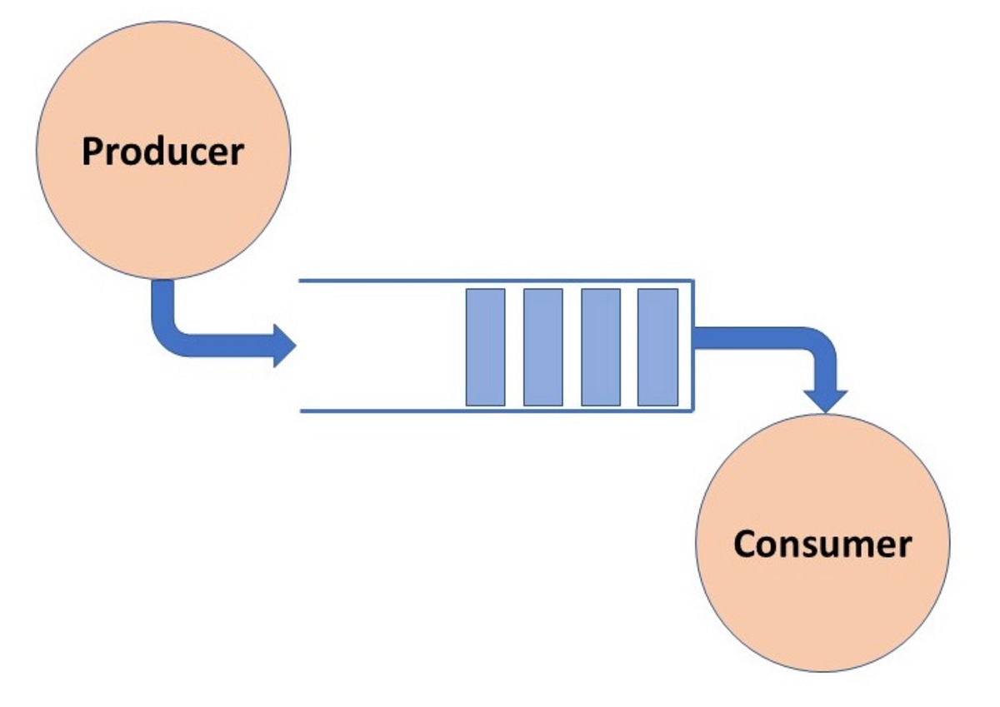
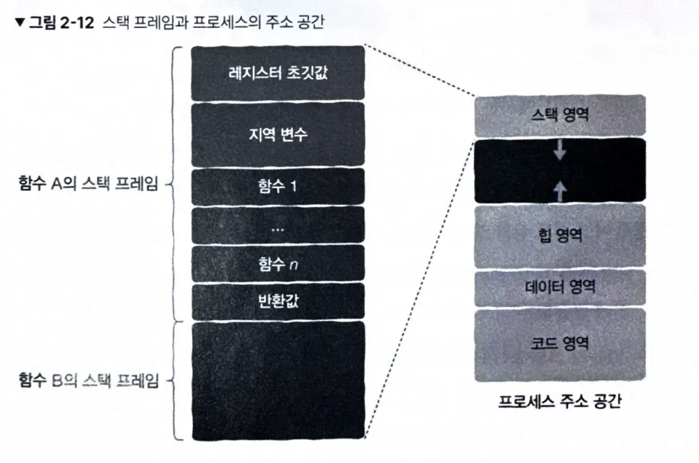
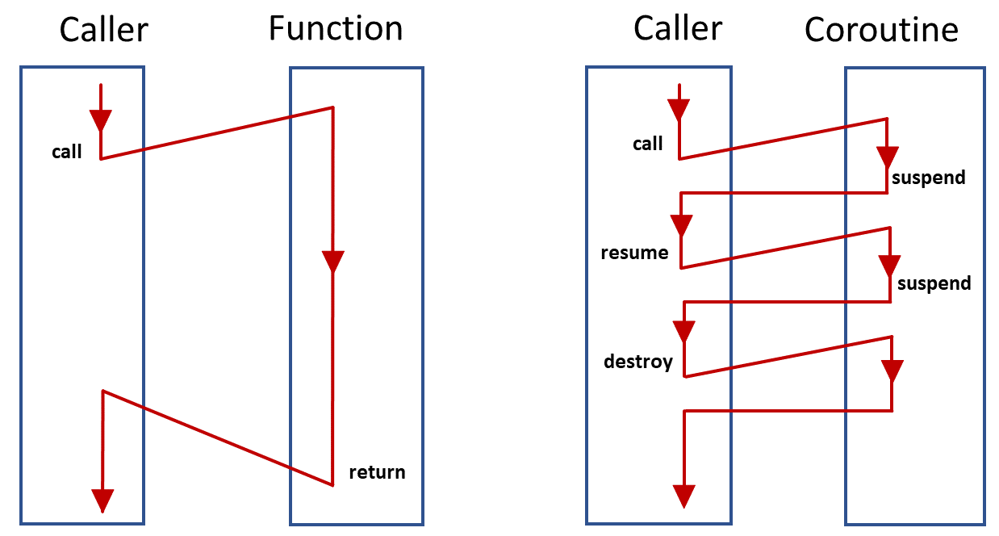

# 2. 프로그램이 실행되었지만, 뭐가 뭔지 하나도 모르겠다.

프로그램의 동적 실행으로 시선을 옮겨 보자. <br>
→ 프로그램이 실행되면 어떻게 변화하는지? 운영체제는 왜 필요한지? 프로세스, 스레드, 코루틴, 콜백 함수, 동기화, 비동기화, 블로킹, 논블로킹이 무엇인지? 왜 이런 개념들을 이해해야 하는지?

## 2.1 운영 체제, 프로세스, 스레드의 근본 이해하기

CPU는 메모리에서 명령어를 가져와서 실행하는 것만 할 수 있다.<br>
프로그램 카운터(PC)는 CPU가 다음에 실행할 명령어의 가상 주소를 저장하는 레지스터이며, 일반적으로 현재 명령어의 길이만큼 증가한다.<br>
분기나 함수 호출과 같은 명령어를 만나면 CPU는 해당 명령어가 지정한 대상 주소에 따라 PC 값을 변경한다.

CPU가 프로그램을 실행하게 하려면 실행 파일을 수동으로 메모리에 복사한 후 main 함수에 해당하는 첫 번째 기계 명령어를 메모리에서 찾아 그 주소를 PC 레지스터에 적재하면 된다.<br>
이를 위해서는 수동으로 프로그램을 적재할 수 있는 적절한 메모리 영역을 찾고, CPU 레지스터를 초기화하고 함수의 진입 포인트를 찾아 PC 레지스터를 설정하는 작업을 실행해야 한다.<br>
또한 수동으로 실행하는 프로그램은 한 번에 하나만 실행할 수 있으며, 사용할 하드웨어를 직접 특정 드라이버와 연결해야 외부 장치를 사용할 수 있다. 네트워크로 통신하려면 TCP/IP 스택 소스 코드도 연결해야 한다. 라이브러리도 직접 구현해야 하고, 상호 작용 인터페이스도 구현해야 한다.<br>
이러한 방식 대신 **적재 도구**를 실행해 프로그램을 메모리에 적재한다.

CPU는 한 시점에 하나의 실행 흐름만 처리할 수 있지만 운영체제가 **프로세스**의 레지스터 상태와 같은 실행 문맥(context)을 저장하고 복구하면서 빠르게 전환함으로써 여러 프로그램이 동시에 실행되는 것처럼 보이게 한다.<br>
이러한 기능을 포함하여 프로그램 적재, 프로세스 관리, 하드웨어 자원 관리 등의 역할을 수행하는 소프트웨어 집합을 **운영체제**라고 한다.

프로그램이 실행 중일 때 운영 체제의 가상 메모리는 각각의 프로세스가 표준적인 메모리 크기를 독점적으로 사용하는 것처럼 보이게 한다. 이를 프로세스 주소 공간이라고 부른다.
- 코드 영역: 코드를 컴파일하여 생성된 기계 명령어 저장
- 데이터 영역: 전역 변수 등 저장
- 힙 영역: malloc 함수가 요청을 반환한 메모리 할당
- 스택 영역: 함수의 실행 시간 스택

<br>

독립적인 프로세스를 각각 실행한 후 프로세스 통신을 이용해 다중 프로세스 프로그래밍을 구현하여 실행 속도를 높일 수 있다.<br>
하지만 프로세스를 생성할 때 오버헤드가 발생하고, 프로세스마다 자체 공간이 있어 프로세스 간 통신을 프로그래밍 하기에 복잡하다는 단점이 있다.

<br>

<br>

또한 프로세스는 진입 함수가 `main` 함수 하나밖에 없어 프로세스의 기계 명령어를 한 번에 하나의 CPU에셔만 실행할 수 있다.<br>
이때 CPU가 여러 개가 있다면, 각 CPU의 PC 레지스터가 `main` 함수가 아닌 다른 함수를 가리키게 하여 새로운 실행 흐름을 형성할 수 있다. <br>
중요한 점은 실행 흐름이 동일한 프로세스 주소 공간을 공유하므로 프로세스간 통신이 필요하지 않다는 것이다.<br>
그리고 공유 프로세스 주소 공간에서 동일한 프로세스에 속한 명령어를 동시에 실행할 수 있다.

이렇게 하나의 프로세스 안에 여러 실행 흐름이 존재하는 것을 **스레드**라고 부른다.<br>
스레드는 코어 개수와는 무관하기 때문에 단일 코어인 상황에서도 스레드 여러 개를 생성할 수 있다. 이 덕분에 처리 시간이 긴 이벤트를 위한 별도의 스레드를 생성하는 방식으로 프로그래밍을 할 수 있다.<br>
하지만 다중 스레드가 공유 리소스에 접근할 때 상호 배제와 동기화 문제를 해결해야 한다.

함수가 실행될 때 필요한 매개변수, 지역변수, 반환 주소 등의 정보는 스택 프레임에 저장된다.<br>
스레드를 사용하게 되면서 하나의 프로세스에 실행 진입점과 실행 흐름이 여러 개 존재할 수 있게 되었다.<br>
이에 따라 프로세스에 주소 공간에 스레드의 실행 흐름을 저장하기 위한 스택 영역이 여러 개 추가되었다.

스레드 활용은 수명 주기 관점에서 볼 때, 긴 작업과 짧은 작업 두 가지 유형이 있다.<br>
**긴 작업**을 디스크에 데이터를 작성하는 행위 등이 있으며, 이를 처리하기 위해서는 전용 스레드를 생성하는 것이 가장 적합하다.<br>
**짧은 작업**은 네트워크 요청, 데이터베이스 쿼리 등 처리 시간이 매우 짧은 작업이다.<br>
짧은 작업은 작업 처리에 필요한 시간이 짧지만, 작업 수가 매우 많기 때문에 요청이 들어올 때마다 해당 작업을 처리하는 요청당 스레드 방식을 사용하면 스레드의 생성과 종료에 시간이 소모되고, 스레드의 독립적인 스택 영역으로 인한 메모리 과다 소비가 발생하고, 스레드 간 전환에 따른 부담이 증가한다.

이를 해결하기 위해 스레드 여러 개를 미리 생성해 두고, 스레드가 처리할 작업이 생기면 해당 스레드에 처리를 요청하는 방법인 **스레드 풀**이 도입되었다.<br>
이 개념에서 중요한 점은 스레드를 **재사용**하는 것이고, 이를 위해 자료 구조 중 queue를 사용한다.

<br>

<br>
스레드 풀에 작업이 전달되는 과정은 다음과 같다.<br>
1. 스레드 풀의 스레드(처리할 데이터, 데이터 처리 함수)는 작업 대기열에서 블로킹 상태로 대기한다.
2. 생산자가 작업 대기열에 데이터를 기록한다.
3. 스레드 풀의 스레드가 깨어나 작업 대기열에서 처리할 스레드의 데이터를 가져온 후 데이터 처리 함수를 실행한다.<br>

작업 대기열은 여러 스레드 간에 공유되는 리소스이므로 동기화를 할 때 상호 배제 문제도 처리해야 한다.

스레드 풀의 스레드 수가 너무 적다면 CPU를 최대한 활용할 수 없으며, 너무 많은 스레드를 생성하면 시스템의 성능 저하, 메모리 과다 점유 등의 문제가 발생한다.<br>
스레드 수를 결정하는 절대 공식은 없으며, 이를 위해서는 구체적인 상황과 그에 대한 분석이 필요하다.<br>
작업을 처리할 때 필요한 리소스 관점에서 작업을 CPU 집약적인 작업과 입출력 집약적인 작업으로 구분할 수 있다.<br>
CPU 집약적인 작업은 외부 입출력에 의존할 필요 없이 처리할 수 있는 작업을 의미하며, 스레드 수와 CPU의 코어 수가 동일하다면 CPU의 리소스를 충분히 활용할 수 있다.<br>
입출력 집약적인 작업은 대부분의 시간을 입출력에 소비하는 작업의 의미한다. 성능 테스트 도구를 사용하여 입출력 대기 시간(WT)와 CPU 연산 시간(CT)를 계산하고, N개의 코어를 가졌다고 할 때 적절한 스레드 수는 `N * (1 + WT / CT)`로 계산할 수 있다.

<br>

## 2.2 스레드 간 공유되는 프로세스 리소스

사전적으로 정의하면 "프로세스는 운영 체제가 리소스를 할당하는 기본 단위고, 스레드는 스케줄링의 기본 단위이며, 프로세스 리소스는 스레드 간에 공유된다"고 할 수 있다.<br>
그렇다면 스레드 전용 리소스에는 무엇이 있을까?

<br>

상태 변화 관점에서 보면 스레드는 CPU가 진입 함수의 명령어를 실행해 만든 실행 흐름이다.<br>
각 스레드는 자신만 사용할 수 있는 스택 영역을 가지므로 스레드 여러 개가 있을 때는 여러 스택 영역이 존재하게 된다.<br>
함수 실행 시간 정보는 스택 영역을 구성하는 스택 프레임에 저장된다. 이때 스택 프레임에는 매개변수, 지역 변수와 레지스터 정보가 저장된다.<br>
이외에도 다음에 실행될 명령어 주소를 저장하는 PC 레지스터, 스레드 스택 영역에서 스택 상단 위치를 저장하는 스택 포인터 등 CPU가 기계 명령어를 실행할 때 내부 레지스터 값도 스레드 전용으로, 다른 스레드가 접근할 수 없다.<br>
스레드 전용 정보를 통틀어 스레드 상황 정보라고 한다. 또한 **전용 리소스(스택 영역)**를 제외한 나머지 영역은 모두 스레드 간에 공용되는 리소스에 해당한다.

**코드 영역**에는 컴파일한 후 생성된 실행 가능한 기계 명령어가 저장된다. 이런 기계 명령어는 실행 파일에 저장되어 있으며, 프로그램이 시작될 때 프로세스 주소 공간에 적재된다.<br>
코드 영역은 스레드 간에 공유되므로 모든 함수는 스레드에 적재하여 실행할 수 있고, 특정 함수를 특정 스레드에서만 실행되도록 하는 것은 불가능하다.<br>
코드 영역은 읽기 전용이기 때문에 프로그램이 실행되는 동안에는 어떤 스레드도 코드 영역의 내용을 변결할 수 없어 스레드 안전 문제가 발생하지 않는다.

**데이터 영역**은 전역 변수가 저장되는 곳이다.<br>
프로그램이 실행되는 동안 데이터 영역 내에 전역 변수의 인스턴스는 하나만 있기 때문에 모든 스레드는 이 전역 변수에 접근할 수 있다.

**힙 영역**은 malloc 함수와 new 예약어로 요청하는 메모리가 할당되는 영역이다.<br>
모든 스레드는 해당 변수 주소(= 포인터)만 알고 있다면 포인터가 가리키는 데이터에 접근할 수 있으므로 힙 영역은 스레드 간 공유 리소스이다.

스레드의 추상화 측면에서 바라보면 스택 영역은 스레드 전용 공간이지만 실제 구현 측면에서 바라보면 스택 영역은 엄밀하게 격리된 스레드 전용 공간은 아니다.<br>
서로 다른 스레드의 스택 영역 간 보호를 위한 작동 방식이 존재하지 않기 때문이다.<br>
따라서 하나의 스레드가 다른 스레드의 스택 프레임에서 포인터를 가져올 수 있다면 해당 스레드는 다른 스레드의 스택 영역을 직접 읽고 쓸 수 있다.<br>
다시 말해 스레드 여러 개가 하나의 프로세스에 속하는 경우에는 하나의 스레드가 다른 스레드의 스택 영역이라고 하더라도 모두 데이터를 읽고 쓸 수 있다.<br>
이러한 스레드 간 느슨한 격리 작동 방식은 문제가 발생했을 때 디버깅 도구로 원인을 찾기 어렵다.

링크는 컴파일 후 최종적으로 실행 파일을 생성하는 단계이다.<br>
정적 링크의 경우 종속된 모든 라이브러리가 실행 파일에 포함되기 때문에 프로그램을 시작할 때 추가적인 작업이 필요하지 않다.<br>
동적 링크는 실행 파일에 종속된 라이브러리의 코드와 데이터 포함되어 있지 않아 실행 중 혹은 시작할 때 링크 과정이 완료되어야 한다.<br>
링크를 위한 데이터와 코드를 스택 영역과 힙 영역 중간에 있는 여유 공간에 배치하면 프로세스 내의 모든 스레드가 동적 라이브러리의 코드와 데이터를 사용할 수 있다.<br>
이 부분은 모든 스레드가 공유하고 있으므로 프로세스 내 모든 스레드가 동적 라이브러리 코드의 데이터를 사용할 수 있다는 의미이다.<br>
프로그램이 동작 중에 열린 파일 정보도 프로세스 주소 공간에 저장되므로 스레드 간 공유 리소스에 속한다.

스레드 전용 저장소에 저장된 변수는 모든 스레드에서 접근할 수 있다.<br>
그렇지만 변수의 인스턴스는 각각의 스레드에 속하기 때문에 하나의 스레드에서 변수 값을 변경해도 다른 스레드에는 반영되지 않는다.<br>
즉, 이 변수들은 모든 스레드에서 접근할 수 있지만 해당 변수는 초기화한 후 각각의 스레드가 복사본을 가지게 되어 각각의 스레드에서 독점적으로 변수를 사용할 수 있다.

정리
- 공유 영역: 코드, 데이터, 힙, 동적 라이브러리, 파일
- 전용 영역: 스택, 레지스터, 스레드 전용 저장소(TLS)

<br>

## 2.3 스레드 안전 코드는 도대체 어떻게 작성해야 할까?

스레드 안전을 위한 2가지 시나리오가 있다.<br>
- 전용 리소스를 사용하는 스레드는 스레드 안전을 달성할 수 있다.
- 공유 리소스를 사용하는 스레드는 다른 스레드에 영향을 주지 않도록 하는 대기 제약 조건에 맞게 공유 리소스를 사용하면 스레드 안전을 달성할 수 있다.

<br>

어떤 코드가 주어졌을 때, 그 코드가 스레드 호출 횟수와 순서에 상관없이 올바른 결과가 나오는 것을 **스레드 안전**이라고 한다.<br>
스레드 안전 문제의 핵심은 **어떤 것이 스레드 전용 리소스이고, 어떤 것이 스레드 공유 리소스인지 구분**하는 데 있다.

- 스레드 전용 리소스: 함수의 지역 변수, 스레드의 스택 영역, 스레드 전용 저장소
- 공유 리소스
    - 힙 영역: 메모리의 동적 할당에 사용되는 영역
    - 데이터 영역: 전역 변수가 저장되는 영역
    - 코드 영역: 읽기 전용

<br>

공유 리소스를 사용하는 스레드는 반드시 순서를 따라야 하며, 핵심은 공유 리소스를 사용하는 작업이 다른 스레드를 방해할 수 없다는 것이다.<br>
이를 위해 각종 잠금이나 세마포어(semaphore)와 같은 장치를 사용할 수 있다.<br>
스레드 전용 리소스인 지역 변수만 사용하는 함수는 실행된 후 스레드의 스택 영역에서 관리한다. 이런 코드를 무상태 함수라고도 하며, 스레드 안전이다.

함수 매개변수를 값으로 전달(call by value)하는 경우라면 스레드 안전이다.<br>
값으로 전달된 매개변수도 스레드 전용 리소스이며, 이 매개변수들도 스레드의 스택 영역에 저장되기 때문이다.

함수 매개변수를 포인터로 전달하면 상황이 달라진다.<br>
전달된 매개변수가 데이터 영역에 위치한 전역 변수를 가리키고 있고, 이 전역 변수는 모든 스레드가 공유하는 리소스에 해당하기 때문에 스레드 안전이 아니다.<br>
따라서 이 경우 전역 변수와 관련된 작업에 잠금과 같은 형태의 순서가 반드시 부여되어야 한다.

포인터가 힙 영역을 가리키는 경우에도 포인터를 통해 모든 스레드가 포인터가 가리키는 데이터에 접근할 수 있기 때문에 스레드 안전이 아니다.<br>
이 경우 모든 스레드가 함수를 호출할 때 해당 스레드에 속하는 리소스 주소를 전달하는 것으로 해결할 수 있다.<br>
이처럼 스레드 안전인 코드를 작성하는 원칙 중 하나는 **스레드 간에 공유 리소스를 사용하지 않도록 가능한 한 모든 조치를 취하는 것**이다.

사용되는 전역 변수가 처음 프로그램이 실행될 때 한 번 초기화되고 나서 모든 코드가 이 변수를 읽는다면 스레드 안전 코드가 된다.<br>
전역 변수의 변경 과정은 반드시 잠금 등의 보호 또는 덧셈 작업을 원자성 작업으로 설정해서 보호해야 한다.<br>
여기서 원자성 작업이란 여러 단계로 나뉘어 보일 수 있는 작업을 CPU·메모리 관점에서 하나의 분할 불가능한 동작처럼 수행하는 것이다.<br>
전역 변수 앞에 ```__thread```를 붙이면 스레드 전용 저장소에 배치되므로 스레드 안전으로 만들 수 있다.(2.2.7 참고)

함수가 값을 반환할 때는 함수가 값을 반환하는 경우와 함수가 포인터를 반환하는 경우로 나눌 수 있다.<br>
함수가 값을 반환하는 경우에는 스레드 안전이다.<br>
하지만 변수의 주소(포인터)를 반환하면 잠재적으로 스레드 공유 리소스가 되어 해당 주소를 획득할 수 있는 모든 스레드가 해당 변수를 수정할 수 있게 되고, 스레드 안전이 아니다.<br>
클래스 내부에서만 생성자를 호출해 인스턴스를 생성한다면 생성자가 함수 안의 static 지역 변수가 되므로 스레드 안전이라고 할 수 있다.

스레드 안전이 아닌 코드는 함수를 호출하기 전에 잠금으로 보호하여 스레드 안전으로 만들 수 있다.<br>
잠금으로 전역 변수를 간접적으로 보호하기 때문이다.<br>
또한 매개변수로 전달된 포인터가 저역 변수를 가리키는지 알 수 없을 때 스레드 안전이 아니다.<br>
이때 ```int b = func(&a);```처럼 전달된 매개변수를 스레드 전용 리소스인 지역 변수로 만들면 스레드 안전으로 만들 수 있다.

공유 리소스가 어느 영역에 저장되어 있든 관계없이 다중 스레드 프로그래밍 중에는 어떤 리소스라도 최대한 공유하지 않는 것이 원칙이다.<br>
처리해야 할 작업이 스레드 사이에서 리소스를 공유해야 한다면 반드시 코드의 스레드 안전에 주의를 기울여야 한다.<br>
스레드 안전을 달성하려면 **무엇이 스레드 전용 리소스와 스레드 공유 리소스인지 분류**하는 것이 중요하다.

- 스레드 전용 저장소: 전역 리소스를 사용해야 하는 경우 스레드 전용 저장소로 선언 가능한지 확인해본다.
- 읽기 전용: 전역 리소스를 사용해야 한다면 해당 전역 리소스를 읽기 전용으로 사용 가능한지 확인해본다.
- 원자성 연산: 도중에 중단되지 않는 원자성 연산을 이용한다.
- 동기화 시 상호 배제: 한 번에 하나의 스레드만 공유 리소스에 접근할 수 있도록 뮤텍스, 스핀 잠금, 세마포어 등의 방식을 사용한다.

<br>

지금까지의 스레드는 기본적으로 커널 스레드이므로, 스레드의 관리를 운영 체제가 수행한다.<br>
운영 체제에 의존하지 않는 상황에서 직접 스레드를 구현하기 위해서 **코루틴**을 사용할 수 있다.

<br>

## 2.4 프로그래머는 코루틴을 어떻게 이해해야 할까?

일반 함수는 return 명령어를 만나거나 코드의 마지막 줄까지 실행되어야 반환이 가능하다. 또한 해당 함수가 재호출되면 다시 처음부터 시작하여 반환될 때까지 모든 줄을 하나씩 실행한다.<br>
일반 함수와 코루팀에 형식적인 차이는 없으나 코루틴에는 일시 중지와 재개 기능이 있다.<br>
코루틴은 자신의 실행 상태를 저장할 수 있기 때문에 코루틴이 반환된 후에도 계속 호출이 가능하며, 마지막으로 일시 중지된 지점에서 다시 이어서 실행된다.<br>
일반 함수가 `return` 명령어를 사용한 뒤 코드를 실행할 방법이 없는 것과 대비된다.<br>
코루틴 코드에서 코루틴 획득은 `co = func()`로, 호출은 `next(co)`로, 정지는 `yield`로 할 수 있다.

<br>

<br>

코루틴이 일반 함수와 다른 점은 **자신이 이전에 마지막으로 실행된 위치를 알 수 있다**는 것이다. 이는 운영체제가 스레드를 스케줄링 하는 것과 동일하다.<br>
유의할 점은 코루틴은 온전히 사용자 상태 내에서 구현된 것이기 때문에 운영체제는 코루틴 생성에 대한 정보를 알지 못한다는 것이다.<br>
따라서 코루틴은 하나의 스레드 위에서 여러 실행 흐름을 사용자 코드가 직접 교대 실행하는 **사용자 상태 스레드**로 해석할 수 있다.

코루틴 개념은 1958년에 등장했는데, 이 시기에는 아직 스레드가 없었기 때문에 동시성을 가지는 프로그램을 작성하려면 코루틴과 같은 기술을 사용할 수밖에 없었다.<br>
이후 스레드가 등장하고 운영체제가 기본적으로 프로그램의 동시 실행을 지원하면서 코루틴은 잊혀져갔다.<br>
인터넷이 발달하며 서버에서 처리해야 하는 사용자 요청이 기하급수적으로 늘어나며 코루틴은 높은 성능과 동시성을 요구하는 분야에서 다시 사용되게 되었다.

코루틴의 구현은 스레드의 구현과 본질적으로 차이가 없다.<br>
코루틴은 일시 중지되거나 다시 시작될 수 있으며, 일시 중지될 대의 상태 정보를 반드시 기록해야 이를 기반으로 코루틴을 다시 시작해야 한다.<br>
상태 정보에는 CPU의 레지스터 정보, 함수 실행 시 상태 정보가 포함되며 주로 함수의 스택 프레임에 저장된다.<br>
코루틴의 스택 프레임 정보는 힙 영역에 배치된다.

스레드는 운영체제가 관리하는 실행 단위로, 커널 스케줄링의 대상이다. 따라서 생성 및 관리 주체가 운영체제이며, 선점형으로 실행되고 언제든지 OS가 강제로 중단하고 인터럽트가 발생할 수 있기 때문에 락, 원자성, 메모리 모델 등으로 데이터 손상을 막아야 한다.<br>
코루틴은 사용자 공간에서 라이브러리/런타임이 관리하는 실행 단위이다. await이나 yield가 명시적으로 작성되었을 때만 중단되며, 스스로 양보하지 않으면 계속 실행된다.

프로그래머는 동기 방식으로 순차적으로 코드를 작성한다. 하지만 코루틴은 await으로 지금 실행을 잠시 중단하고 스레드 내에서 다른 코루틴을 실행할 수 있다.<br>
따라서 코루틴은 프로그래머가 동기 방식으로 비동기 프로그래밍을 가능하게 한다.

<br>

## 2.5 콜백 함수를 철저하게 이해한다

핵심 모듈 함수만을 사용하면 조건에 따라 수백 개의 ```else if``문을 작성하고, 요청 사항이 추가될 때마다 핵심 모듈 함수를 수정해야 한다.<br>
핵심 모듈 함수를 수정하는 대신, 자신이 정의한 함수를 전달하는 함수 변수로 문제를 해결할 수 있다.<br>
이 함수 변수를 **콜백 함수**라고 부른다.<br>
일반적으로 콜백 함수는 직접 구현하고, 다른 모듈이나 스레드에서 함수를 호출한다.

함수 호출 횟수가 증가할수록 핵심 모듈 함수의 실행 시간이 길어지고, 함수가 반환되는 데 시간이 오래 걸리게 된다.<br>
우선 순위가 높은 함수를 먼저 실행하기 위해 함수 내부에서 스레드를 생성하고 해당 스레드로 함수를 실행할 수 있다.<br>
각자의 스레드에서 병렬로 실행되기 때문에 이전 함수의 실행이 완료되기 전에 다음 함수의 실행이 끝날 수 있는데, 이를 **비동기**라고 한다.<br>
이와 같이 호출 스레드가 콜백 함수 실행에 의존하지 않는 것을 **비동기 콜백**이라고 한다.<br>
반대로 함수의 **동기 호출**은 이전 함수가 반환되는 것을 무조건 기다려야 한다.

함수는 호출자가 정보를 채워 넣기 전까지는 매개변수 정보가 무엇인지 알 수 없다.<br>
프로그래머가 함수를 호출할 때 데이터 형태의 일반적인 변수 외에 코드로 된 함수 형태의 변수도 전달할 수 있다.<br>
따라서 함수를 직접 호출하는 대신 `request(handle);`과 같이 해당 함수를 다른 함수의 매개변수로 전달할 수 있다.<br>
함수 호출이 비동기 콜백이라면 함수는 즉시 반환될 수 있으며, 결과를 받아 처리하는 프로세스는 다른 스레드와 프로세스, 다른 시스템에서 완료될 수 있다.

<br>
프로그래밍 관점에서 보면, 비동기 호출과 동기 호출은 매우 큰 차이가 있다.<br>
처리 흐름을 하나의 작업으로 생각할 때, 동기 호출 프로그래밍 방식에서는 함수를 호출한 스레드에서 전체 작업이 처리되는데 반해 비동기 호출 프로그래밍 방식에서는 작업 처리가 두 부분으로 나뉜다.<br>
1. 첫 번째 부분은 함수를 호출하는 스레드에서 처리된다. (request가 호출되기 전에 해당하는 부분)
2. 두 번째 부분은 함수를 호출하는 스레드에서 처리되지 않고 다른 스레드, 프로세스 혹은 다른 시스템에서 처리된다.<br>
호출자는 해당 작업이 끝난 후 무엇을 해야 하는지 알고 있으므로, 그 작업을 대신 처리해 줄 콜백 함수를 미리 전달해야 한다.

컴퓨터 과학에서 콜백 함수는 다른 코드에 매개변수로 전달되는 실행 가능한 코드이다.
콜백 함수는 사용자가 작성하지만 직접 호출하지 않고, 호출은 서드파티 라이브러리(또는 시스템)가 한다.<br>
따라서, 콜백과 주 프로그램은 같은 계층에 있지만 역할은 다르다고 할 수 있다.<br>
네트워크 응답 도착, 파일 다운로드 완료 등의 이벤트 발생에 맞춰 미리 등록한 콜백 함수가 자동으로 실행될 수 있어 콜백은 이벤트 중심(Event-driven) 프로그래밍에 매우 적합하다.

동기 콜백은 가장 익숙한 콜백 유형으로, 블로킹 콜백이라고도 한다.<br>
함수 A를 호출할 때 콜백 함수를 매개변수로 전달한다고 가정하면, 함수 A가 반환되기 전에 콜백 함수가 실행된다.

함수 A를 호출하고 콜백 함수를 매개변수 형태로 전달한다고 가정해보자. 함수 A의 호출이 즉시 완료되고 일정 시간이 지나면 콜백 함수가 실행된다.<br>
이때 주 프로그램과 콜백 함수의 실행이 동시에 진행될 수 있기에 보통 주 프로그램과 콜백 함수는 서로 다른 스레드 혹은 프로세스에서 실행되는데, 이를 **비동기 콜백**이라고 한다. 지연 콜백이라고도 부른다.<br>
비동기 콜백은 동기 콜백에 비해 다중 코어 리소스를 더 잘 활용하며, 입출력 작업이나 웹 서비스처럼 동시성이 높은 시나리오에 적합하다.<br>
하지만 비즈니스 구성이 상대적으로 복잡한 경우 이 서비스 호출을 비동기 콜백으로 처리하면 콜백 지옥에 빠질 가능성이 높다.<br>
비동기 콜백의 효율성과 동기 콜백의 코드 단순성과 가독성을 함께 누리기 위해 코루틴을 사용할 수 있다.

<br>

## 2.6 동기와 비동기를 철저하게 이해한다

작업을 주고 완료할 때까지 계속 기다리는 시나리오는 **동기 작업**에 해당한다.<br>
작업을 마칠 때까지 기다리지 않고 다른 작업을 처리하다가, 해당 작업의 처리가 완료된 후 보고하는 시나리오는 **비동기 작업**에 해당한다.<br>
두 가지 작업을 동시에 진행할 수 있기 때문에 일반적으로 비동기가 동기보다 더 효율적이다.

일반적인 함수 호출은 동기 방식이다. 동기 호출 방식은 여러 함수가 동일한 스레드에서 실행된다.<br>
입출력 작업의 경우, 최하단 계층에서 시스템 호출로 운영 체제에 요청을 보내 호출 스레드를 일시 중지시키고 커널이 디스크 내용을 읽어온 뒤 스레드를 재개한다. 이것을 블로킹 입출력이라고 부르며, 코드가 다른 스레드에서 실행되고 있는 동기 호출이다.<br>
블로킹 입출력을 통해 동기 호출은 호출자와 수신자가 같은 스레드에서 실행 중인지 여부와는 관련이 없다는 결론을 내릴 수 있다.<br>
동기 프로그래밍은 이해하기 쉬우나 호출자가 요청한 작업이 끝날 때까지 기다려야 하기 때문에 효율은 높지 않다.

일반적으로 비동기 호출은 디스크의 파일 읽고 쓰기, 네트워크 데이터 송수신, 데이터베이스 작업처럼 시간이 많이 걸리는 입출력 작업을 백그라운드 형태로 실행한다.<br>
비동기 입출력에서는 호출자가 블로킹되지 않고 함수가 즉시 반환되기 때문에 호출자는 즉시 다음 작업을 실행할 수 있어 높은 효율성이 나타난다.<br>
그러나 비동기 호출은 프로그래머가 이해하는 데 부담이 될 수 있으며, 코드를 작성하기 어렵다.

비동기 호출 방식에서 작업이 실제로 완료되는 시점은 어떻게 파악할 수 있을까? 이에 대한 처리는 두 가지 상황이 있을 수 있다.
1. 호출자가 실행 결과를 신경 쓰지 않을 때 - 콜백 함수 사용, 요청 처리 후 결과 처리까지 작업 수행 쪽에 위임
2. 호출자가 실행 결과를 반드시 알아야 할 때 - 알림 사용, 요청 처리 후 결과 처리를 호출자에게 되돌림

<br>
웹 서버에서 사용자 요청을 처리하기 위해 다음과 같은 단계를 거친다고 가정해보자.<br>
```A → B → C → DB 요청 → D → E → F```
여기에서 입출력 작업이 필요한 유일한 단계는 DB 요청 작업이다.<br>
동기 방식의 경우, DB 요청 후 주 스레드가 블로킹되어 일시 중지되며, DB 스레드에서 DB 처리가 완료된 시점에서 다음 단계가 실행된다. 이로 인해 주 스레드에서 유휴 시간이 발생한다.<br>
비동기 방식에서는 주 스레드가 DB 처리가 완료될 때까지 기다리는 대신, DB 처리 요청을 전송하자마자 바로 다음에 넘어온 새로운 사용자 요청을 직접 처리한다.

<br>
주 스레드가 DB 처리 결과를 전혀 신경 쓰지 않을 때<br>
DB 스레드에서는 자신의 주 업무인 DB를 처리하고, 콜백 함수를 호출해 자신의 임무를 완료한다. 이후 콜백 함수를 통해 함수에 작성된 D, E, F 작업을 처리한다.<br>
주 스레드의 유휴 시간이 없어지고 끊임없이 작업을 처리하기 때문에 시스템 리소스 활둉도가 높아져 효율성이 높아진다.

<br>
주 스레드가 DB 작업 결과에 관심을 가질 때<br>
DB 스레드가 알림 작동 방식을 이용하여 작업 결과를 주 스레드로 전송하고, 주 스레드는 메시지를 수신하면 이전 사용자 요청의 후반부를 이어서 처리한다.<br>
DB 스레드는 유휴 상태이지만 주 스레드에 유휴 시간이 없기 때문에 동기 호출에 비하면 효율적이다.<br>
다만 모든 비동기 호출이 반드시 동기 호출보다 더 효율적인 것은 아니기 때문에 구체적인 상황에 따라 분석해야 한다.

<br>

## 2.7 아 맞다! 블로킹과 논블로킹도 있다

동기 또는 비동기를 이야기할 때 항상 두 가지 대상을 언급한다.<br>
작업 A가 작업 B에 의존하는 관계가 존재할 때 A와 B는 동기이며, 강하게 결합된 것이다.<br>
작업 A와 B가 강한 결합과 같은 제약이 없어 각자 자신의 작업을 실행할 수 있을 때 A와 B는 비동기이다.

함수 A가 함수 B를 호출할 때, 함수 B를 호출함과 동시에 운영체제가 함수 A가 실행 중인 스레드나 프로세스를 일시 중지시킨다면 함수 B에 대한 호출 방식은 **블로킹 방식**이며, 그렇지 않다면 **논블로킹 방식**이다.<br>
블로킹 호출 핵심은 스레드 또는 프로세스가 일시 중지되는 것이다.

일반적으로 블로킹은 대부분 입출력과 관련이 있다. 입출력을 처리하는 데 시간이 오래 걸리기 때문이다.<br>
입출력 작업을 진행하는 동안 CPU 제어권을 다른 스레드에 넘겨 다른 작업을 할 수 있도록 하고, 입출력 작업이 완료되면 다시 CPU 제어권을 우리 스레드 또는 프로세스에서 넘겨받아 계속 다음 작업을 실행할 수 있도록 한다.<br>
CPU 제어권을 상실했다가 되찾는 시간 동안 스레드나 프로세스는 블로킹되어 일시 중지된다.<br>
블로킹 입출력 방식을 사용하면 운영 체제가 CPU의 리소스를 최대한 활용할 수 있다.<br>
동기 호출은 반드시 블로킹이 아닌 반면, 블로킹 호출은 모두 확실한 동기 호출이다.

호출 스레드가 일시 중지되지 않으면서 입출력 작업을 시작하는 것을 **논블로킹**이라고 하며, 이런 유형의 입출력 작업을 **비동기 입출력**이라고 한다.<br>
네트워크 데이터 수신을 예로 들어보자면, 데이터를 수신하는 함수인 `recv`가 논블로킹이면 이 함수를 호출할 때 운영체제는 스레드를 일시 중지시키는 대신 `recv` 함수를 즉시 반환한다. 이후 호출 스레드는 자신의 작업을 계속 진행하며, 데이터 수신 작업은 커널이 처리한다. 따라서 2가지 작업이 비동기적으로 처리된다.<br>
논블로킹 방식에서 데이터 수신을 확인하는 방법은 다음과 같다.
1. 요청 전달 시 결과를 확인하는 폴링 함수를 함께 제공하고, 폴링 함수를 호출해 수신된 데이터가 있는지 확인
2. 데이터가 수신되면 스레드에 메시지나 신호 등을 전송하는 알림 작동 방식
3. ```recv``` 함수를 호출할 때, 데이터 수신 처리를 담당하는 함수를 콜백 함수에 담아 매개변수를 전달

<br>

이것을 쉬운 예시로 풀어서 설명하면 다음과 같다.
- 블로킹 호출: 피자 가게에 직접 가서 피자를 주문
- 논블로킹 호출: 전화로 피자를 주문
    - 배달이 도착해 전화가 오기 전까지 할 일을 하고 있음 - 알림 작동 방식
    - 5분마다 전화를 걸어서 피자 완성 여부를 물어봄 - 폴링 함수 호출
    - 논블로깅 ≠ 비동기

<br>

네트워크 데이터 수신을 예로 들어보자.
- `recv`: 데이터 수신 함수
- `handler`: 네트워크 데이터 처리 함수
- `NON_BLOCKING_FLAG`: `recv` 함수를 논블로킹 호출로 설정하기 위한 flag<br>

이떼 `handler` 함수를 `recv` 함수에 콜백으로 전달하는 경우에는 **비동기이자 논블로킹**이다.<br>
그러나 시스템이 네트워크 데이터의 도착을 감지하는 전용 함수인 `check` 함수를 이용해 끊임없이 감지를 시도하여 데이터가 도착하기 전까지 `handler` 함수를 사용할 수 없는 경우에는 **동기이자 논블로킹**이다.<br>
논블로킹이더라도 전체적으로 반드시 비동기는 아니며, 코드 구현 방식에 따라 달라진다.

<br>

<br>

## 2.8 높은 동시성과 고성능을 갖춘 서버 구현

다중 프로세스: 가장 간단한 형태의 병행 처리 방식, 부모 프로세스가 사용자 요청을 먼저 수신하고, 자식 프로세스를 생성해서 해당 사용자 요청을 처리한다. 모든 요청에는 각각 대응하는 프로세스가 있다.

다중 프로세스의 장점은 다음과 같다.
1. 프로그래밍이 간단하다.
2. 개별 프로세스의 주소 공간이 서로 격리되어 있어 하나의 프로세스에 문제가 발생해도 다른 프로세스에 영향 X
3. 다중 코어 리소스를 최대한 활용 가능

<br>

다중 프로세스의 단점은 다음과 같다.
1. 개별 프로세스의 주소 공간이 서로 격리되어 있어 프로세스 간 통신 작동 방식이 어려움
2. 프로세스를 생성할 때 부담이 상대적으로 크고, 프로세스의 빈번한 생성과 종료로 인해 시스템 부담이 증가함

<br>

스레드는 프로세스 주소 공간을 공유하기 때문에 스레드 간 통신을 위해 별도의 통신 작동 방식을 사용할 필요가 없다.<br>
주소 공간은 프로세스가 소유하고 있기 때문에 스레드는 가볍고 생성과 종료에 드는 부담이 적다.<br>
각 요청에 대응하는 스레드를 생성하여 사용자 요청을 처리한다.

하지만 스레드는 서로 같은 주소 공간을 공유하기때문에 하나의 스레드에 문제가 발생하면 같은 프로세스를 공유하는 모든 스레드와 프로세스에 문제가 발생한다.<br>
또한 여러 스레드가 동시에 공유 리소스의 데이터를 읽고 쓸 수 없기 때문에 공유 데이터의 스레드 안전 문제를 방지하기 위해 동기화 시 상호 배제와 같은 작동 방식을 사용해야 하고, 교착 상태와 같은 문제를 일으킬 수 있다.<br>
스레드를 생성할 때 발생하는 부담이 프로세스에 비해서는 덜하지만, 부담 자체가 없는 것은 아니므로 높은 동시성을 가지는 경우 과도한 메모리 소비나 성능 문제가 발생할 수 있다.

병행 프로그래밍을 위해 이벤트 기반의 동시성을 이용한 이벤트 기반 프로그래밍 기술을 사용할 수 있다.<br>
이벤트 기반 프로그래밍 기술에는 두 가지 요소가 필요하다.
1. 이벤트: 네트워크 데이터의 수신 여부, 파일의 읽기 및 쓰기 가능 여부 등이 관심 대상인 이벤트
2. 이벤트 처리 함수 = 이벤트 핸들러<br>
이벤트 도착 → 이벤트 유형 확인 → 대응하는 이벤트 핸들러 호출<br>
이벤트가 계속해서 발생하므로 `while` 또는 `for` 반복문을 사용해 반복적으로 처리하고, 이 반복을 **이벤트 순환**이라고 한다.<br>

가장 단순한 방법으로, 사용자 연결에 대응하는 소켓 서술자를 사용자 연결만큼 만들어 데이터를 수신할 수 있다.<br>
```
recv(fd1, buf1);
recv(fd2, buf2);
...
```
이 경우 첫 번째 사용자가 데이터를 보내지 않으면 `recv(fd1, buf1);`가 반환되지 않아 서버가 두 번째 사용자의 데이터를 수신할 수 없다.

따라서 입출력 다중화 방식으로, 운영 체제에 다음 내용을 전달하는 작동 방식을 사용하는 것이 더 낫다.<br>
리눅스에서는 입출력 다중화 방식을 위해 `epoll`을 사용한다.<br>
```
epoll_fd = epoll_create(); // epoll 생성

Epoll_ctl(epoll_fd, fd1, fd2, fd3, fd4...); // 서술자를 epoll이 처리하도록 지정

while (1) {
    int n = epoll_wait(epoll_fd);
    for (i = 0; i < n; i++) {
        // 특정 이벤트 처리
    }
}
```
`epoll_wait()`은 지금 당장 처리 가능한 이벤트가 발생한 fd만 골라서 알려 달라고 커널에게 요청하는 함수이다.<br>
여기서 file descriptor란 운영체제가 입출력 대상을 가리키기 위해 부여한 정수 핸들로 파일, 소켓, 파이프 등의 요소에 전부 fd를 부여한다.<br>
`epoll_wait()`을 이용해 이벤트(=지금 수행 가능한 I/O 상태 변화)가 발생한 fd 리스트를 반환하여 이벤트 순환의 엔진이 되고, 지속적으로 다양한 이벤트를 제공한다.

이벤트 핸들러에 다음과 같은 두 가지 특징이 있다고 가정해보자.<br>
1. 입출력 작업 X
2. 처리 함수가 간단해 소유 시간이 매우 짧음<br>
이 경우 이벤트 핸들러와 이벤트 순환을 동일한 스레드에서 실행할 수 있다.<br>
하지만 사용자 요청을 처리하는 데 CPU 시간을 많이 소모한다면 단일 스레드는 처리가 느리다. 요청의 처리 속도를 높이고 다중 코어를 최대한 활용하기 위해서는 다중 스레드를 사용해야 한다.<br>
이벤트 핸들러를 독립적인 스레드에 배치해 작업자 스레드를 만들고, 작업자 스레드에 이벤트를 분배할 이벤트 순환 스레드를 생성해 다중 스레드를 이용한 병행 실행을 할 수 있다.<br>
해당 구조는 시스템의 다중 코어를 최대한 활용해 요청 처리를 가속화하며, 스레드 풀로 구현할 수도 있다.<br>
이러한 설계 방법을 **반응자 패턴**이라고 부른다.

이제 요청 처리 과정에 입출력 작업도 포함된다고 가정해보자.<br>
이때 입출력 작업을 두 가지 상황으로 나눌 수 있다.
1. 입출력 작업에 대응하는 논블로킹 인터페이스가 있는 경우 - 직접 논블로킹 인터페이스를 호출해도 스레드가 일시 중지 X, 인터페이스 즉시 반환 → 이벤트 순환에서 직접 호출 OK
2. 입출력 작업에 블로킹 인터페이스만 있는 경우 - 이벤트 순환 내에서 블로킹 인터페이스를 호출하면 이벤트 순환 스레드가 중지되어 시스템이 멈춤 → 블로킹 입출력 호출이 포함된 작업은 작업자 스레드에 전달

<br>

시스템의 전체적인 형태는 아래 그림과 같이 구성된다.<br>
<br>
이벤트 순환 스레드에서는 논블로킹 작업만 진행하고, 블로킹 작업은 작업자 스레드에서 실행해 이벤트 순환에 문제가 없도록 한다.

서버 기능이 복잡해지며 서버 기능을 용도에 따라 여러 부분으로 나뉘어 각 부분을 별도의 서버에 배치하게 되었다.<br>
서버는 일반적으로 __RPC(원격 프로시저 호출)__ 를 통해 네트워크 설정, 데이터 전송, 데이터 분석 등의 작업을 담아 일반 함수를 호출하는 것처럼 네트워크로 통신할 수 있도록 한다.

RPC 호출은 모두 블로킹 호출이기 때문에 사용자가 응답하기 전에는 함수가 반환되지 않는다. 이로 인해 스레드가 빈번하게 중단되면 작업자 스레드가 많은 시간을 사용자 응답을 기다리는 데 소모돼 CPU의 리소스를 최대한 활용하지 못한다.<br>
이를 보완하기 위해 동기 방식의 RPC 호출을 비동기 호출로 수정해야 한다.<br>
비동기 호출은 호출 스레드를 블로킹하지 않기 때문에 함수가 즉시 반환되지만, 함수 반환 시 사용자 응답에 대한 결과가 없을 수도 있다.<br>
따라서 함수를 호출한 후 처리할 내용을 콜백 함수에 담아 RPC 호출에 포함시켜야 한다.<br>
하지만 사용자 서비스가 더 많아지면 이런 형태의 코드는 거의 관리가 불가능하므로, 코루틴이 필요하다.

코루틴은 **일시 중지(`yield`)와 재개가 가능**한 함수이다.
프로그래밍 언어나 프레임워크가 코루틴을 지원하는 경우 `handler` 함수를 코루틴에서 실행되게 할 수 있다.<br>
`handler` 함수는 동기적으로 작성되지만, RPC 통신과 같이 같이 오래 걸리는 작업을 만나면 yield로 제어권을 반환해 코루틴은 멈추고, 작업자 스레드는 다른 코루틴을 즉시 실행할 수 있다. 이처럼 동기 코드처럼 보이지만 비동기로 동작한다.<br>
여기서 가장 중요한 점은 **코루틴이 일시 중지되더라도 작업자 스레드가 블로킹되지 않는다**. 이것이 코루틴과 스레드를 사용하는 블로킹 호출의 가장 큰 차이점이다.

<br>
코루틴이 일시 중지되면 작업자 스레드는 준비 완료된 다른 코루틴을 실행하기 위해 전환되며, 일시 중지된 코루틴에 할당된 사용자 서비스가 응답한 후 그 처리 결과를 반환하면 다시 준비 상태가 되어 스케줄링 차례가 돌아오길 기다린다. 이후 코루틴은 마지막으로 중지되었던 곳에서 이어서 계속 실행된다.<br>
코루틴의 도움으로 동기 방식으로 프로그래밍하더라도 비동기 실행과 같은 효과를 얻는다는 목표를 달성할 수 있다.<br>
이와 같이 코루틴이 블로킹 방식으로 RPC 호출을 하더라도 작업자 스레드는 블로킹되지 않기 때문에 시스템 리소스를 효율적으로 사용하겠다는 목적을 달성할 수 있다.

- CPU: 기계 명령어를 실행하여 컴퓨터를 움직임, 하드웨어
- 스레드: 커널 상태 스레드, 커널로 생성되고 스케줄링. 스레드 우선순위에 따라 CPU 연산 리소스 할당
- 코루틴: 사용자 상태 스레드, 커널 입장에서는 알 수 없음. 프로그래머가 스레드에 할당된 시간 내 실행할 코루틴을 결정할 수 있음.

<br>
<br>

## 2.9 컴퓨터 시스템 여행: 데이터, 코드, 콜백, 클로저에서 컨테이너, 가상 머신까지

- 함수: 별칭으로 명령어 여러 개를 지칭하는 것
- 변수: 별칭으로 데이터를 지칭하는 것
- 참조: 변수를 사용하여 데이터를 가리키는 것, C언어에서는 포인터라고 함

<br>

first-class function: 특정 언어에서 코드를 할당, 사용, 매개변수로 전달, 반환값으로 사용 등 일반 변수를 다루듯이 처리할 수 있는 언어 함수<br>
콜백 함수: 다른 함수에 매개변수로 전달되는 함수<br>
콜백 함수는 정의와 호출을 서로 다른 곳에서 하는데, 콜백 함수가 정의된 곳에서만 얻을 수 있는 실행 시간 환경이나 데이터를 콜백 함수가 사용할 수 있어야 하는 상황이 있을 수 있다.<br>
이때 콜백 함수를 일부 데이터와 한데 묶어 변수로 취급하는 것을 **클로저**라고 부른다.

- 코루틴: CPU를 능동적으로 일시 중지하고, 다시 호출할 때 중단된 지점부터 실행 가능한 함수
- 스레드: 함수의 일시 중지와 재개가 커널 상태에서 구현되는 경우
- 프로세스: 스레드에 주소 공간처럼 종속된 실행 시 리소스를 결합한 것
- 컨테이너: 프로그램이 구성, 라이브러리처럼 의존하는 실행 환경과 함께 묶인 것

<br>

컨테이너: 프로세스를 격리하고 CPU, 메모리, 디스크에 대한 접근을 제어하는 방식<br>
컨테이너에 포함된 프로세스가 전체 운영 체제 안에서 자기 자신의 프로세스만 존재하고 있다고 간주하게 한다. 운영 체제 계층 수준에서 소프트웨어 리소스를 가상화하는 방식이다.

하이퍼바이저: 서프트웨어를 이용해 컴퓨터의 하드웨어를 추상화하고, 하드웨어 리소스를 가상 컴퓨터 여러 개로 나눈 뒤 그 위에서 운영 체제를 실행한 것<br>
가상 머신 감시자: 가상화 소프트웨어<br>
가상 머신: 가상 머신 감시자에서 실행되는 운영 체제, 가상 머신 감시자에서 실행되는 운영 체제는 하드웨어 리소스를 독점한다고 생각한다.