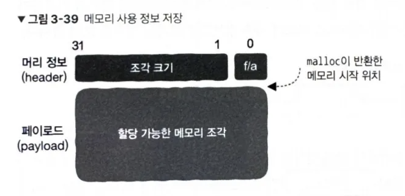
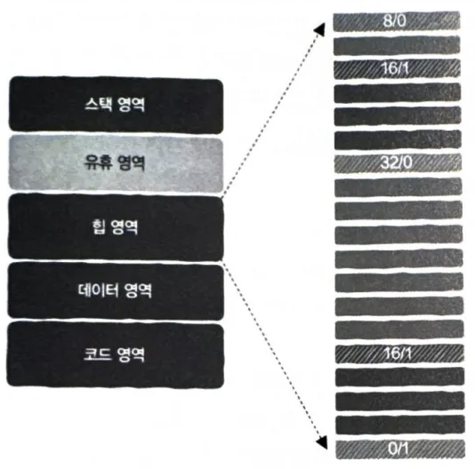
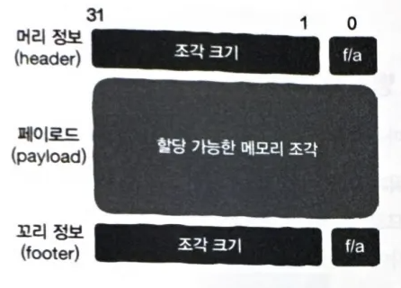

# 3.4 힙 영역: 메모리의 동적 할당은 어떻게 구현될까?

모든 함수에는 각각의 스택 프레임이 있으며 이 안에는 반환 주소, 함수의 지역 변수, 매개변수, 사용되는 레지스터를 비롯한 정보가 저장된다. 
여기서 두 가지 내용에 주의해야 한다.
1. 호출한 함수의 호출 과정이 완료되면 스택 프레임에 저장되어 있던 내용은 더 이상 사용되지 않고 무효화된다. 따라서 사용이 끝난 스택 프레임 정보를 사용해서는 안 된다.
2. 지역 변수의 수명 주기는 함수 호출과 동일하다. 이것의 장점은 지역 변수 메모리의 할당과 반환에 신경 쓸 필요가 없다는 것이고, 단점은 함수를 뛰어넘어 사용하는 것이 불가능하다는 것이다. 

## 3.4.1 힙 영역이 필요한 이유

특정 데이터를 여러 함수에 걸쳐 사용하는 방법으로 전역 변수가 있지만, 전역 변수는 모든 묘듈에 노출되어 있다. 
하지만 모든 모듈에 노출하고 싶지 않은 데이터는 프로그래머가 직접 관리하는 메모리 영역에 저장하고 이런 메모리 영역을 언제 요청할지, 데이터를 저장하는 데 얼마나 많은 메모리 영역을 요청할지 직접 결정해야 한다. 
이 메모리는 함수의 호출 횟수와 관계없이 프로그래머가 해당 메모리 영역의 사용이 완료되었다고 확신할 때까지 유효하게 유지된다. 
이렇게 프로그래머가 완전히 직접 제어할 수 있는 매우 큰 메모리 영역을 **힙 영역**이라고 한다. 
C/C++ 언어에서는 `malloc` 함수 또는 `new` 예약어를 사용하여 힙 영역에 메모리를 요청하며, `free` 함수나 `delete` 예약어를 이용하여 해당 메모리를 반환한다. 

## 3.4.2 malloc 메모리 할당자 직접 구현하기

C/C++ 언어에서 메모리의 동적 할당과 해제 요청은 모두 `malloc` 메모리 할당자에서 이루어진다. 
실행 파일을 생성할 때 링커는 `malloc` 메모리 할당자가 포함되어 있는 C 표준 라이브러리를 자동으로 링크한다.  

힙 영역의 메모리 관리 작업을 하는 자신만의 malloc 메모리 할당자를 구현하려면 어떻게 해야 할까? 
메모리 할당자의 입장에서는 적절한 크기의 메모리 영역을 제공하기만 하면 되고, 할당자는 메모리 영역에 무엇을 저장할지는 신경 쓰지 않는다. 
따라서 힙 영역은 커다란 배열 형태로 이루어져 있다. 
이제 힙 영역 위에서 두 가지 문제를 해결해야 한다. 
- `malloc` : 메모리 영역을 요청하면 힙 영역에서 가능한 메모리 영역을 찾아 요청자에게 반환
- `free` : 메모리 영역의 사용이 완료되었을 때 힙 영역에 메모리 영역을 반환 

## 3.4.3 주차장에서 메모리 관리까지

요청하는 메모리 크기가 일정하지 않을 때 요청된 크기를 만족하는 여유 메모리를 최대한 빨리, 가능한 한 많은 메모리 할당 요청을 만족시켜야 한다.  

여기 네 가지 문제가 있다. 
1. 메모리를 요청할 때, 어떤 메모리가 여유 메모리고 어떤 메모리가 이미 할당되어 있는지 어떻게 알 수 있을까?
2. 메모리 조각을 조직화 모든 메모리 조각의 할당 상태를 추적할 수 있다. 여러 여유 메모리 조각이 있을 때 어떤 메모리 조각을 사용자에게 반환해야 할까?
3. 여유 메모리 조각을 할당한 뒤 남은 메모리는 어떻게 처리해야 할까?
4. 사용자가 반환한 메모리를 어떻게 처리해야 할까? 

## 3.4.4 여유 메모리 조각 관리하기

모든 메모리 조각은 연결 리스트로 관리하면 어떤 것이 사용 가능하고 어떤 것이 이미 할당된 것인기 기록하기 편리하다. 
하지만 연결 리스트를 생성하려면 메모리 할당을 해야 하고, 메모리 할당자를 사용해야 하는데 우리는 지금 메모리 할당자를 구현하는 단계이다. 
따라서 연결 리스트와 메모리 사용 정보를 메모리 조각 그 자체에 함께 저장해야 한다. 
해당 메모리 조각이 비어 있는지를 알려주는 **flag**와 해당 메모리 조각의 크기를 기록한 숫자를 포함해 구현하면 된다.  

 
메모리 조각의 최대 크기가 2GB로 제한되어 있기 때문에 31비트를 사용하여 조각 크기를 기록하고, 나머지 1비트는 조각이 비어 있는지 또는 할당되어 있는지 인식하는 데 사용한다. 
이 32비트는 **header**라고 하며, 메모리 조각의 사용 정보를 저장하는 데 사용된다. 
할당 가능한 메모리 조각을 **payload**라고 하며, `malloc` 호출 시 반환되는 메모리 주소이다. 
해당 구성에서는 header의 주소만 알고 있다면 다음 노드의 시작 주소를 알 수 있다. 
힙 영역의 모든 메모리를 남김없이 할당하는 것은 불가능하다. 

## 3.4.5 메모리 할당 상태 추적하기

 
힙 영역은 한 조각에 4바이트인 매우 작은 영역으로, 할당된 메모리 조각과 여유 메모리 조각을 나타낸다. 
header에는 a/b 형식으로 a에는 메모리 조각 크기가, b에는 할당 여부가 0과 1로 나타난다. 
마지막 조각의 0/1로 메모리 할당자의 끝을 나타낸다. 
header 정보를 통해 전체 힙 영역을 쉽게 추적할 수 있고, 마지막 비트를 확인하여 메모리 조각이 여유 상태인지 할당되었는지 알 수 있다. 

## 3.4.6 어떻게 여유 메모리 조각을 선택할 것인가: 할당 전략

### 1. 최초 적합 방식

매번 처음부터 탐색하다가 가장 먼저 발견된 요구 사항을 만족하는 항목을 반환하는 것을 **최초 적합 방식(first-fit)**라고 한다. 
- 장점: 단순하다.
- 단점: 제일 처음부터 사용 가능한 메모리 조각을 찾으므로 메모리 할당 과정에서 앞부분에 작은 메모리 조각이 많이 남을 수 있다. 

### 2. 다음 적합 방식

메모리를 요청할 때 처음부터 검색하는 대신 적합한 여유 메모리 조각이 마지막으로 발견된 위치에서 시작하는 것을 **다음 적합 방식(next fit)**라고 한다. 
- 장점: 이론적으로 최초 적합 방식보다 더 빠르게 여유 메모리 조각을 탐색할 수 있다.
- 단점: 다음 적합 방식의 메모리 사용률이 최초 적합 방식에 미치지 못한다. 

### 3. 최적 적합 방식

사용 가능한 메모리 조각을 모두 찾은 후 그 중 요구 사항을 만족하면서 크기가 가장 작은 조각을 반환하는 것을 **최적 적합 방식(best fit)**라고 한다. 
- 장점: 다른 방식보다 메모리를 더 잘 활용한다.
- 단점: 메모리를 할당할 때 사용 가능한 모든 메모리 조각을 탐색해야 하므로 느리다. 

## 3.4.7 메모리 할당하기

메모리 요청 시 할당을 위해 발견된 여유 메모리 조각을 할당한 것으로 표시하고, header 뒤에 따라오는 메모리 조각의 주소를 요청자에게 반환하여 메모리를 할당할 수 있다. 
이때 header 정보를 담고 있는 메모리는 손상되면 메모리 할당자가 정상적으로 작동할 수 없기 때문에 요청자에게 반환되면 안된다. 
여유 메모리 조각이 요청한 메모리보다 크다면 메모리가 낭비되는 **내부 단편화**가 발생하여 해당 메모리 조각의 남은 부분은 사용할 수 없다. 
여유 메모리 조각을 두 개로 분할하여 앞부분은 할당한 후 반환하고, 뒷부분은 새로운 여유 메모리 조각으로 만들어 이를 해결할 수 있다. 
이때 4바이트는 header로 설정하고 여유 메모리 조각으로 표시해야 한다. 

## 3.4.8 메모리 해제하기

사용자가 요청할 때 얻은 주소를 해제 함수에 전달하여 메모리를 해제할 수 있다. 
`free(ADDR)`처럼 호출하여 header 정보에서 할당 설정값을 여유 메모리로 바꾸면 해제가 완료된다. 
해제되는 메모리 조각과 인접한 메모리 조각이 여유 메모리 조각일 때, 더 큰 메모리 조각으로 서로 병합해야 한다. 
메모리가 해제될 때 즉시 병합하는 것은 비교적 간단하지만 메모리 조각 병합으로 인한 부담이 발생한다. 
따라서 실제 메몸리 할당자는 거의 대부분 여유 메모리 조각 병합을 연기하는 전략을 사용한다. 

## 3.4.9 여유 메모리 조각을 효율적으로 병합하기

 
현재 위치에서 뒤에 위치한 메모리 조각은 header를 확인해 비어 있는지를 확인할 수 있다. 
이전 메모리 조각에 대한 정보를 갖기 위해서 footer 정보를 추가했다. 
header와 footer를 통해 메모리 조각을 일종의 암시적 양방향 연결 리스트로 만든다. 