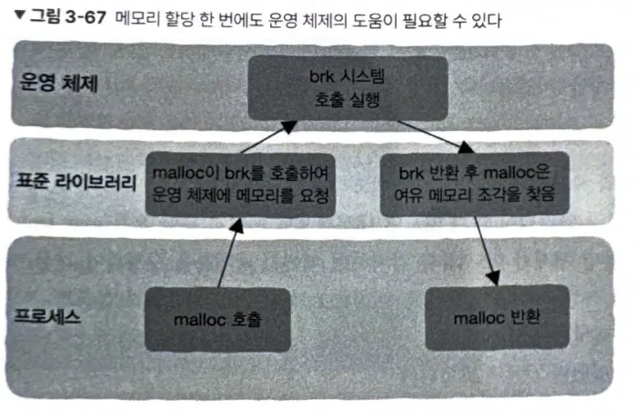

# 3.5 메모리를 할당할 때 저수준 계층에서 일어나는 일

## 3.5.1 천지인과 CPU 실행 상태

 
코드는 여러 가지 등급으로 나뉜다. 
x86 CPU는 **네 가지 특권 단계**를 제공한다. 숫자가 작을수록 CPU의 특권은 커진다. 
여기서 특권은 일 부 명령어를 실행할 수 있는지를 나타낸다. 
일반적으로 시스템은 CPU의 특권 단계 중 0과 3 두 단계만 사용한다. 
특권 3단계는 **사용자 상태(user mode)**라고 하며, 특권 0단계는 **커널 상태(kernel mode)**라고 한다.  

## 3.5.2 커널 상태와 사용자 상태

CPU가 운영 체제의 코드를 실행할 때 커널 상태에 해당한다. 
커널 상태에서는 CPU가 모든 기계 명령어를 시랳ㅇ할 수 있고, 모든 주소 공간에 접근할 수 있으며, 제한 없이 하드웨어에 접근할 수 있다.  

프로그래머가 작성한 '일반적인' 코드를 CPU가 실행할 때 사용자 상태에 해당한다. 
사용자 상태 코드는 특정 주소 공간에 접근할 수 없으며 특권 명령어를 실행할 수 없다.  

## 3.5.3 포털: 시스템 호출

 
CPU는 커널 상태에서는 응용 프로그램을 실행할 수 없는 반면, 사용자 상태에서는 운영 체제의 코드를 실행할 수 없다. 
프로그래머는 시스템 호출을 이용하여 운영 체제가 파일의 읽기와 쓰기, 네트워크 데이터 통신 같은 작업을 응용 프로그램 대신 처리하도록 한다. 
시스템 호출은 x86의 INT 명령어처럼 특정한 기계 명령어로 구현되며, 이 명령어를 실행할 때 CPU는 사용자 상태에서 커널 상태로 전환되어 운영 체제의 코드를 실행하는 방법으로 사용자 요청을 수행한다.  

## 3.5.4 표준 라이브러리: 시스템의 차이를 감춘다

시스템 호출을 직접 사용하면 리눅스의 프로그램은 윈도에서 직접 실행할 수 없게 된다. 
따라서 저수준 계층 간 차이를 감추는 일종의 표준이 필요한데, C언어에서는 **표준 라이브러리**를 사용한다. 
일반적으로 프로그래머는 표준 라이브러리를 호출하여 파일의 읽고 쓰기 작업과 네트워크 통신을 수행하며, 표준 라이브러리는 실행 중인 운영 체제에 따라 대응되는 시스템 호출을 선택한다.  

고수준 계층에서는 응용 프로그램이 위치하며, 일반적으로 표준 라이브러리만 의사소통 대상으로 간주한다. 
표준 라이브러리는 시스템 호출로 운영 체제와 소통하며, 운영 체제는 저수준 하드웨어를 관리한다. 
`malloc`, `tcmalloc`, `jemalloc` 등 다양한 메모리 할당자는 표준 라이브러리의 일부이다. 

## 3.5.5 힙 영역의 메모리가 부족할 때

메모리 할당자 안의 여유 메모리 조각이 부족해지면 어떻게 해야 할까? 
스택 영역의 함수 호출 단계까 깊어질수록 아래쪽으로 메모리 점유 공간이 늘어나는 것처럼, 힙 영역의 메모리가 부족하면 위쪽으로 더 많은 메모리를 점유하게 된다. 
malloc은 메모리가 부족해지면 운영 체제에 메모리를 요청하고, 힙 영역의 최상단을 가리키는 brk 변수를 위로 이동시켜 힙 영역을 확장한다. 이때 시스템 호출이 필요하다. 

## 3.5.6 운영 체제에 메모리 요청하기: brk

brk나 mmap 등의 시스템 호출을 통해 힙 영역이 부족하면 즉시 운영 체제에 힙 영역을 늘릴 것ㅇ르 요청할 수 있고, 이것으로 더 많은 여유 메모리를 확보할 수 있다.  

이제 메모리 할당이 더 이상 사용자 상태의 힙 영역에만 국한되지 않으므로 메모리 할당 단계가 다음과 같이 달라진다. 
  
1. 프로그램은 표준 라이브러리에 구현되어 있는 `malloc`을 호출하여 메모리 할당을 요청한다.
2. `malloc`은 여유 메모리 조각을 검색하고, 적절한 크기의 조각을 찾으면 이를 할당한다. 해당 단계는 사용자 상태에서 처리된다.
3. `malloc`이 여유 메모리 조각을 찾지 못하면 brk 시스템 호출 등을 통해 운영 체제에 힙 영역을 늘려 주라고 요청한다. brk는 운영 체제의 일부분이므로 커널 상태에서 처리된다.
4. 힙 영역이 늘어나면 `malloc`이 적절한 여유 메모리 조각을 찾아서 할당한다.

## 3.5.7 빙산의 아래: 가상 메모리가 최종 보스다

malloc을 이용하여 힙 영역에서 메모리를 요청하고, malloc 역시 운영 체제의 도움을 받아 힙 영역을 확장하지만, 이 힙 영역을 포함한 전체 프로세스 주소 공간은 모두 실제 물리 메모리가 아니다. 
프로세스 입장에서 사용하는 메모리는 모두 가상이며 운영 체제가 프로세스에 보여 주는 환상이다.  

실제 물리 메모리는 실제로 할당된 메모리가 사용되는 순간에 할당된다. 
이때 가상 메모리가 실제 물리 메모리와 연결되어 있지 않으면 내부적으로 페이지 누락 오류(page fault)가 발생할 수 있다. 
운영 체제가 이 오류를 감지하면 페이지 테이블을 수정하여 가상 메모리와 실제 물리 메모리의 사상 관계를 설정하며, 이것으로 실제 물리 메모리가 할당된다. 
이 과정이 완료되면 프로그램에서 할당받은 메모리를 사용할 수 있다.  

## 3.5.8 메모리 할당의 전체 이야기

`malloc`을 호출하여 메모리를 요청하면 다음 일이 일어난다.  

1. `malloc`이 여유 메모리 조각을 검색하기 시작하고 적절한 크기의 조각을 찾으면 이를 할당한다.
2. `malloc`이 적절한 여유 메모리를 찾지 못하면 `brk` 같은 시스템 호출을 통해 힙 영역을 확장하여 더 많은 여유 메모리를 얻는다.
3. `malloc`이 `brk`를 호출하면 커널 상태로 전환되는데, 이때 운영 체제의 가상 메모리 시스템이 힙 영역을 확장하는 작업을 시작한다. 이때 메모리 영역은 가상 메모리이므로 운영 체제는 아직 실제 물리 메모리를 할당하지 않았을 수 있다.
4. `brk` 실행이 종료되면 `malloc`으로 제어권이 돌아가며 CPU도 커널 상태에서 사용자 상태로 전환된다. `malloc`은 적절한 여유 메모리 조각을 찾아 반환한다.
5. 프로그램은 메모리를 성공적으로 요청했기 때문에 계속 다음 단계를 실행한다.
6. 코드가 새로 요청된 메모리를 읽거나 쓰면 시스템 내에서 페이지 누락 인터럽트(page fault interrupt)가 발생한다. CPU가 사용자 상태에서 커널 상태로 전환되어 운영 체제가 실제 물리 메모리를 할당한다. 페이지 테이블 내 가상 메모리와 실제 물리 메모리의 사상 관계가 설정된 후 CPU는 다시 커널 상태에서 사용자 상태로 돌아가고 다음 처리로 넘어간다.  

`malloc`을 사용하지 않고 싶다면 메모리 풀 기술을 사용할 수 있다.