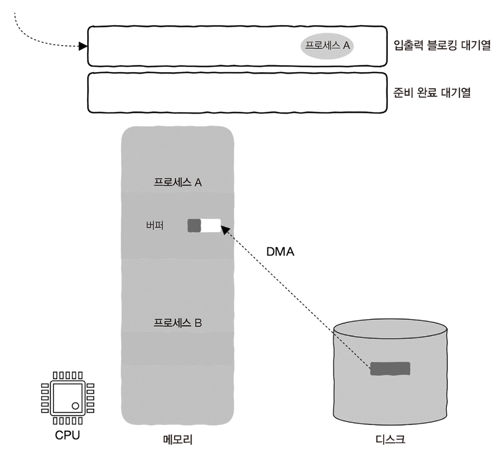
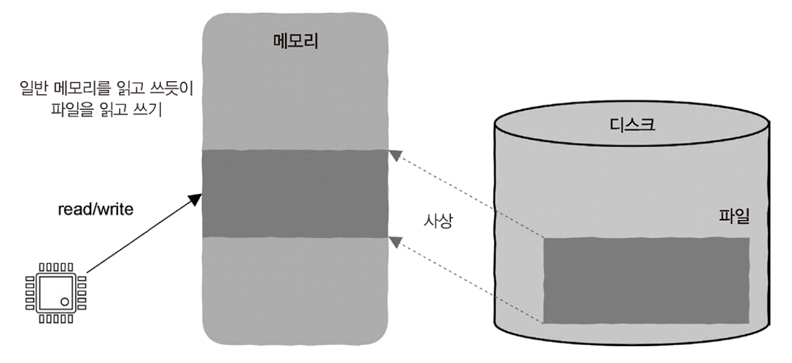
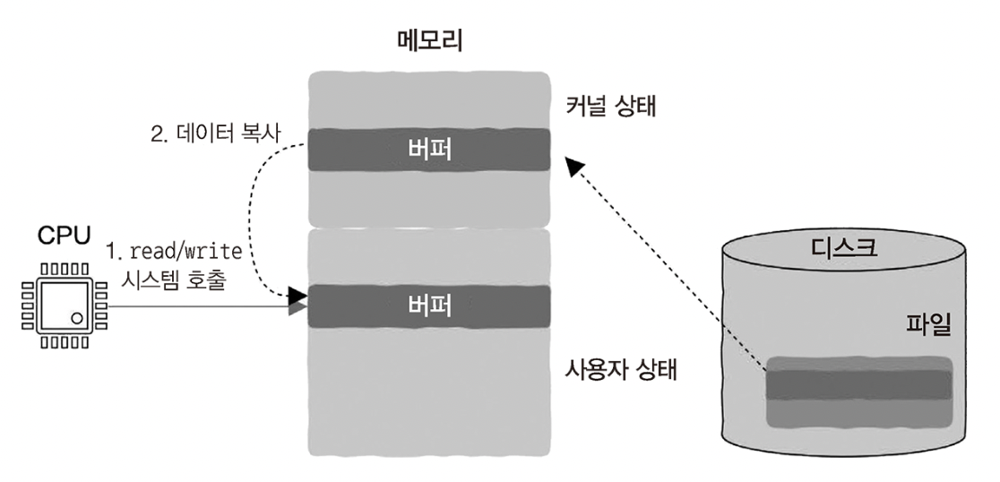
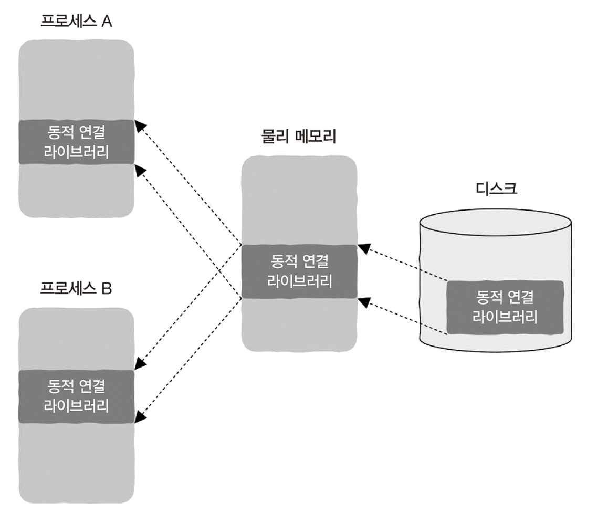

# 6. 입출력이 없는 컴퓨터가 있을까?

## 6.1 CPU는 어떻게 입출력 작업을 처리할까?

CPU 내부에 레지스터가 있는 것과 마찬가지로, 장치에도 장치에 관련된 일부 정보를 저장하는 장치 레지스터가 있다.
1. 데이터를 저장하는 레지스터: 사용자가 키보드의 키를 누르면 정보가 저장되는 레지스터
2. 제어 정보와 상태 정보를 저장하는 레지스터: 읽고 쓰는 작업을 이용해 장치를 제어하거나 장치 상태 확인 가능

 

프로그래머 관점에서 장치는 저수준 계층의 레지스터를 한데 묶은 것이고, 장치에서 생성된 데이터를 얻거나 장치를 제어하는 작업은 모두 이런 레지스터를 읽고 쓰는 것을 한다. 
장치 레지스터를 읽고 쓰는 과정은 기계 명령어 중 입출력 명령어(IN, OUT)를 통해 실행한다. 
어떤 장치 레지스터를 읽고 써야 하는지는 장치마다 부여된 고유 주소를 입출력 명령어에 저장해 지정한다. 
CPU의 입장에서는 메모리 역시 하나의 외부 장치로 간주할 수 잇으므로 장치 레지스터를 읽고 쓰는 데 LOAD와 STORE를 사용할 수 있다.

LOAD와 STORE 명령어만으로는 읽고 쓰는 대상이 메모리인지, 장치 레지스터인지 알 수 없다. 
LOAD, STORE 명령어가 전달하는 메모리 주소 공간이 메모리에 할당되어 있는지, 장치에 할당되어 있는지를 통해 대상을 구분한다. 
이렇게 주소 공간의 일부분을 장치에 할당하여 메모리를 읽고 쓰는 것처럼 장치를 제어하는 방법이 __메모리 사상 입출력(memory mapping input and output)__ 이다.

메모리 사상 입출력 방식을 채용하고 키보드가 레지스터 주소 공간의 0xfe00에 사상되어 있다고 가정하면, CPU가 키보드를 읽는 기계 명령어는 `Load R1 0xFE00`일 것이다. 
하지만 키보드는 어떻게 데이터를 언제 읽어야 할지 알 수 있을까? 대다수의 장치는 사람이 조작하는 것이기 때문에 언제 동작할지 알 수 없다. 
CPU는 장치 상태 레지스터의 값을 읽음으로써 장치를 읽을 수 있는지 쓸 수 있는지 알 수 있다.

장치 상태 레지스터를 지속적으로 읽는 작업으로 키보드를 누르면 바로 해당 키보드의 문자를 읽을 수 있으며, 누르지 않을 때는 계속 검사를 반복한다는 **폴링**을 생각할 수 있다. 
문제는 사용자가 키를 누르지 않으면 CPU는 항상 불피룡하게 순환하며 대기하게 된다. 
본질적으로 폴링은 일종의 동기식 설계 방식이므로, 이를 개선하기 위한 방법은 동기를 비동기로 바꾸는 것이다. 
따라서 CPU가 명령어를 실행하고 있을 때 새로운 이벤트가 발생해 외부 장치가 인터럽트 신호를 보내면 CPU는 실행 중인 현재 작업의 우선순위가 인터럽트 요청보다 높은지 판단한다. 인터럽트가 우선순위가 더 높다면 현재 작업 실행을 일시 중지하고 인터럽트를 처리하며, 인터럽트 처리를 끝낸 후에 다시 현재 작업으로 돌아온다.

하지만 인터럽트를 사용하는 방법에서도 프로그램의 실행 상태를 저장하고 복원하는 과정에서 약간의 시간을 낭비하게 된다. 
입출력을 비동기로 처리하는 이 방법이 바로 **인터럽트 구동식 입출력**이다. 이를 통해 동기 기반의 폴링에서 비동기 인터럽트 처리로 바뀌었다. 
인터럽트를 처리할 때는 먼저 중단된 작업 상태를 보존해야 한다. 이어서 CPU는 인터럽트 처리 함수의 시작 위치로 점프하여  인터럽트 처리 함수의 명령어를 실행한 후 처리가 끝나면 다시 원래 자리로 점프하여 중단되었던 작업을 계속 실행한다.

인터럽트 처리는 일반 함수의 호출과 매우 유사하지만, 함수 호출은 단일 스레드 내부에서 발생하는 반면 인터럽트 처리 함수는 서로 다른 두 실행 흐름을 포함하므로 함수 호출에 비해 인터럽트 점프는 저장해야 할 정보가 훨씬 많다. 
상태 저장의 경우 프로그램 실행 상태를 저장하는 전용 스택을 커널에 만들어서 사용한다.

 

## 6.2 디스크가 입출력을 처리할 때 CPU가 하는 일은 무엇일까?

최신 컴퓨터 시스템의 경우 디스크가 입출력 요청을 처리하는 동안 CPU는 다른 작업을 수행하도록 스케줄링한다. 
디스크의 입출력 처리와 CPU가 실행하는 작업은 서로 의존하지 않는 독립적인 작업이므로 병행 처리가 가능하다.

디스크는 입출력 요청이 들어왔을 때 읽어야 하는 데이터가 헤드에 위치한 트랙에 없을 가능성이 있다. 
이때 헤드가 특정 트랙으로 이동하는 과정을 탐색이라고 하고, 탐색이 디스크 입출력 중에서 매우 시간을 많이 소모하는 작업에 해당한다. 
전자 부분은 전자 부품으로 구성되어 있으며, 이를 장치 제어기라고 한다.  
장치 제어기는 마이크로 컴퓨터 시스템으로 발전하여 자체적인 프로세스와 펌웨어를 갖추고 있으므로 CPU가 도와주지 않는 상황에서도 복잡한 작업을 할 수 있으며, 자신만의 버퍼나 레지스터를 갖추고 잇어 장치에서 읽은 데이터나 장치에 저장할 데이터를 저장할 수 있다. 
장치 제어기는 운영 체제에서 해당하는 장치 드라이버와 외부 장치를 연결하는 다리에 해당하며, 장치 제어기가 점점 더 복잡해지는 목적 중 하나가 CPU를 해방시키기 위해서이다.

CPU 개입이 없는 상황에서 직접 장치와 메모리 사이에 데이터를 전송하는 작동 방식을 **직접 메모리 접근**이라고 부른다. 
CPU는 어떻게 데이터를 복사할지 알려주는 명령어를 DMA에 전달한다. 
DMA는 자신의 작업 목표를 명확히 하고 버스 중재(= 버스의 사용 권한 요청) 후 이어서 장치를 작동시킨다. 
디스크에서 데이터를 읽는다고 가정했을 때, 장치 제어기의 버퍼에서 데이터를 읽으면 DMA가 지정된 메모리 주소에 데이터를 쓰는 방식으로 데이터 복사가 완료된다.

DMA가 CPU를 해방시키면서 가상 메모리와 캐시를 지원하는 시스템에서 문제가 발생했다. 
가상 메모리를 지원하는 시스템에는 가상 주소와 물리 메모리 주소가 있는데, DMA는 읽은 데이터를 어느 쪽 주소에 저장해야 하는지 알 수 없다. 
이를 해결하기 위해 운영 체제가 DMA에 필요한 가상 주소와 물리 메모리 주소 사이의 mapping 정보를 전달한다. 
이외에도 캐시가 존재하는 시스템에서는 메모리의 데이터가 캐시와 동일하지 않을 수 있다. DMA가 메모리에서 정보를 읽어 왔는데, 캐시에 최신값이 아직 동기화되지 않은 상태라면 문제가 발생한다. 
이 문제를 해결하기 위해 상응하는 캐시의 데이터를 즉시 메모리에 갱신하여 일관성 문제가 나타나지 않도록 할 수 있다. 
CPU는 DMA가 발생시키는 인터럽트를 통해 데이터 전송이 완로된 것을 알 수 있다.

1. CPU로 실행되는 스레드 1이 시스템 호출로 입출력 요청을 시작하면, 운영체제는 스레드 1의 실행을 일시 중지하고 CPU를 스레드 2에 할당하고 스레드 2가 실행된다.
2. 디스크가 동작하여 데이터 준비가 완료되면 DMA 작동 방식이 직접 장치와 메모리 사이에서 데이터를 전송한다.
3. 데이터 전송이 완료되면 인터럽트를 이용해 CPU에게 알리고, CPU는 스레드 2의 실행을 일시 중지하고 인터럽트를 처리한다.

 

소프트웨어든 하드웨어든 간에 높은 효율성을 이끌어 내는 비결은 비동기이다. 
다른 말로는 무의존성 또는 분리라고 불리며, 상대적으로 독립적일 때만 시스템의 리소스를 더 효율적으로 사용할 수 있다.

 

## 6.3 파일을 읽을 때 프로그램에는 어떤 일이 발생할까?

메모리 관점에서 입출력은 단순한 메모리의 복사일 뿐, 그 이상도 이하도 아니다.  
데이터가 외부 장치에서 메모리로 복사되면 그것이 입력(input)이며, 반대로 데이터가 메모리에서 외부 장치로 복사되면 그것이 출력(output)이다. 
즉, 메모리와 외부 장치 사이에 복사 데이터가 왔다 갔다 하는 것을 입출력(input/output)이라고 하며, 약어로 I/O라고 표현한다.

그렇다면 read 함수는 어떻게 파일을 읽을 수 있을까? 
단일 코어 CPU 시스템에 프로세스 A와 프로세스 B 두 개가 있고, 프로세스 A가 현재 실행 중이라고 가정해보자. 
프로세스 A에는 파일을 읽는 코드가 있다. 일반적으로 데이터를 저장하는 버퍼를 정의한 후 read 함수를 호출한다. 
read 함수는 저수준 계층에서 시스템 호출을 이용해 운영체제에 파일 읽기 요청을 보내고, 이 요청은 커널에서 디스크가 이해할 수 있는 명령어로 변환되어 디스크로 전송된다.

 
CPU가 명령어를 실행하는 속도에 비해 디스크 입출력은 매우 느려 프로세스가 진행되지 못하는 블로킹이 발생한다. 
따라서 운영체제는 현재 프로세스의 실행을 일시 중지하고 입출력 블로킹 대기열에 넣어 CPU가 계속 일할 수 있도록 한다. 
이때 운영 체제는 이미 디스크에 입출력 요청을 보낸 상태이고, 디스크는 DMA 작동 방식을 사용하여 데이터를 buffer로 복사하는 작업을 시작한다. 
운영 체제는 실행 중인 프로세스가 입출력 블로킹 대기열에 들어가면 준비 완료 대기열에 있는 다른 프로세스를 CPU에 할당한다. 
디스크가 데이터를 프로세스 A의 메모리에 복사하는 작업이 완료되면 디스크는 CPU에 인터럽트 신호를 보낸다. 운영 체제는 프로세스 A를 입출력 블로킹 대기열에서 준비 완료 대기열로 변경한다. 
운영체제는 CPU를 어느 프로세스에 할당할지 결정해야 하는데, 실행되고 있던 프로세스에 할당된 CPU 시간이 남아 있다면 그대로 유지한다. 
이후 프로세스 B는 실행되고 프로세스 A는 대기하다가 시스템의 타이머가 타이머 인터럽트 신호를 보내면 CPU는 인터럽트 처리 함수로 점프한다. 
프로세스 B가 충분히 실행되었으므로 준비 완료 대기열에 넣음과 동시에 프로세스 A를 준비 완료 대기열에서 꺼내 CPU를 할당한다.

 

## 6.4 높은 동시성의 비결: 입출력 다중화

모든 입출력 장치는 파일이라는 개념으로 추상회된다. __모든 것이 파일(everything is file)__ 이라는 개념이다. 
디스크, 네트워크 데이터, 터미널, 프로세스 간 통신 도구인 파이프까지 모두 파일로 취급된다. 
모든 입출력 작업은 파일 읽기와 쓰기로 구현할 수 있으머, 프로그래머는 이 추상화를 이용하여 일련의 인터페이스로 모든 외부 장치를 사용할 수 있다.

유닉스/리눅스 운영체제에서 파일을 사용하려면 파일 서술자(file descriptor)를 빌려 와야 한다. 
파일을 열 때 커널은 파일 서술자를 반환하며, 파일 작업을 실행할 때 해당 파일 서술자를 커널에 전달해야 한다. 
커널은 이 숫자를 얻은 후 해당 숫자에 대응하는 파일에 관련된 모든 정보를 찾아 파일 작업을 완료할 수 있다. 
파일 서술자를 사용하면 파일이 어디에 저장되어 있는지, 지금 읽고 있는 위치는 어디인지 등의 정보를 운영 체제가 대신 처리하므로 프로세스는 이에 대해 신경 쓸 필요가 없다.

높은 동시성이란 서버가 동시에 많은 사용자 요청을 처리할 수 있음을 의미한다. 네트워크 통신은 대부분 소켓 프로그래밍을 사용한다. 
웹 서버에서 3 way handshake에 성공하면 accept 함수를 호출하여 연결과 파일 서술자를 얻을 수 있는데, 이 파일 서술자를 통해 사용자와 통신을 진행할 수 있다. 
여기에서 서버는 동시에 몇 만 명의 사용자와 통신해야 하므로 파일 몇 만 개를 처리해야 하는 동시성 문제가 발생한다. 
read 함수는 일반적으로 블로킹 입출력이므로 첫 번째 사용자가 데이터를 보내지 않으면 해당 코드를 사용하는 스레드 전체가 일시 중지된다. 
다중 스레드를 사용해 각각의 사용자 요청에 스래드를 생성해서 특정 스레드가 블로킹되어도 다른 스레드 영향에 미치지 않는 방법을 고안할 수 있으나, 스레드 수가 너무 많아질 수 있고 스레드의 스케줄링과 전환에 너무 많은 부담이 가해지므로 높은 동시성을 발휘해야 하는 상황에서 최적의 방법이 아니다. 
많은 수의 파일 서술자를 처리하는 나은 방법은 필요할 때 커널이 응용 프로그램에 통지하도록 하는 것이다. 
파일 서술자를 커널에 알려주고, 커널이 파일 서술자를 읽고 쓸 수 있는 시점을 알려주면 응용 프로그램은 수동적이고 여유 있는 상태로 변한다. 
이것이 프로그래머가 동시에 많은 수의 파일 서술자를 다룰 수 있는 방법인 **입출력 다중화** 기술이다.

입출력 다중화는 다음과 같은 과정을 의미한다:
1. 파일 서술자를 획득한다.
2. 특정 함수를 호출하여 커널에 "이 파일 서술자를 감시하다 읽거나 쓸 수 있는 파일 서술자가 나타나면 반환해달라"고 요청한다.
3. 해당 함수가 반환되면 읽고 쓸 수 있는 조건이 준비된 파일 서술자를 획득하고, 이에 상응하는 처리를 한다.

 

리눅스에서 입출력 다중화 기술을 사용하는 방법에는 select, poll, epoll 세 가지가 있다. 
본질적으로 select, poll, epoll은 모두 동기 입출력 다중화 기술이다. 이런 함수가 호출될 때 감시해야 하는 파일 서술자에서 읽기/쓰기 가능 같은 관심 대상 이벤트가 나타나지 않으면 호출된 스레드가 블로킹되어 일시 중지되고, 파일 서술자가 해당 이벤트를 생성할 때까지 함수는 반환되지 않는다. 

- select
    - 1024개 이하의 파일 서술자 묶음을 감시 가능
    - 블로킹되어 일시 중지된 후 파일 서술자 중 하나라도 읽기/쓰기 가능 이벤트가 나타나면 해당 프로세스/스레드가 깨어남
    - 어떤 파일 서술자가 읽기/쓰기 가능 상태인지 알 수 없어 확인이 필요함
    - 파일 서술자 수가 늘어날수록 성능이 저하되는 문제가 발생해 높은 동시성을 요구하는 상황에 대응 X
- poll
    - select와 유사함
    - 파일 서술자 묶음 제한이 1024개 이상임
    - 파일 서술자 수가 늘어날수록 성능이 저하되는 문제가 발생해 높은 동시성을 요구하는 상황에 대응 X
- epoll
    - 커널에 필요한 데이터 구조(준비 완료된 파일 서술자 목록)를 추가하여 문제 해결
    - 감시하고 있는 파일 서술자에서 이벤트가 발생하면 해당 프로세스를 깨우면서 준비 완료된 파일 서술자가 준비 완료 목록에 추가됨
    - 준비 완료된 파일 서술자를 직접 획득할 수 있어 효율적임

 

## 6.5 mmap: 메모리 읽기와 쓰기 방식으로 파일 처리하기

파일을 사용하는 것이 메모리를 사용하는 것보다 훨씬 더 복잡하다. 
메모리는 바이트 단위로 직접 주소를 지정할 수 있지만 디스크에 저장되는 파일은 조각(block) 밀도에 따라 주소가 지정된다. 
이외에도 CPU와 디스크의 속도 차이가 너무 커서 디스크의 파일은 반드시 먼저 메모리에 저장한 후 메모리에서 바이트 단위로 파일 내용을 처리한다.

 
사용자가 보기에 파일은 디스크의 연속된 공간에 저장된다. 이 두 공간은 가상 메모리를 통해 연결할 수 있다. 
가상 메모리의 목적은 모든 프로세스가 각자 독점적으로 메모리를 소유하고 있다고 생각하게 하는 것이다. 
가상 메모리를 지원하는 시스템에서 기계 명령어는 가상 주소를 전달하지만, 가상 주소는 메모리에 도달하기 전에 실제 물리 메모리 주소로 변환된다. 
파일은 개념적으로 연속된 디스크 공간에 저장되어 있다고 생각할 수 있으므로 이 공간을 프로세스 주소 공간에 직접 매핑할 수 있다. 이를 통해 메모리를 직접 읽고 쓰는 것처럼 디스크의 파일을 사용할 수 있다.

주소 공간을 읽을 때, 대응하는 파일이 아직 메모리에 적재되지 않아 page fault interrupt가 발생할 수 있다. 
이후 CPU가 운영체제의 인터럽트 처리 함수를 실행해 실제 디스크 입출력 요청이 시작되며, 파일을 메모리로 읽고 가상 메모리와 실제 메모리 사이의 연결이 수립되면 프로그램에서 메모리를 읽고 쓰듯이 직접 디스크의 내용을 사용할 수 있다. 
mmap을 사용하더라도 여전히 실제로 디스크를 읽고 써야 하기는 하지만, 이 과정은 운영체제가 진행한다. 
또 가상 메모리를 경유하기 때문에 고수준 계층에 있는 사용자는 이 사실을 신경 쓰지 않아도 된다.

 
read/write 함수 같은 입출력 함수는 저수준 계층의 시스템 호출을 사용한다. 
read 함수를 사용하여 파일을 읽을 때는 데이터를 커널 상태에서 사용자 상태로 복사해야 하며, 반대로 write 함수를 사용하여 데이터를 쓸 때는 데이터를 사용자 상태에서 커널 상태로 복사해야 한다. 
이런 작업들은 모두 큰 부담을 수반한다.

mmap으로 디스크의 파일을 읽고 쓸 때는 시스템 호출과 데이터 복사가 주는 부담이 없다. 
하지만 커널은 프로세스 주소 공간과 파일의 사상 관계를 유지하기 위해 특정 데이터 구조를 사용해야 하는데, 이것이 성능에 부담을 가져온다. 
이외에도 페이지 누락 인터럽트가 발생하면 이에 상응하는 인터럽트 처리 함수가 실제로 파일을 메모리에 적재하는 페이지 누락 문제가 있다. 
페이지 누락 인터럽트에도 부담이 걸리고 커널마다 구현 방식이 다르기 때문에 mmap이 성능 면에서 항상 read/write 함수보다 더 낫다고 할 수는 없다. 따라서 구체적인 상황을 보고 부담이 더 적은 쪽을 확인해야 한다.

물리 메모리를 용량을 초과할 정도의 큰 파일을 read/write 함수를 사용하면 파일을 조금씩 나누어 메모리에 적재해야 하며, 파일의 일부분에 대한 처리가 끝나면 다시 다음 부분에 대한 처리를 하는 방식을 사용할 수 있다. 
너무 많은 메모리를 요청하게 되면 out of memory 강제 종료가 발생할 수 있고, 전체 파일에 접근이 어렵다. 
mmap을 사용하면 가상 메모리의 도움 하에 프로세스 주소 공간이 충분하다면 실제 물리 메모리의 크기와 상관없이 큰 파일 전체를 프로세스 주소 공간에 직접 사상할 수 있다. 
파일은 물리 메모리의 크기에 교환 영역의 크기를 더한 영역보다 클 때만 메모리 부족 오류가 발생한다. 
mmap과 가상 메모리의 결합은 큰 메모리를 처리할 때, 특히 임의의 위치에서 읽거나 써야 할 때 코드 설계를 단순화할 수 있다. 
하지만 32비트 시스템은 프로세스의 주소 공간이 4GB에 불과하고, 그 중 일부는 운영 체제를 위해 예약되어 있다. 
따라서 처리할 파일이 나머지 사용자 영역의 주소 공간보다 클 때에는 공간 자체가 부족하므로 mmap 호출이 실패할 수 있다. 
64비트 시스템은 주소 공간 부족 문제를 걱정할 필요가 없다.

 
동적 링크 라이브러리는 많은 프로세스가 읽기 전용 방식으로 해당 파일을 참조하고 있다. 
동적 라이브러리를 참조하는 프로그램이 아무리 많더라도 실행 파일에는 라이브러리의 코드와 데이터가 포함되지 않는다. 
또한 라이브러리를 참조하는 모든 부분이 메모리에 적재되더라도 동일한 동적 라이브러리를 공유하므로 디스크와 메모리의 공간을 절약할 수 있고, 제한된 메모리에서 더 많은 프로세스를 실행할 수 있다. 
많은 프로세스가 동일한 동적 링크 라이브러리에 의존하므로 mmap으로 해당 라이브러리를 사용하는 모든 프로세스의 주소 공간에 직접 mapping할 수 있다.

 

## 6.6 컴퓨터 시스템의 각 부분에서 얼마큼 지연이 일어날까?

메모리에 접근하는 속도가 SSD에 접근하는 속도보다 빠르고, SSD에 접근하는 속도가 디스크에 접근하는 속도보다 빠르다. 
각 속도를 비교하기 위해 환산을 통해 비유로 이해해보았다. (첵 참고)

 

## 6.7 요약

프로그램은 실행 도중에 외부 장치에서 들어오는 데이터를 받고, 처리가 끝나면 결과를 내보내야 한다. 이것이 입출력이 존재하는 목적이다. 
이와 동시에 외부 장치에서 생성된 데이터는 CPU가 실행하는 기계 명령어와 비동기이다.  
외부 장치의 속도는 CPU에 비해 매우 느리므로 높은 효율의 입출력 처리와 하드웨어 리소스를 최대한 활용하기 위해 인터럽트 작동 방식, DMA 등에 운영 체제의 스케줄링 능력을 한데 결합하는 것으로 해결했다.

이번 책에서 프로그래밍 언어는 무엇인지, 고급 언어로 작성된 코드가 어떻게 단계별로 기계 명령어로 변환되는지, 실행 파일은 어떻게 생성되는지, 프로그램은 어떻게 실행되는지 등을 살펴보았다. 
운영 체제, 프로세스, 스레드, 코루틴 같은 개념이 존재하는 이유는 무엇인지도 알아보았다. 메모리 특성은 무엇이고, 힙 영역과 스택 영역은 무엇이며, 프로그램이 어떻게 메모리를 요청하는지도 생각해 보았다. 
CPU 동작 원리를 거쳐, 복잡 명령어 집합과 축소 명령어 집합이 생겨난 이유도 알아보았다. 
CPU와 메모리 사이에 캐시 계층이 있는 이유는 무엇인지도 살펴보았고, 마지막으로 입출력은 무엇인지도 들여다보았다. 
이것들이 바로 컴퓨터 시스템의 저수준 계층이 깊은 곳에 품고 있던 비밀이다.

더 많은 이해로 언젠가 코드가 어떤 방식으로 실행될지 정확하게 예측할 수 있을 것이다. 
이를 통해 결국 프로그래밍과 시스템 설계에 대해 강력한 제어 능력을 갖추게 될 것이다.