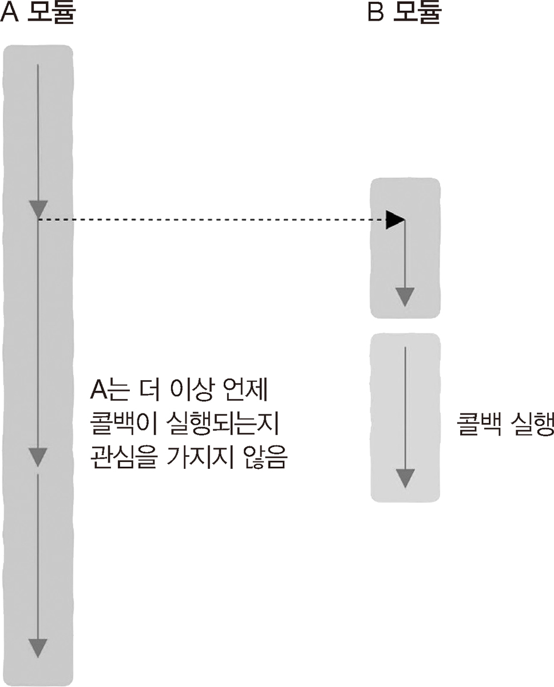

# 2.5 콜백 함수를 철저하게 이해한다

## 2.5.2 콜백이 필요한 이유

> 2.5.1 -> 많은 요구를 한 번에 만족하게 할 수는 없을까?

**함수 변수**

- = 콜백 함수
- 현지화 코드에 맞추어 코드를 변경하는 것이 아니라
- 정의한 현지화 함수를 전달 받아 이를 실행

## 2.5.3 비동기 콜백

> 동기적으로 처리되는 걸 기다릴 수 없는 상황일 때

**비동기 콜백**

- 호출 스레드가 콜백 함수 실행에 의존하지 않는 것

```
void real_make_dount(func f) {
  ...
  f();
  ...
}
void make_dount(func f) {
  thread t(real_make_dount, f); // 스레드 시작
  somthing_important(); // 기다리지 않고 처리 가능
}
```

## 2.5.4 비동기 콜백은 새로운 프로그래밍 사고방식으로 이어진다

> 우리는 어떤 일을 해야 하는지 알지만, 언제하게 될지 모름
> 다른 모듈은 언제 해야 하는지 알지만, 무엇을 해야 하는지 모름
> 따라서 알고 있는 정보를 콜백 함수에 담아 다른 모듈에 전달

**동기 호출**<br>
<br>

1. 함수를 호출하고 결과를 획득
2. 획득한 결과를 처리

- 함수가 반환되는 것을 무조건 기다려야 함

```
res = request();
handle(res);
```

**비동기 호출**<br>
<br>

- 사용자가 정보를 채워 넣기 전까지 매개변수 정보가 무엇인지 알 수 없음 <br>
  => 함수도 매개변수로 전달 가능

```
request(handle);
```

- 비동기 호출 작업 처리 (2-38 그림)
  1. request가 호출되기 전에 해당하는 부분 -> 함수 호출 스레드에 의해 처리
  2. 함수를 호출하는 스레드에서 처리되지 않고 다른 스레드, 프로세스 또는 시스템에서 처리
  - 2번째 부분은 우리가 제어할 수 있는 범위에서 벗어남
  - 호출자만 무엇을 해야 할지 앎

## 2.5.5 콜백 함수의 정의

콜백 함수<br>
<br>

- 다른 코드에 매개변수로 전달되는 실행 가능한 코드
- 일반적인 함수와 다르지 않음
- 함수 작성자가 나라도 함수를 호출하는 것은 내가 아닌, 내가 참조하는 외부 모듈
- 이벤트 처리 도구
  - 이벤트가 발생하면 이를 처리할 수 있는 코드를 호출 -> 콜백 함수 사용
  - 이벤트 중심 프로그래밍에 적합

## 2.5.6 두 가지 콜백 유형

**동기 콜백 = 블로킹 콜백**

- 함수가 반환되기 전에 콜백 함수 실행

**비동기 콜백 = 지연 콜백**

- 콜백 함수와 주 프로그램이 동시에 실행
- 서로 다른 스레드 또는 프로세스에서 실행
- 동기 콜백에 비해 다중 코어 리소스를 더 잘 활용
  - 입출력 작업에서 자주 볼 수 있음
  - 동시성이 높은 시나리오에 적합 (ex. 웹 서비스)

## 2.5.7 비동기 콜백의 문제: 콜백 지옥

- 데이터 서비스(downstream)는 수십~수백 개씩 호출됨
- 구성이 상대적으로 복잡한 경우에 비동기 콜백으로 처리 => **콜백 지옥**
- 코드 단순성+가독성 => **코루틴**을 사용하자
