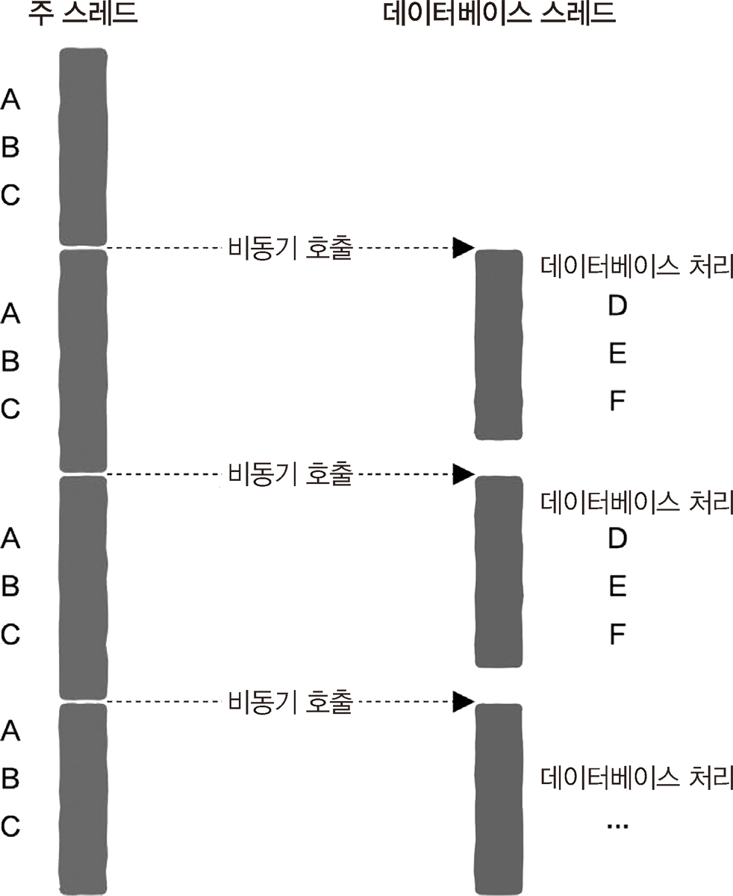
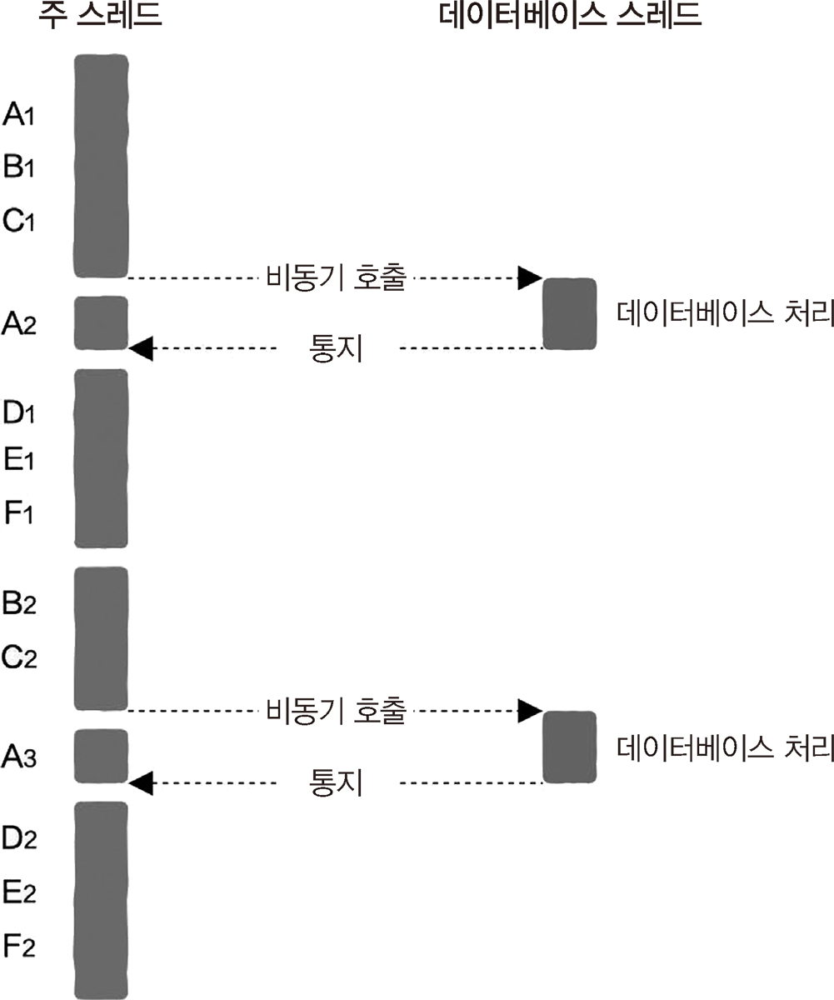

# 2.6 동기와 비동기를 철저하게 이해한다

## 2.6.1 고된 프로그래머

동기 작업

- 작업을 주고 완료할 때까지 계속 대기
- ex. 전화, 무전기

비동기 작업

- 업무를 마칠 때까지 기다리지 않고 다른 일을 처리
- 작업이 동시에 진행 -> 효율적
- ex. 비동기

## 2.6.3 동기 호출

일반적인 동기 호출

- 동일한 스레드에서 실행

**블로킹 입출력**

- 입출력 작업에서 발생
  - 호출 스레드를 일시 중지
  - 커널이 디스크 내용을 읽어 오면 스레드가 다시 깨어남
- 동기 호출
  - 호출자와 파일을 읽는 코드가 다른 스레드에서 실행되고 있을 뿐임
  - 호출자와 수신자가 같은 스레드에서 실행 중인지 여부와는 관련 없음
  - 효율이 높지 않음

## 2.6.4 비동기 호출

**비동기 호출**

- 백그라운드 형태로 실행
- 읽기 작업이 완료되지 않은 상태에서도 함수 즉시 반환 가능
- 이후 작업은 파일 읽기 작업과 동시에 진행 -> 효율적

**작업 완료 시점 파악**

1. 호출자가 실행 결과를 신경쓰지 않음

- 콜백 함수가 실행되는 다른 스레드 또는 프로세스 등에서 완전 처리

2. 호출자가 실행 결과를 알아야 함

- 알림 작동 방식 -> 작업 완료를 알리는 신호나 메시지
- 흔히 스레드 2개가 사용됨

## 2.6.5 웹 서버에서 동기와 비동기 작업

실제 예시: 데이터베이스 요청

- 동기 구현
  - 동기 호출되면 처리하고 반환하고 다시 주 스레드 처리 반복
  - 스레드의 유휴 시간(idle time) 긺
- 비동기 구현
  - 데이터베이스 처리 결과를 신경쓰지 않을 때 
     
    - 데이터베이스를 처리하고 나서 콜백 함수를 호출 -> 임무 완료
    - 유후 시간이 없어져 효율적
  - 데이터베이스 작업 결과에 관심을 가질 때 
     
    - 알림 작동 방식을 이용해 작업 결과를 주 스레드로 전송
    - 주 스레드에는 유후 시간이 없어 효율적
