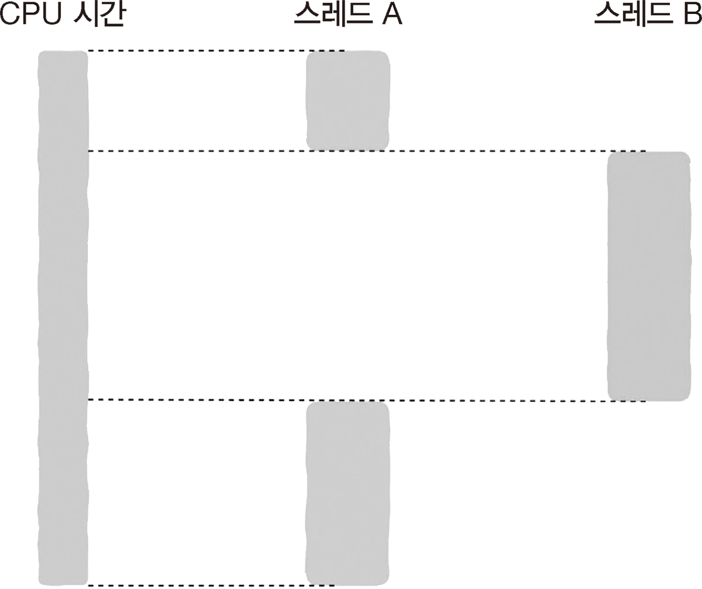

# 2.7 아 맞다! 블로킹과 논블로킹도 있다

**- 동기 / 비동기 두 가지 대상**

- 서로 상호작용하는 모든 모듈 2개 혹은 함수
- 동기 -> 두 대상이 강하게 결합
- 비동기 -> 제약이 없어 각자 자신의 작업을 실행 가능
- **동기, 비동기를 언급할 때는 양쪽 모두를 의미하는 것!**

## 2.7.1 블로킹과 논블로킹

> 함수를 호출할 때 주로 사용

함수 A가 함수 B를 호출

**블로킹**

- 호출함과 동시에 운영 체제가 함수 A가 실행 중인 _스레드나 프로세스를 일시 중지_
- 모든 함수 호출이 일시 중지시키는 것은 아님

**논블로킹**

- 일시 중지시키지 않음

## 2.7.2 블로킹의 핵심 문제: 입출력

> 대부분 입출력과 관련 

 

- 디스크, CPU의 처리 속도 차이 有
- 입출력 과정이 실행되는 동안 CPU 제어권을 다른 스레드에게 넘김
- CPU 제어권을 상실했다가 되찾는 시간 동안 스레드나 프로세스는 블로킹되어 일시 중지 상태
  - 스레드 A는 입출력 작업을 실행해 블로킹되어 CPU는 스레드 B에 할당
  - 입출력 작업이 완료된 것을 확인하면 다시 A에 CPU 할당

## 2.7.3 논블로킹과 비동기 입출력  

비동기 입출력

 

- 논블로킹 호출 유형의 입출력 작업
- 일시 중지 대신 recv 함수 즉시 반환
- 호출 스레드는 자신의 작업을 계속 진행
- 데이터 수신 작업은 커널이 처리

**데이터 수신 확인 방법**

1. 결과를 확인하는 함수를 제공 -> 함수 호춣하여 수신된 데이터가 있는지 확인
2. 데이터가 수신되면, 알림 작동 방식으로 스레드에 메시지/신호 전송
3. recv 함수를 호출할 때 데이터 수신 처리를 담당하는 함수를 콜백 함수에 담아 매개변수로 전달

## 2.7.5 동기와 블로킹

- 동기는 블로킹과 다소 유사
- 블로킹 호출은 모두 동기 호출
- 동기 호출이 모두 블로킹 호출은 아님

## 2.7.6 비동기와 논블로킹

함수를 논블로킹 호출로 설정하기 위한 flag = NON_BLOCKING_FLAG

비동기이자 논블로킹
- 네트워크 데이터를 처리해주는 handler 함수를 recv 함수에 콜백으로 전달

동기이자 논블로킹  
- 데이터의 도착을 감지하는 check 함수
- 반복문에서 끊임없이 감지 싣 -> handler 함수 사용 불가
- 논블로킹이자만 동기함수
- 비효율적
