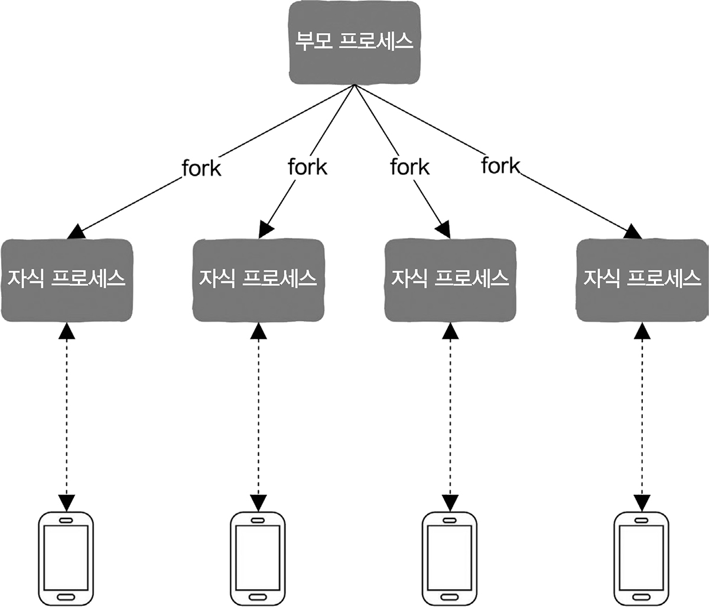
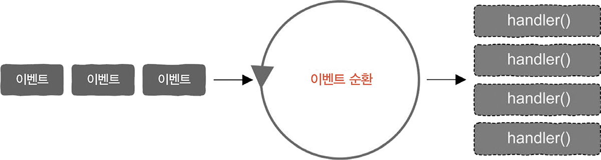
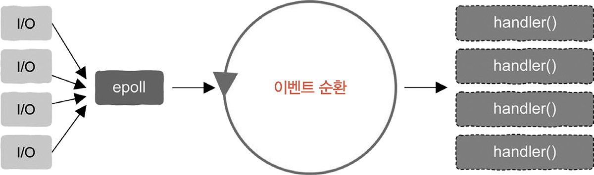
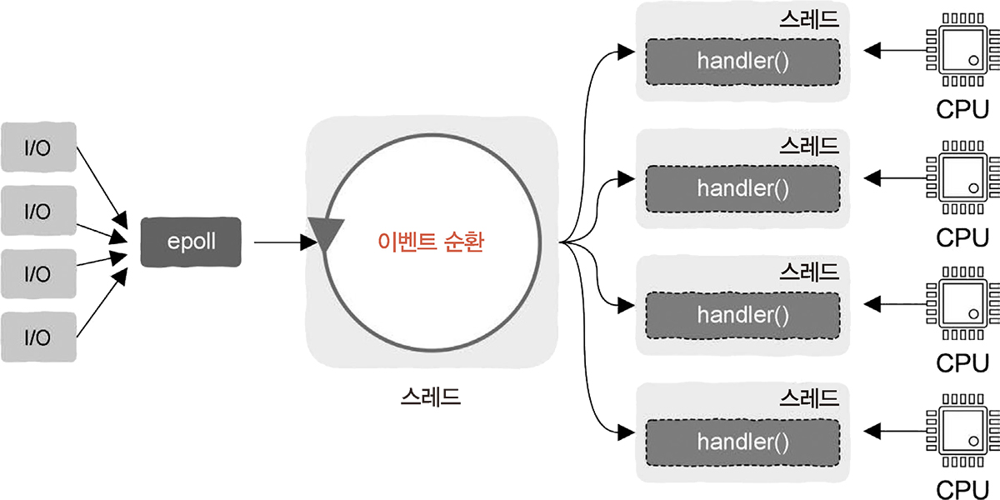
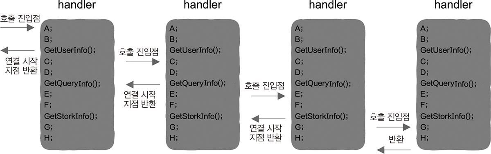
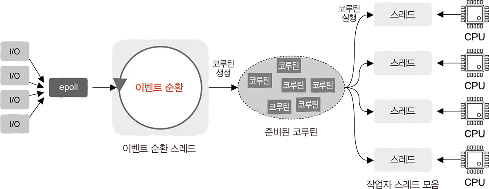

# 2.8 높은 동시성과 고성능을 갖춘 서버 구현

## 2.8.1 다중 프로세스

**다중 프로세스로 처리**<br>
<br>

- 동시성과 고성능을 위해 가장 먼저 출현한 기술
- 모든 요청에는 각각 대응하는 프로세스가 있음

**장점**

- 이해하기 쉬움
- 주소공간이 격리 -> 다른 프로세스에 영향을 미치지 않음
- 다중 코어 리소스 최대한 활용 가능

**단점**

- 프로세스 간 통신이 필요할 때 난이도가 올라감
- 프로세스의 통신 작동 방식을 사용해야 함
- 생성할 때 부담이 상대적으로 크고 프로세스의 빈번한 생성과 종료가 시스템 부담 증가

## 2.8.2 다중 스레드

**다중 스레드로 처리**

- 프로세스 주소 공간 공유
- 요청에 대응하는 스레드 생성 가능
- 스레드 중 일부가 블로킹되어 일시 중지되더라도 다른 스레드에는 영향을 미치지 않음

**장점**

- 스레드 안전이 보장된다는 전자 하에 메모리를 직접 읽어 데이터를 얻을 수 있음
- 매우 가볍고 생성, 종료에 드는 부담이 적음

**단점**

- 스래드에 문제가 발생해 강제 종료되면 같은 프로세스를 공유하는 모든 스레드와 프로세스가 강제 종료됨
- 동시에 공유 리소스의 데이터를 읽고 쓸 수 없음
- 교착 상태와 같은 문제를 일으킬 수 있음
- 스레드 개수가 많아짐에 따라 과도한 메모리 소비나 스레드로 전환할 때의 성능 손실 발생

=> 사용자 규모가 크지 않은 경우 충분히 처리 가능 & 동시 요청 수가 매우 많으면 어려움

## 2.8.3 이벤트 순환과 이벤트 구동

**이벤트 기반 프로그래밍**

- 이벤트 기반의 동시성(event-based concurrency)을 이용
- 2가지 요소 필요: 이벤트 / 이벤트 처리 함수(= 이벤트 핸들러)

<br>

**동작 방식**

- 이벤트가 도착하길 기다리다가 도착하면 유형 확인
- 유형에 대응하는 이벤트 핸들러 찾고 호출
- 이벤트 계속해서 반복 -> 반복 처리 = 이벤트 순환(event loop)

**문제**

1. 이벤트 소스에 관한 문제. 어떻게 여러 이벤트를 가져올 수 있을까?
2. 이벤트 핸들러 함수가 반드시 이벤트 순환과 동일한 스레드에서 실행돼야 할까?

## 2.8.4 첫 번째 문제: 이벤트 소스와 입출력 다중화

**입출력 다중화**

<br>

- 운영 체제에 다음 내용을 전달하는 작동 방식을 사용
- epoll
  - 이벤트 순환을 위해 탄생
  - epoll_wait() 역할 = getEvent 함수 역할

## 2.8.5 두 번째 문제: 이벤트 순환과 다중 스레드

**가정: 이벤트 핸들러의 특징 2가지**

1. 입출력 작업이 없음
2. 처리 함수가 간단해서 소유 시간이 매우 짧음

- 이벤트 핸들러와 이벤트 순환을 동일한 스레드에서 실행 가능
- 단일 스레드에서 순차적으로 처리

**가정: 사용자 요청이 CPU 시간을 많이 소모할 경우**

<br>

- 단일 스레드를 사용 -> 느림
- 다중 코어를 활용한 다중 스레드로 처리
- 이벤트 핸들러와 이벤트 순환은 독립적인 스레드에 배치됨
- 그림: 작업자 스레드 4개와 이벤트 순환 스레드 1개 생성된 모습
  - 요청을 수신하면 작업자 스레드에 분배
  - 작업자 스레드를 스레드 풀로 구현하는 것도 가능
  - = 반응자 패턴

## 2.8.6 카페는 어떻게 운영되는가: 반응자 패턴

고객 = 이벤트 순환
주방 요리사 = 작업자 스레드
카페를 운영하는 전체적인 방식 = 반응자 패턴

## 2.8.7 이벤트 순환과 입출력

**가정: 요청 처리 과정에 입출력 작업 포함**

**1. 입출력 작업에 대응하는 논블로킹 인터페이스가 있는 경우**

- 스레드가 일시 중지 되지 않음
- 인터페이스 즉시 반환
- 이벤트 순환에서 직접 호출 가능

**2. 입출력 작업에 블로킹 인터페이스만 있는 경우**

- 절대 어떤 블로키 인터페이스도 호출하면 안 됨
  - 이벤트 순환 스레드 일시 중지
- 블로킹 입출력 호출이 포함된 작업을 작업자 스레드에 전달
- 작업자 스레드가 일시 중지되어도 다른 작업자 스레드에 문제를 일으키지 않음

## 2.8.8 비동기와 콜백 함수

여러 서버가 조합되어 있다면 -> 사용자 요청을 처리하는데 여러 서비스 포함될 수 있음

**원격 프로시저 호출 (remote procedure call, RPC)**

- 서버가 일반적으로 통신하는 방법
- 일반 함수처럼 보이지만 최하위 계층에서 네트워크 통신 수행 가능
- 블로킹 호출 -> 사용자가 응답하기 전에 함수가 반환되지 않음

**동기 방식 RPC 호출**

```
GetUserInfo(request, response);

void handler(request) {
  A;
  B;
  GetUserInfo(request, response) // 서버 A에 요청
  C;
  D;
  GetUserInfo(request, response) // 서버 B에 요청
  E;
  F;
}
```

- 코드가 명확하고 이해하기 쉬움
- 블로킹 호출로 스레드가 일시 중지될 수 있음
- 블로킹 호출이 여러 번 발생하면 스레드가 빈번하게 중단될 수 있음

=> 동기 방식 RPC 호출을 비동기 호출로 수정

**비동기 방식 RPC 호출**

```
GetUserInfo(request, callback);

void handler_after_GetQueryInfo(response) {
  E;
  F;
}

void handler_after_GetUserInfo(response) {
  C;
  D;
  GetUserInfo(request, handler_after_GetQueryInfo) // 서버 B에 요청
}

void handler(request) {
  A;
  B;
  GetUserInfo(request, handler_after_GetUserInfo) // 서버 A에 요청
}
```

- 주 프로세스 분할됨
- 콜백 안에 콜백 포함
- 사용자 서비스가 더 많아지면 관리가 힘듦

=> 코루틴으로 문제 해결 가능

## 2.8.9 코루틴: 동기 방식의 비동기 프로그래밍

- 동기로 작성됨
- 차이: yield로 CPU 제어권을 반환하는 등 RPC 통신이 시작된 후 적극적으로 바로 호출됨
  - RPC 호출 함수 또는 네트워크 데이터 전송 함수를 수정해야 가능
- **코루틴이 일시 중지되더라도 작업자 스레드가 블로킹되지 않음**

  <br>

  - 코루틴 일시 중지 -> 작업자 스레드는 준비 완료된 다른 코루틴을 실행하기 위해 전환
  - 일시 중지된 코루틴에서 할당된 사용자 서비스가 응답 후 처리 결과 반환
  - 다시 준비 상태가 되어 스케줄링 차례가 오길 기다림
  - 중지되었던 곳에서 이어서 계속 실행

  => 동기 방식으로 비동기 실행과 같은 효과

**코루틴 추가 후 서버 구조**

<br>

- 이벤트 순환 요청을 받음
- 핸들러 함수를 코루틴에 담아 스케줄링과 실행을 위해 각 작업자 스레드에 배포
- 작업자 스레드는 코루틴을 획득 후 진입 함수인 핸들러 실행
- 어떤 코루틴이 RPC 요청으로 능동적으로 CPU 제어권 반환 시, 작업자 스레드는 다른 코루틴 실행


## 2.8.10 CPU, 스레드, 코루틴

스레드
- 커널 상태 스레드
- 스레드 우선 순위에 따라 CPU 연산 리소스 할당

코루틴
- 커널 입장에서 알 수 없음
- 커널은 스레드에 따라 CPU 시간을 할당
- 프로그래머가 스레드에 할당된 시간 내 실행할 코루틴을 결정
  - 스레드에 할당된 CPU 시간을 사용자 상태에서 재차 할당
  -> 사용자 상태 스레드