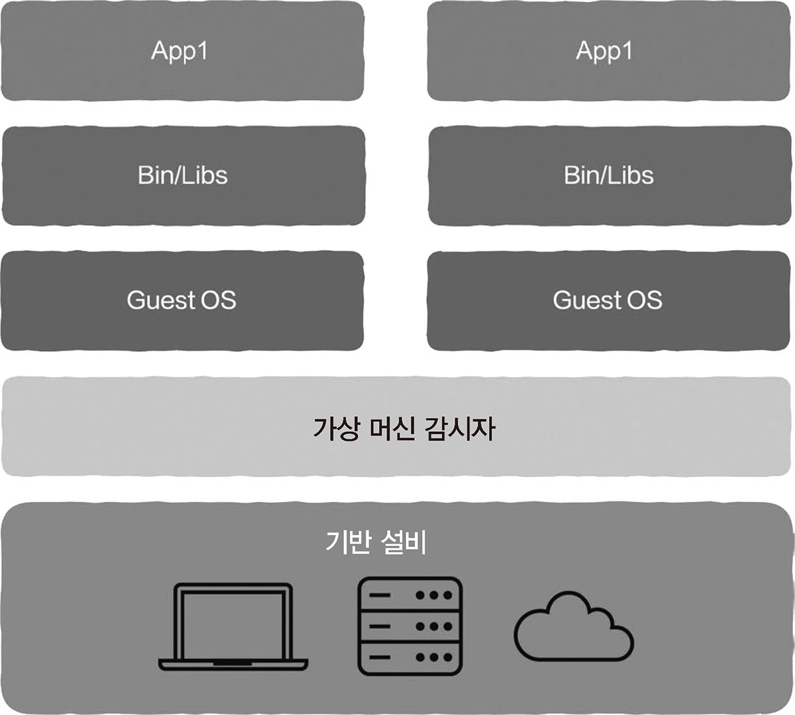

# 2.9 컴퓨터 시스템 여행: 데이터, 코드, 콜백, 클로저에서 컨테이너, 가상 머신까지

## 2.9.1 코드, 데이터, 변수, 포인터

**변수**: 별칭을 사용하여 데이터를 지칭

**포인터 (= 참조)**: 변수를 사용하여 동일한 데이터를 참조

**함수**: 별칭으로 명령어 여러 개를 지칭

## 2.9.2 콜백 함수와 클로저

**일급 객체 함수(first-class function)**

- 함수를 일반 변수를 다루듯이 처리할 수 있을 때 함수를 지칭하는 단어
- 코드를 할당, 사용, 매개변수로 전달, 반환값 사용 등
- C언어 불가, Python 가능

**콜백 함수**

- 함수가 다른 함수에 매개변수로 전달될 때 해당 함수를 지칭
- 문제
  - 정의와 호출을 서로 다른 곳에서 함
  - 콜백 함수가 정의된 A에서만 얻을 수 있고 실행하는 B에서는 얻을 수 없는 실행 시간 환경이나 데이터를 콜백 함수가 사용할 수 있어야 함

**클로저(closure)**

- 콜백 함수를 일부 데이터와 하데 묶어 변수로 취급

**예시**

```
def add():
    b = 10
    def add_inner(x):
        return b + x
    return add_inner

f = add()
print(f(2))
```

- add 함수 내에서 add_inner 함수 정의
- add_inner 함수는 2가지 데이터 사용
  - add 함수 내에서 정의된 b 변수
  - 사용자 매개변수
- add_inner 함수는 실행 시간 환경인 b 변수를 묶어서 전달하는 클로저


## 2.9.3 컨테이너와 가상 머신 기술

**코루틴**: CPU를 능동적으로 일시 중지하고 함수가 다시 호출될 때 중단된 지점에서 계속 실행하는 것이 가능

**스레드**: 함수의 일시 중지와 재개가 커널 상태에서 구현되는 경우

**프로세스**: 종속된 실행 시 리소스를 결합한 것

**컨테이너(container)**

- 프로그램이 의존하는 실행 환경과 함꼐 묶인 것
- 운영 체제에서 제공하는 기능을 이용하여 프로세스를 격리, CPU/메모리/디스크에 대한 접근을 제어
  - 컨테이너에 포함된 프로세스는 OS 안에 자기 자신의 프로세스만 존재한다고 간주

**가상화 기술**

- 가상머신 감시자(virtual machine monitor) 이용해 컴퓨터의 HW를 추상화
- HW 리소스를 가상 컴퓨터 여러 개로 나눔
- 그 위에서 OS를 실행하면 HW의 리소스를 가져와 사용할 수 있게 됨 <br>
  => 하이퍼바이저(hypervisor)

**가상 머신**

- 가상 머신 감시자에서 실행되는 OS

<br>

가상화 기술 -> 1세대 클라우드 컴퓨팅의 초석

컨테이너 & 가상 머신 -> 최신 클라우드 컴퓨팅의 기반
