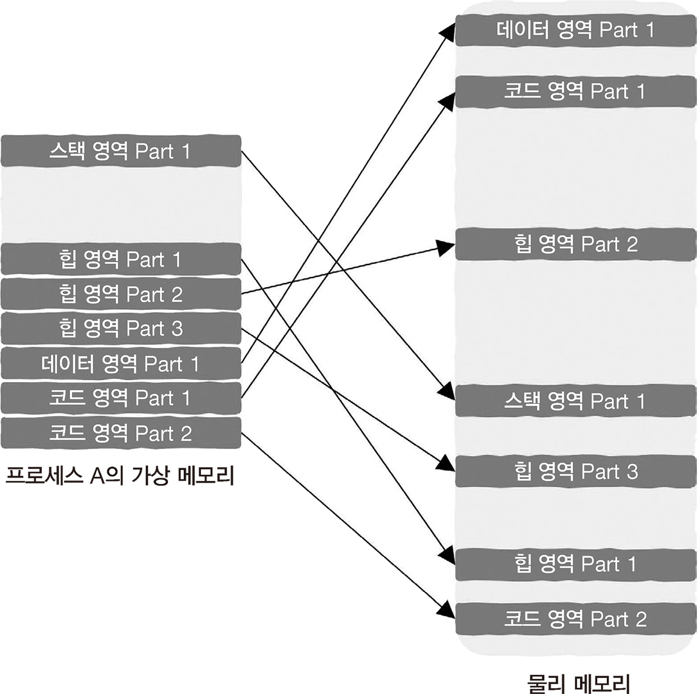
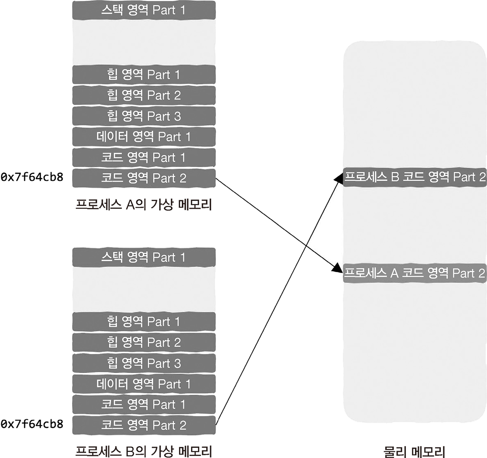

# 3.2 프로세스는 메모리 안에서 어떤 모습을 하고 있을까?

**프로세스 주소 공간**

- 코드, 데이터 영역: 생성되는 구역
- 힙 영영: 동적 메모리 할당에 사용
- 스택 영역: 함수 호출에 사용되며 매개변수 반환 주소 레지스터 등을 포함한 함수 실행 시 정보를 저장

## 3.2.1 가상 메모리: 눈에 보이는 것이 항상 실제와 같지는 않다

**가상 (메모리) 주소**

- 가짜 주소
- 조작이 일어나기 전에 실제 물리 메모리 주소로 변경된다.

> 프로세스는 동일한 크기의 조각으로 나뉘어 물리 메모리에 저장된다.  
> 모든 조각은 물리 메모리 전체에 무작위로 흩어져 있다.  

따라서, 가상 메모리와 물리 메모리 사이의 사상 관계만 유지하면 된다.

= 페이지 테이블의 존재 이유.

## 3.2.2 페이지와 페이지 테이블: 가상에서 현실로

> 가상 메모리 주소 - 물리 메모리 주소 사상 관계가 유지되는 한, 프로세스 주소 공간의 데이터가 실제 물리 메모리에 어디에 저장 되는지는 전혀 신경 쓸 필요가 없다.  

 

**페이지**
- 프로세스의 주소 공간을 동일한 크기의 조각(chunk)로 나눈 것

**페이지 테이블**

- 사상 관계를 유지한다.
- 하나의 프로세스에는 단 하나의 페이지 테이블만 있어야 한다.
- 사상은 페이지 단위로 이루어진다.
  - 페이지 테이블이 가져야 하는 항목 수가 대폭 줄어든다.
- 두 프로세스가 동일한 메모리 주소가 기록해도 서로 다른 물리 메모리 주소에 저장되기 때문에 문제가 발생하지 않는다.  
 