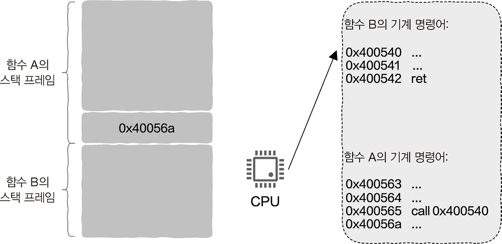
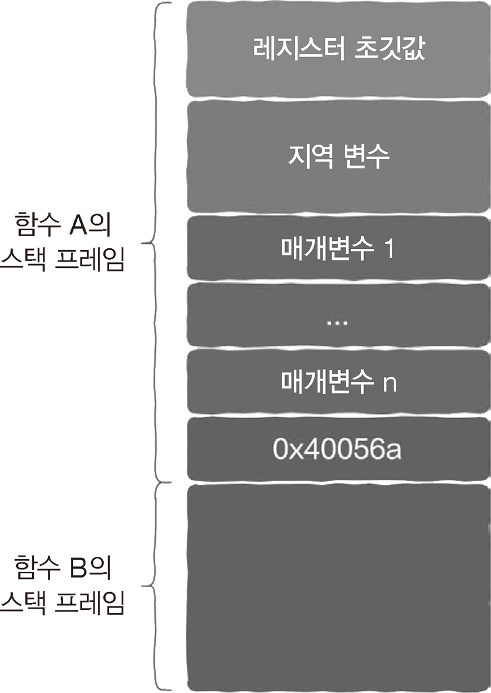

# 3.3 스택 영역: 함수 호출은 어떻게 구현될까?

> 함수 실행 시간 스택 (runtime stack) <br>
> 함수 호출 스택 (call stack)

## 3.3.1 프로그래머를 위한 도우미: 함수

**함수**

- 일부 기능을 반복해서 구현할 때 사용한다.
- 작성한 코드를 다음에 호출하기 위해 담아둔다.
- 가장 기초적이고 간단한 코드 재사용 방식이다.
- 호출하기 위해서 함수 이름, 매개변수, 반환 값만 알면 된다.
- 추상화에 해당한다.

## 3.3.2 함수 호출 활동 추적하기: 스택

**스택**

- 후입선출(LIFO)
- 높은 주소가 맨 위에 있고 낮은 주소 방향으로 커진다.
  - 스택 영역이 차지하는 메모리는 함수 호출 깊이에 따라 증가하고 완료될수록 감소한다.
- 트리 구조 순회로 재귀 구현뿐만 아니라 스택 구현에도 사용될 수 있다.

## 3.3.3 스택 프레임 및 스택 영역: 거시적 관점

<br>

**스택 프레임 (= 호출 스택)**

- 함수가 실행될 때 사용되는 여러 가지 정보가 저장된다.
- 프로세스의 스택 영역에 생성된다.

## 3.3.4 함수 점프와 반환은 어떻게 구현될까?

**점프와 반환**

- 제어권: 실제로 CPU가 어떤 함수에 속하는 기계 명령어를 실행하는지 의미한다.
- 제어권 이전
  - 함수 A가 함수 B를 호출하면 제어권이 함수 B로 옮겨진다.
  - CPU가 함수 A의 명령어를 실행하다가 함수 B의 명령어로 점프하는 것이다.
  - 필요 정보 2가지
    - 반환(return): 어디에서 왔는지에 대한 정보
    - 점프(jump): 어디로 가는지에 대한 정보
  - 함수 B의 실행이 완료되면 다시 함수 A로 점프할 수 있다.

**call 명령어**

<br>

```nasm
call 0x400540    ; call 명령어 주소 = 호출된 함수의 첫 번째 기계 명령어
...
ret              ; CPU에 함수 A의 스택 프레임에 저장된 반환 주소로 점프하도록 하는 역할
```

- 스택 프레임의 도움이 필요
- call 명령어를 실행
  - 지정된 함수로 점프한다.
  - call 명령어 다음에 위치한 주소를 함수 A스택 프레임에 넣는다.

## 3.3.5 매개변수 전달과 반환값은 어떻게 구현될까?

**함수 호출**

- 전달: 함수 이름, 매개변수
- 반환 값을 가져오기
- 대부분 레지스터가 매개변수의 전달과 반환 값을 가져온다.
  - 레지스터 수는 제한되어 있다.
  - 전달된 매개변수가 사용 가능한 레지스터 수보다 많다면?
  - 나머지 매개변수는 스택 프레임에 직접 넣는다.

## 3.3.6 지역 변수는 어디에 있을까?

**전역 변수**

- 함수 외부에 정의된 변수
- 실행 파일의 데이터 영역에 저장되어 있다.
- 실행되면 프로세스 주소 공간의 데이터 영역에 적재 된다.

**지역 변수**

- 함수 내부에서 정의된 변수
- 마찬가지로 레지스터에 저장할 수 있더,
- 로컬 변수가 레지스터 수보다 많으면 변수들도 스택 프레임에 저장되어야 한다.

## 3.3.7 레지스터의 저장과 복원

**저장**

<br>

- 지역 변수를 저장하기 전에 반드시 먼저 레지스터에 원래 저장되었던 초깃값을 꺼낸다.
- 스택프레임에 저장한다.
- 레지스터를 사용하고 나면 다시 그 초기값을 저장해야 한다.

**복원**

- 스택 프라임에 저장되어 있는 초깃값을 상응하는 레지스터의 내용으로 복원한다.

## 3.3.8 큰 그림을 그려 보자, 우리는 지금 어디에 있을까?

**스택 넘침 (stack overflow)**

- 스택 프레임은 스택 영역에 위치해있다.
- 스택 영역의 크기에는 제한이 있다.
- 제한을 초과하면 스택 오버플로우 오류가 발생한다

**주의할 점**

- 너무 큰 지역 변수를 만들면 안 된다.
- 함수 호출 단계가 너무 많으면 안 된다.
