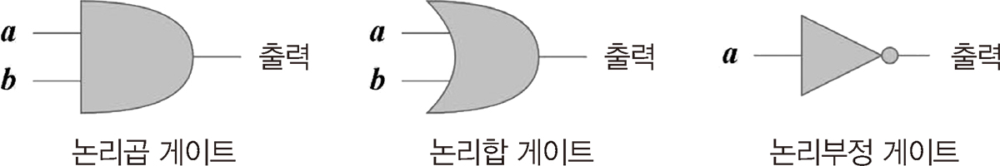
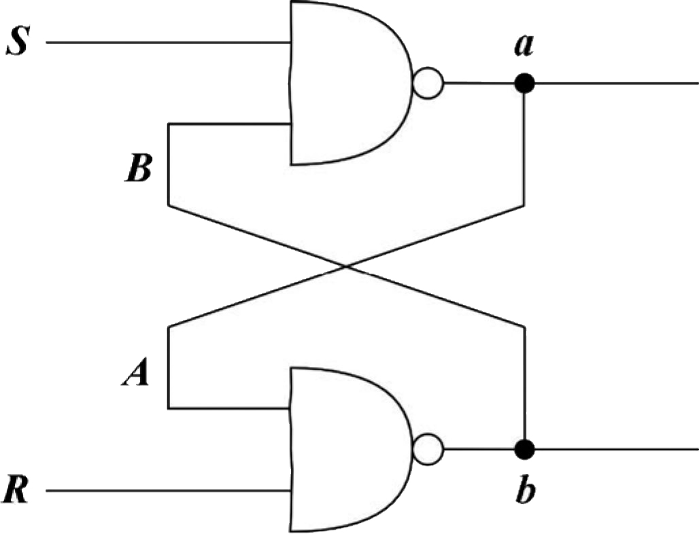
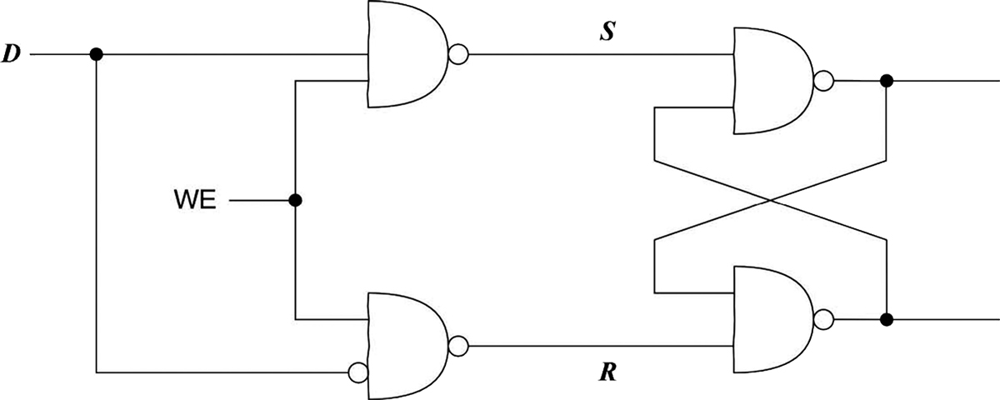
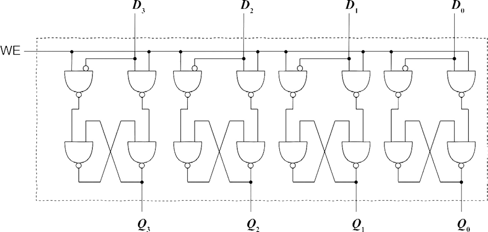

# 4.1 이 작은 장난감을 CPU라고 부른다

## 4.1.1 위대한 발명

**트랜지스터(transistor)**

- 한쪽에 전류를 흘리면 나머지 단자 두 개에 전류가 흐르게 할 수도 있고 흐르지 못하게 할 수도 있다.
- 그 본질은 스위치와 동일

## 4.1.2 논리곱, 논리합, 논리부정

 

**논리곱 게이트(logical conjunction gate)**

- 동시에 켜져야 전류가 흐르고 등이 켜짐

**논리합 게이트(logical disjunction gate)**

- 둘 중 하나라도 켜져 있으면 전류가 흐를 수 있고 등이 켜짐

**논리부정 게이트(logical negation gate)**

- 스위치를 닫으면 전류가 흘러 등이 켜짐
- 스위치를 열면 전류가 흐르지 않고 등이 꺼짐

## 4.1.3 도는 하나를 낳고, 하나는 둘을 낳고, 둘은 셋을 낳으며, 셋은 만물을 낳는다

> 세 종류의 게이트로 모든 논리 함수 표현 가능
> = **논리적 완전성**

## 4.1.4 연산 능력은 어디에서 나올까?

**2진법 계산**

- 0 + 1의 결과는 1이며, 자리 올림수는 0입니다.
- 1 + 0의 결과는 1이며, 자리 올림수는 0입니다.
- 1 + 1의 결과는 0이며, 자리 올림수는 1입니다

**배타적 논리합(exclusive OR)**

- 논리곱 게이트 한 개와 배타적 논리합 게이트 한 개를 조합
  = 가산기

**산술 논리 장치 ALU(Arithmetic Logic Unit)**

- CPU에는 전문적으로 계산을 담당하는 모듈

## 4.1.5 신기한 기억 능력

> 회로가 어떻게 정보를 저장할 수 있을까?

**부정 논리곱 게이트(non-conjunction gate)**
 

- 논리곱 게이트, 논리부정 게이트를 조합
- 논리곱 연산을 처리한 후 논리부정 연산
- 첫 번째 부정 논리곱 게이트의 출력은 다른 부정 논리곱 게이트의 입력
- 상태
  - 단자 a가 1이면, B = 0, A = 1, b = 0입니다.
  - 단자 a가 0이면, B = 1, A = 0, b = 1입니다.
  - S 단자를 0으로 설정하면(R 단자는 여전히 1) 회로의 출력 값인 단자 a는 항상 1
  - R 단자를 0으로 설정하면(S 단자는 여전히 1) 회로의 출력 값인 단자 a는 항상 0

 

- WE(Write Enable) 단자는 저장 여부를 선택하는 데 사용
- D 단자가 0이면 전체 회로가 저장하는 것은 0이며, 그렇지 않으면 1

## 4.1.6 레지스터와 메모리의 탄생

**레지스터**

 

- 주소 지정(addressing) 기능을 제공
- 8비트를 1바이트로 규정하고 각각의 바이트가 자신의 번호를 부여 받는다.
- 전원이 연결되어 있는 한 이 회로는 정보를 저장할 수 있지만, 전원이 끊기면 저장된 정보는 모두 사라진다.

## 4.1.7 하드웨어 아니면 소프트웨어? 범용 장치

**범용 연산 장치**

- 모든 연산 논리를 반드시 회로 같은 하드웨어로 구현할 필요는 없다.
- 하드웨어는 가장 기본적인 기능만 제공
- 모든 연산 논리는 이런 가장 기본적인 기능을 이용하여 소프트웨어로 표현

## 4.1.8 하드웨어의 기본 기술: 기계 명령

**기계 명령어**

- 무엇을 해야 하는지 알려주는 것
- 조합 회로를 이용하여 실행
- 문제: 기계 명령어가 매우 많다는 것

=> CPU는 덧셈 연산의 연산 능력만 제공하고, 프로그래머가 피연산자를 제공하면 된다.

## 4.1.9 소프트웨어와 하드웨어 간 인터페이스: 명령어 집합

**명령어 집합**

- CPU가 실행할 수 있는 명령어(opcode)와 각 명령어에 필요한 피연산자(operand)를 묶은 것
- 고급 언어로 작성한 프로그램이 명령어로 변환된 후 CPU에서 하나씩 실행
- 소프트웨어와 하드웨어가 만나는 곳 = 서로 통신하는 인터페이스
- 컴파일러 필요
  - 고급 프로그래밍 언어를 기계 명령어로 변환하는 도구가 필요

## 4.1.10 회로에는 지휘자가 필요하다

**클럭 신호(clock signal)**

- 전압을 변경할 때마다 전체 회로의 각 레지스터, 즉 전체 회로 상태가 갱신됩

**클럭 주파수(clock rate)**

- 1초에 얼마나 많은 작업을 할 수 있는가

## 4.1.11 큰일을 해냈다, CPU가 탄생했다!

**중앙 처리 장치(central processing unit) 또는 프로세서(processor) 구성**

- 계산이 가능한 산술 논리 장치
- 정보를 저장할 수 있는 레지스터
- 작업을 함께하도록 제어해 주는 클럭 신호
