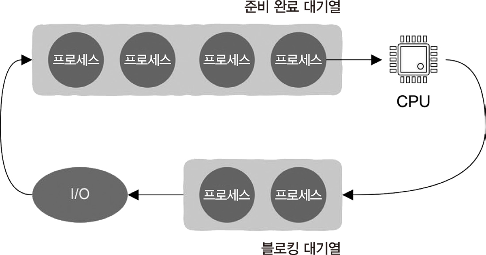

# 4.2 CPU는 유휴 상태일 때 무엇을 할까?

## 4.2.1 컴퓨터의 CPU 사용률은 얼마인가?

> 대부분 CPU의 사용률은 7~8% 정도로 매우 낮다. 프로세스는 특정 이벤트가 발생하여 자신을 깨우기를 기다리고 있다.

## 4.2.2 프로세스 관리와 스케줄링

**기존 개념**
프로그램이 메모리에서 실행되면 프로세스 형태로 존재 -> 프로세스가 생성되면 운영 체제가 관리하고 스케줄링

 

- 프로세스도 운영 체제의 대기열로 관리
- 프로세스에 우선순위를 할당하고, 우선순위에 따라 스케줄러(scheduler)가 스케줄링할 수 있도록 한다.

## 4.2.3 대기열 상태 확인: 더 나은 설계

대기열이 비어 있음
= 현재 운영 체제가 스케줄링해야 하는 프로세스가 없고, CPU가 유휴 상태임

**유후 작업**

- 대기열을 가득 채워 스케줄러가 대기열에서 항상 실행할 수 있는 프로세스를 찾을 수 있도록 함 (like. 감지사 노드)
- 윈도우의 ‘System Idle Process’
- 스케줄링 가능한 프로세스가 없을 때 스케줄러는 이 유휴 프로세스를 꺼내서 실행
- 항상 준비 완료 상태에 있으며 우선순위는 가장 낮음

## 4.2.4 모든 것은 CPU로 돌아온다

**halt 명령어**

- CPU 내부의 일부 모듈을 절전 상태로 전환하여 전력 소비를 크게 줄인다.
- 실행을 위해 순환에 배치
- 가급적 절전 상태를 유지하는 것이 목적
- 커널 상태에서 CPU로만 실행될 수 있다.

> 프로세스 일시 중지(suspend)와 halt 명령어를 혼동하지 않도록 유의

## 4.2.5 유휴 프로세스와 CPU의 저전력 상태

> halt 명령어 실행 시 저전력 상태로 진입

- 커널은 시스템 유휴 시간을 예측하고 이에 따라 어떤 수면 상태로 진입할지 결정
  - 깊은 수면(deep sleep) 상태(C3)
  - 더 깊은 수면(deeper sleep) 상태(C4) 등

## 4.2.6 무한 순환 탈출: 인터럽트

**타이머 인터럽트(timer interrupt)**

- 운영 체제는 일정 시간마다 생성
- CPU는 인터럽트 신호를 감지
- 운영 체제 내부의 인터럽트 처리 프로그램을 실행
- 인터럽트 처리 함수에서는 프로세스가 실행될 준비가 되었는지 판단
- 중단되었던 프로세스를 계속 실행합
- 준비되어 있지 않았다면 프로세스를 일시 중지시키고, 스케줄러는 준비 완료 상태인 다른 프로세스를 스케줄링
