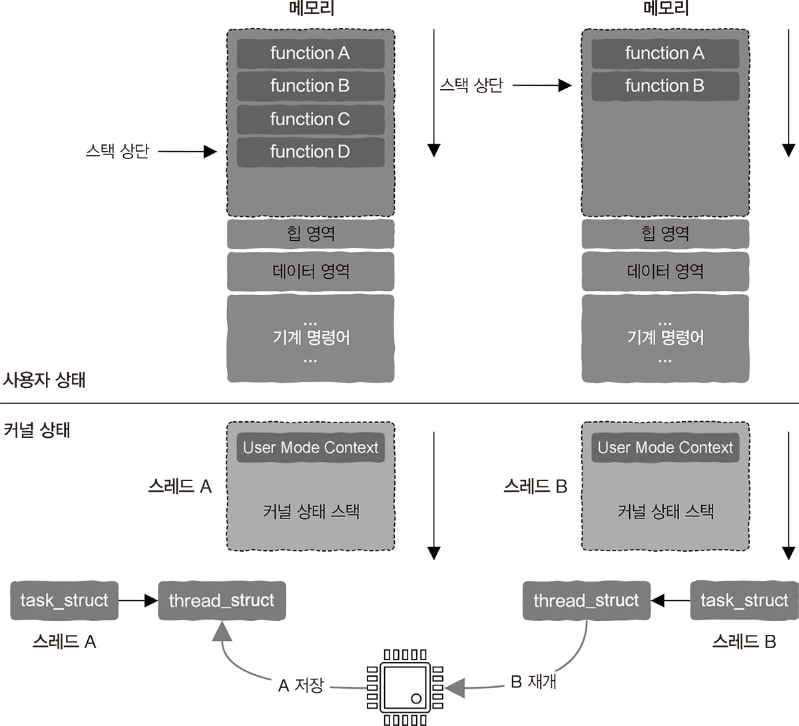

# 4.9 CPU, 스택과 함수 호출, 시스템 호출, 스레드 전환, 인터럽트 처리 통달하기

## 4.9.1 레지스터

- 사용이유: 속도
- CPU가 메모리에 접근하는 속도는 레지스터에 접근하는 속도의 대략 100분의 1 정도
- 읽기와 쓰기 속도가 훨씬 빠르고 제조 비용도 훨씬 비쌈 => 한계 有

## 4.9.2 스택 포인터

**스택 포인터(stack pointer)**

- 스택의 가장 중요한 정보: 스택 상단(stack top)
- 스택 하단(stack bottom)을 가리킴
- 스택 상단 정보가 저장됨

**스택 프레임(stack frame)**

- 함수에 정의된 로컬 변수와 전달된 매개변수 등을 저장하는 독립적인 메모리 공간
- 함수 호출 단계가 깊어질수록 스택 프레임 수도 증가
- 완료되면 함수 호출의 반대 순서로 스택 프레임 수가 줄어듦

## 4.9.3 명령어 주소 레지스터

**프로그램 카운터(PC, program counter)**

- 실행할 명령어를 가리키는 포인터
- x_86: 명령어 포인터(IP, instruction pointer)

**CPU 명령어 실행**

- 프로그램이 실행되면 첫 번째로 실행할 기계 명령어의 주소가 PC 레지스터에 저장
- CPU는 이 PC 레지스터에 저장되어 있는 주소에 따라 메모리에서 명령어를 가져와 실행
- 일반적으로, 명령어는 순차적으로 실행
  - PC 레지스터 값은 순차적으로 증가
- 제어 이전과 관련된 명령어 (순차 실행 X)
  - 새로운 명령어 주소를 PC 레지스터에 저장

## 4.9.4 상태 레지스터

**상태 레지스터(status register)**

- 상태 정보를 저장
- x_86: FLAGS 레지스터
- ARM: 응용 프로그램 상태 레지스터(application program status register)

**상태 정보**

- 산술 연산: 자리 올림수(carry), 넘침(overflow)...
- CPU 동작 상태: 사용자 / 커널
  - CPU가 현재 어떤 상태에서 동작 중인지 표시하는 특정한 비트
  - 값을 바꿔 CPU가 사용자 상태와 커널 상태 사이를 전환

## 4.9.5 상황 정보

**상황 정보**

- 현시점에 레지스터에 저장된 모든 정보
- 프로그램의 실행 시 상황 정보를 가져오고 저장

-> 언제든지 프로그램의 실행을 일시 중지

-> 언제든지 프로그램의 실행을 재개

**상황 정보를 저장/복원 하는 이유**

- CPU가 엄격한 오름차순(ascending order)으로 기계 명령어를 실행하지 않기 때문
- 4가지 상황
  - 함수 호출
  - 시스템 호출
  - 스레드 전환
  - 인터럽트 처리
  - 상황 정보의 저장과 복원을 기반으로 구현됨

## 4.9.6 중첩과 스택

- 작업들은 모두 중첩된 구조 -> 처리를 위해 **스택** 탄생
- 스택은 일종의 구조(mechanism) -> 소프트/하드웨어로 구현 가능. 상관 X

## 4.9.7 함수 호출과 실행 시간 스택

 

**플로우**

1. 함수 A가 함수 B를 호출
2. 실행 시 정보는 함수 A의 스택 프레임에 저장
3. CPU가 호출된 함수의 첫 번째 기계 명령어로 점프
4. 함수 B의 실행이 완료되면 스택 프레임 정보를 기반으로 함수 A의 실행이 재개 (= 다시 점프)

## 4.9.8 시스템 호출과 커널 상태 스택

- 디스크 파일을 읽고 쓰거나 새로운 스레드를 생성 -> 운영 체제가 스레드 생성
- 응용 프로그램 -> 시스템 호출(system call)을 통해 운영 체제에 서비스 요청

**커널 상태 스택(kernel mode stack)**

- 운영 체제 system call을 받아 요청을 처리하는 _함수_ 를 호출
- 운영 체제가 시스템 호출을 완료하는 데 필요한 실행 시간 스택
- 사용자 상태 스레드는 커널 상태에 대응하는 커널 상태 스택을 가지고 있음

 

**플로우**

1. 사용자 스레드가 운영 체제에 서비스 요청
2. 시스테 호출이 특정 기계 명령어에 대응해 명령어를 실행하려 함
3. 사용자 상태 -> 커널 상태
4. 커널 상태에서 사용자 상태 스레드에 대응하는 커널 상태 스택을 찾음

- 사용자 상태 스레드의 레지스터 정보와 같은 실행 상황 정보는 커널 상태 스택에 저장되는 것에 유의

5. 대응하는 커널 코드를 실행해 시스템 호출 요청 처리

- 함수의 호출과 반환에 따라 그 크기가 증가하고 감소

6. 호출 완료 후, 커널 상태 스택에 저장된 사용자 상태 프로그램의 상황 정보에 따라 CPU 상태가 복원
7. 커널 상태-> 사용자 상태

## 4.9.9 인터럽트와 인터럽트 함수 스택

**인터럽트**

- CPU의 실행 흐름을 끊고 특정 인터럽트 처리 함수로 점프 -> 실행이 완료되면 원래 위치로 다시 점프
- 인터럽트 처리 함수도 실행 시간 스택이 있음

**인터럽트 처리 함수의 실행 시간 스택**

1. 자체적인 실행 시간 스택이 없는 경우

- 커널 상태 스택을 이용하여 인터럽트 처리를 실행

2. 자체적인 실행 시간 스택이 있는 경우

- 인터럽트 처리 함수(ISR, interrupt service routine) 스택
- 모든 CPU가 자신만의 인터럽트 처리 함수 스택을 가짐

**인터럽트 처리 함수**

- 인터럽트 처리가 외부 장치로 실행됨 (시스템 콜은 상태 프로그램이 직접 실행)

 

**플로우**

1. 기계 명령어를 실행할 때 인터럽트가 발생
2. 사용자 상태 -> 커널 상태
3. 사용자 상태 스레드에서 대응하는 커널 상태 스택을 찾아 커널 상태 스택에 사용자 상태 스레드의 실행 상황 정보를 저장
4. CPU가 인터럽트 처리 함수의 시작 주소로 점프
5. 실행 완료 -> 커널 상태 스택에 저장된 상황 정보에 따라 CPU 상태 복원
6. 커널 상태-> 사용자 상태

## 4.9.10 스레드 전환과 커널 상태 스택

**인터럽트 처리 프로그램(timer interrupt handler)**
- 스레드에 할당된 CPU 시간 조각(time slice)이 전부 사용되었는지 판단
- 남아 있다면 사용자 상태로 돌아가 실행을 계속
- 모두 사용했다면 다른 스레드에 할당

 

**스레드 전환**
1. 주소 공간 전환
  - 스레드가 서로 다른 프로세스에 속해 있을 수 있음
  - 서로 다른 프로세스의 주소 공간은 다름
2. CPU를 스레드 A에서 스레드 B로 전환
  - 스레드 A의 CPU 상황 정보를 저장하고 스레드 B의 CPU 상황 정보를 복원하는 것을 포함

**프로세스 서술자(process descriptor)**
- task_struct 구조체
- 그 안의 thread_struct 구조체에 CPU 상황 정보 저장
- 스레드에 대한 CPU 상황 정보는 스레드 각각의 서술자에 저장

# 4.10 요약
