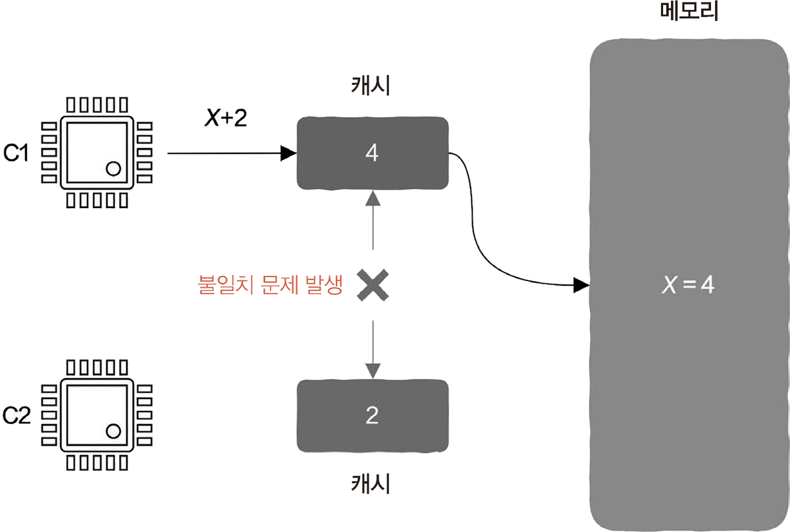
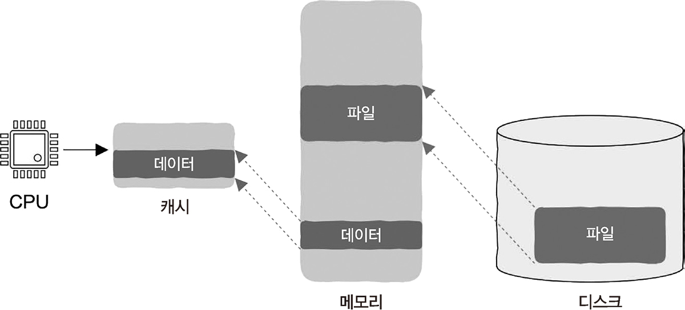
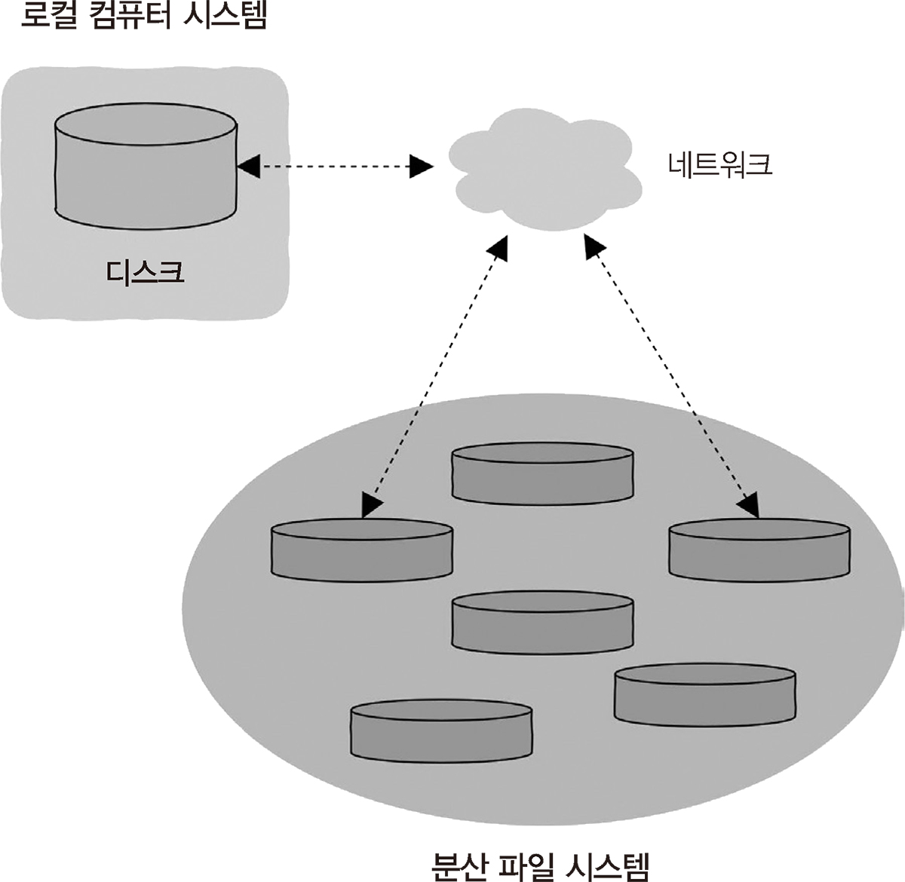

# 5-1. 캐시, 어디에나 존재하는 것

폰 노이만 구조에서는 기계 명령어와 명령어에서 사용하는 데이터가 메모리에 저장되어 있어야 한다.

CPU가 기계 명령어를 실행할 때 먼저 명령어를 메모리에서 읽어야 한다.

## 5.1.1~2 CPU와 메모리의 속도 차이 & 도서관, 책상, 캐시

> CPU는 메모리보다 약 100배 빠르다.

**캐시**
- 최신 CPU는 메모리 사이에 캐시 계층이 추가되어 있다.
- 캐시는 가격이 비싸고 용량이 제한적이지만, 속도는 CPU와 맞먹는다.
- 메모리에서 얻은 데이터가 저장된다.
- CPU는 메모리보다 캐시에 먼저 가서 내용을 찾는다.
- 캐시가 적중하면 (Cache Hit) CPU 명령어 실행 속도를 크게 끌어올릴 수 있다.

**캐시 계층**
- L1 ~ L3까지 있으며, 접근 속도는 각각 4 / 10/ 50 클럭 주기가 소요된다.
  - 캐시 단게에 따라 접근 속도는 낮아지지만 용량은 증가한다.
  - CPU는 이 순서대로 캐시를 살펴보고 없으면 메모리에 접근한다.
- 캐시와 CPU 코어는 레지스터 칩 내에 묶여 패키징 되어있다.
- CPU 칩에서 상당 부분의 공간은 캐시가 차지하고 있다.

## 5.1.3 공짜 점심은 없다: 캐시 갱신

> 캐시 데이터와 메모리 데이터의 불일치(inconsistent) 문제가 발생한다.

**연속 기입 (write-through)**
- 캐시를 갱신할 때 메모리도 함께 갱신하는 방법이다. > 캐시를 업데이트 하면 메모리에 접근한다.
- 메모리가 갱신될 때까지 대기한다. > 동기식 설계 방법

**후기입(write-back)**
- CPU가 메모리에 기록할 때는 캐시를 직접 갱신한다.
- 메모리가 갱신이 완료되기를 기다릴 필요는 없다.
- 캐시의 갱신과 메모리의 갱신이 분리해서 진행한다.
- 연속 기입보다 복잡하지만 성능이 좋다.

## 5.1.4 세상에 공짜 저녁은 없다: 다중 코어 캐시의 일관성

> 다중 코어를 사용하면서 어려움이 시작되었다.

**문제**
- CPU 코어가 여러 개라면 코어에서는 서로 다른 스레드가 실행된다.
- 여러 개의 코어가 각각의 캐시에 어떤 한 데이터의 복사본을 가지고 있다면?
- 해당 데이터를 수정했을 시 불일치가 발생할 수 있다.

 

> 다만 최신 CPU에는 고전적인 MESI 규칙 같은, 다중 코어 캐시의 일관성을 유지하는 규칙이 있다.

> 해당 페이지에서는 신경쓸 게 늘어났다 정도로 생각하기

## 5.1.5 메모리를 디스크의 캐시로 활용하기

> 디스크 탐색 속도는 메모리 접근 속도 보다 10만배 정도 느리다.

> 메모리는 디스크의 캐시와 같은 기능을 하게 된다.

**왜? 어떻게?**
- 디스크의 접근 속도는 매우 느리기 때문이다.
- 메모리의 여유 공간을 디스크의 캐시로 활용한다.
  - 다음에 파일에 접근할 때 디스크를 이용한 입출력 과정을 거칠 필요가 없다.
  - 페이지 캐시 기본 원리에 해당한다.

**캐시 갱신 문제**
- 파일을 기록할 때 메모리 내 캐시에 기록만 하고 반환 > 파일의 최신 데이터가 디스크에 갱신이 안 되었을 때 발생한다.
- 데이터의 유실을 막기 위해 입출력 라이브러리는 동기화(sync), 캐시 비우기(flush) 함수를 제공한다.

 

**디스크를 메모리로 대체**
- 서버에서는 최근 메모리가 디스크를 대체하고 있다.
- 하지만 메모리에는 영구적으로 저장할 수 있는 기능이 없다.
- 메모리 용량 때문에 디스크에 의존해야 했던 서비스는 대체 되는 중이다.

## 5.1.6 가상 메모리와 디스크

> 모든 프로세스가 표준 크기의 자체적인 주소를 가지고 있고, 이 공간의 크기는 물리 메모리와는 관계가 없어 물리 메모리 크기를 초과할 수 있다.

**디스크의 역할**
- 메모리의 창고 역할을 한다.
- 자주 사용되지 않은 메모리 데이터를 디스크에 기록 & 데이터가 차지하던 물리 메모리 공간을 해제한다.

## 5.1.7 CPU는 어떻게 메모리를 읽을까?

> CPU가 보는 것은 가상 메모리 주소이기 때문에 실제 물리 메모리 주소로 변환되어야 한다.

1. 가상 메모리 주소 > 실제 메모리 주소로 변환한다.
2. 캐시를 검색한다. L1 > L2 > L3 순서로 검색한다. 어떤 계층에서든 찾았다면 직접 반환한다.
3. 메모리에 접근해서 데이터를 찾는다.
4. 메모리에 없다면 디스크의 프로세스 데이터를 메모리에 다시 적재한다.
5. 3~4번을 반복한다.

## 5.1.8 분산 저장 지원

> 데이터가 많아짐에 따라 여러 대의 장치를 사용하게 됐다. = distributed file system

**분산 파일 시스템**
- 사용자 장치에 분산 파일 시스템을 직접 장착할 수 있다.
- 로컬 디스크(예를 들어 C, D Drive)에 원격 분산 파일 시스템에서 전송된 파일을 저장한다.
- 다음부터는 네트워크를 통해 가져오지 않고 로컬 디스크에 직접 접근해서 사용한다.
  - 로컬 디스크를 원격 분산 파일 시스템의 캐시로 간주할 수 있다.

 

**응답 속도를 더 높이고 싶다면?**
- 원격 분산 파일 시스템 데이터를 data stream 형태로 직접 로컬 컴퓨터 시스템의 메모리로 끌어온다.
- 이 경우 메모리를 캐시로 간주할 수 있다.

## 마무리
> 저장 체계의 각 계층이 다음 게층에 대한 캐시 역할을 한다.

> 각 계층의 저장 용량은 반드시 다음 계층보다 작아야 한다. 아니면 바로 그곳에 저장하면 되기 때문에 캐시의 의미가 없다.

> 전체 저장 체계가 최대 성능을 발휘하려면 프로그램이 캐시 친화적이어야 한다. > 다음 장에 게속