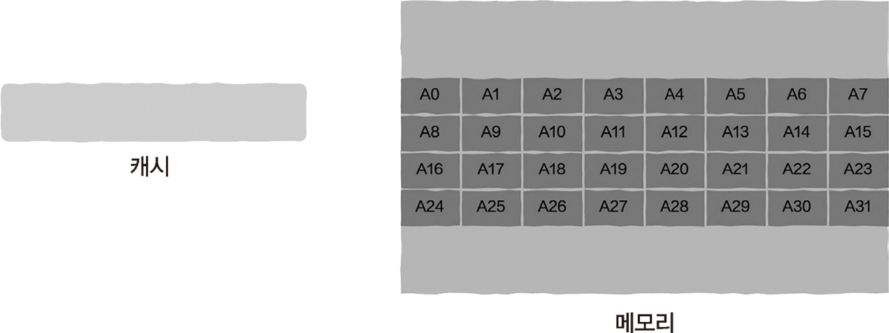

# 5.2 어떻게 캐시 친화적인 프로그램을 작성할까?

> 캐시 친화적인 프로그램을 작성하면 캐시 적중률을 향상시킬 수 있다.

## 5.2.1 프로그램 지역성의 원칙

> 프로그램 지역성의 원칙(locality of reference or principle of locality)의 본질은 프로그램이 ‘매우 규칙적으로’ 메모리에 접근한다는 것

**시간적 지역성(temporal locality)**
- 프로그램이 메모리 조각에 접근하고 나서 이 조각을 여러 번 참조하는 경우
- 캐시 친화성이 매우 높다.

**공간적 지역성(spatial locality)**
- 프로그램이 메모리 조각을 참조할 때는 인접한 메모리도 참조할 수 있다.
- 이 역시 캐시 친화적이다.
- 캐시를 적재할 때 일반적으로 인접 데이터도 함께 캐시에 저장되기 때문이다.

## 5.2.2 메모리 풀 사용

**malloc으로 메모리를 동적으로 할당 받을 때 문제점**
- 비교적 복잡한 과정에 속한다.
- 프로그램이 메모리에서 조각을 N개 할당받아야 하는 경우, 메모리 조각 N개가 힙 영역의 이곳저곳에 흩어져 있을 가능성이 높기 때문에 *공간적 지역성이 그다지 좋지 않다.*

**메모리 풀 사용**
- 메모리 풀 기술은 일반적으로 고성능 요구 사항이 있을 때만 사용된다.
- 커다란 메모리 조각을 미리 할당받으며, 이후에는 메모리를 요청하거나 해제할 때 더 이상 malloc을 거치지 않는다. => 따라서 malloc에 따라오는 부담이 없다.
- 메모리 풀을 초기화할 때 일반적으로 연속적인 메모리 공간을 할당받는다. => 공간적 지역성이 우수하며, 캐시 친화적

## 5.2.3 struct 구조체 재배치

> 예. 연결 리스트에 특정 조건을 만족하는 노드가 있는지 판단하고자 한다.

```
bool find(struct List* list, int target)
{
    while (list)
    {
        if(list->value == target)
        {
            return true;
        }

        list = list->next;
    }

    return false;
}
```
연결 리스트를 순회하면서 연결 리스트 값을 차례로 살펴보는 코드이다.

```c
#define SIZE 100000

struct List
{
    List* next;
    int arr[SIZE];
    int value;
};
```
- 빈번하게 사용되는 항목은 next 포인터와 value 값
- 배열 arr는 전혀 사용되지 않는다.
- 현재 문제점: next 포인터와 value 값이 배열 arr에 의해 멀리 떨어져 있기 때문에 공간적 지역성이 나빠질 수 있다.

```c
// 수정본

struct List
{
    List* next;
    int value;
    int arr[SIZE];
};
```
- next 포인터와 value 값이 서로 인접하게 수정한다.
- 공간적 지역성 원리로 구조체의 형태를 최적화하는 방법 중 하나이다.


## 5.2.4 핫 데이터와 콜드 데이터의 분리

> 예. 5.2.3의 예시 상황과 동일하다.

> 일반적으로 연결 리스트에 노드가 하나뿐인 경우는 거의 없으며, 노드가 비교적 많을 때는 연결 리스트에 접근할 때 캐시해야 하는 노드도 비교적 많아진다. 하지만 캐시 용량은 제한되어 있다.

→ 연결 리스트 자체가 차지하는 저장 공간이 클 수록 캐시 저장 가능 노드는 줄어든다.

→ 배열 arr를 다른 구조체에 넣고 List 구조체 안에 이 구조체를 가리키는 포인터를 추가


```c
struct List
{
    List* next;
    int value;
    struct Arr* arr;
};

struct Arr
{
    int arr[SIZE];
};
```
- List 구조체 크기는 크게 줄어들고 캐시는 더 많은 노드를 저장 가능하다.

> 접근 빈도에 따라서 cold/hot이 나눠진다.

- cold data: 배열 arr
- hot data: 포인터 next, 값 value
- cold/hot 분리 시 더 나은 지역성을 얻을 수 있다.


## 5.2.5 캐시 친화적인 데이터 구조

> 지역성 원칙 관점에서는 배열이 연결 리스트보다 낫다.

> 단, 여기에서 언급하는 장단점은 캐시 친화적인가 아닌가에만 해당한다.

-  배열은 하나의 연속된 메모리 공간에 할당되지만, 연결 리스트는 일반적으로 이곳저곳에 흩어져 있을 수 있기 때문.
- 연속된 메모리는 공간적 지역성이 더 좋고 캐시 친화적이다.

> 연결 리스트를 캐시 친화적으로 만들고 싶다면?

- 연결 리스트를 생성할 때, 직접 정의한 메모리 풀에서 메모리를 요청하기

## 5.2.6 다차원 배열 순회

> 예. 2차원 배열을 합산하는 경우를 가정한다.

- 배열을 행(row)과 열(column) 순서로 순회하면서 값을 모두 더한다.
- C언어는 행 우선 방식으로 배열을 저장한다.
- 행 = 4, 열 = 8, 캐시는 최대 4개의 int 데이터 저장 가능

<br>

**행 우선 방식**

```c
int matrix_summer(int A[M][N])
{
    int i, j, sum = 0;

    for (i = 0; i < M; i++)
    {
        for (j = 0; j < N; j++)
        {
            sum += A[i][j];
        }
    }

    return sum;
}
```
- 순회가 시작되면 캐시에 아직 배열에 대한 데이터가 없기 때문에 캐시는 비어 있다.
  - 처음 접근할 때는 캐시가 적중할 수 없다.
  - A0~3까지 4개가 캐시에 저장된다.
- A1~3은 캐시에 저장이 되어 있어 적중된다.
- A4에 접근하면 캐시 적중에 실패한다.
  - A4~7을 이전 캐시 데이터와 교체한다.
- 이를 반복한다.

> 총 32개 중 8개가 적중하지 못했기 때문에, 캐시 적중률 = 75%

**열 우선 방식**
```c
int matrix_summer(int A[M][N])
{
    int i, j, sum = 0;

    for (j = 0; j < N; j++)
    {
        for (i = 0; i < M; i++)
        {
            sum += A[i][j];
        }
    }

    return sum;
}
```
- 첫 번째 요소에 접근할 때는 캐시에 적중할 수 없다.
  - A0~3까지 4개가 캐시에 저장된다.
- 다음 접근할 요소는 A8이기 때문에 여전히 캐시에 적중할 수 없다.
  - A8부터 A11까지 요소로 교체한다. => 이전 작업을 그냥 버린다.
- 계속 반복된다.

> 매번 적중에 실패, 캐시 적중률 = 0%

> 반드시 성능 분석 도구를 사용하여 캐시 적중률이 시스템 성능의 병목이 되는지 판단해야 한다. 병목이 되지 않는다면 굳이 여기에서 언급한 원칙을 너무 신경 쓸 필요가 없다.