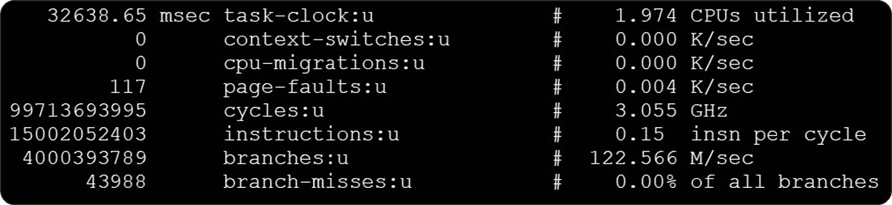
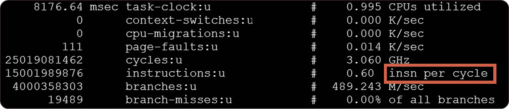

# 5.3 다중 스레드 성능 방해자
## 5.3.1 캐시와 메모리 상호 작용의 기본 단위: 캐시 라인

**캐시 라인(cache line) = 묶음 데이터**
- 인접한 데이터에 접근할 가능성이 높으므로, 해당 데이터의 있는 곳의 묶음 데이터를 캐시에 저장한다.
- 일반적으로 64바이트 크기
- 캐시가 적중하지 못했을 때 캐시에 저장된다.

## 5.3.2 첫 번째 성능 방해자: 캐시 튕김 문제

```c
atomic<int> a;

void threadf()
{
    for (int i = 0; i < 500000000; i++)
    {
        ++a;
    }
}

void run()
{
    thread t1 = thread(threadf);
    thread t2 = thread(threadf);

    t1.join();
    t2.join();
}
```
2개의 스레드를 시작하며, 각각의 스레드는 전역변수 a 값을 1씩 5억 번 증가시킨다.

```c
atomic<int> a;

void run()
{
    for (int i = 0; i < 1000000000; i++)
    {
        ++a;
    }
}
```
단일 스레드로, 전역 변수 a 값을 1씩 10억 번 증가시킨다.

> 병렬 계산임에도 다중 스레드보다 단일 스레드가 더 빨랐다. 이유는? → 리눅스 perf 도구를 사용해서 분석하기

<br>

<br>

`insn per cycle`하나의 클럭 주기에 CPU가 실행하는 프로그램에서 기계 명령어를 몇 개 실행됐는지 알려준다.

단일 스레드에서 a 변수를 원자적 변수가 아닌 일반 int 형으로 정의하면 실행 시간은 더욱 빨라진다.

<br>

1. 예제처럼 동일한 변수가 모두 사용되면 캐시 일관성을 보장하기 위해 두 코어의 캐시에 모두 저장된다.
2. 연산을 실행한다면 다른 CPU의 캐시의 변수를 무효화해야한다. → *캐시 튕김* 이 발생
3. C2는 캐시가 무효화되어 있기 때문에 어쩔 수 없이 메모리에서 직접 a 변수 값을 읽어야 한다.
4. 또다시 2번의 반대 방향으로 캐시를 무효화해야 한다. → *캐시 튕김* 이 발생
5. 빈번하게 캐시 일관성을 유지해 캐시가 자신의 역할을 하지 못할 뿐만 아니라 프로그램 성능까지 저하된다.

> 이런 문제를 캐시 튕김(cache line bouncing) 또는 캐시 핑퐁(cache ping-pong)이라고 한다.

> 캐시를 유지하는 데 드는 부담과 메모리에서 매번 새로 데이터를 읽어 오는 부담이 전체 흐름을 방해할 만큼 매우 커서 성능이 떨어지게 된다.

## 5.3.3 두 번째 성능 방해자: 거짓 공유 문제

```c
struct data
{
    int a;
    int b;
};

struct data global_data;
```
데이터 구조체 data를 통해 전역 변수를 정의한다.

```c
void add_a()
{
    for (int i = 0; i < 500000000; i++)
    {
        ++global_data.a;
    }
}

void add_b()
{
    for (int i = 0; i < 500000000; i++)
    {
        ++global_data.b;
    }
}

void run()
{
    thread t1 = thread(add_a);
    thread t2 = thread(add_b);

    t1.join();
    t2.join();
}
```
스레드 2개를 시작한 후, 구조체의 a, b 변수를 1씩 각각 5억 번 증가시킨다.

```c
void run()
{
    for (int i = 0; i < 500000000; i++)
    {
        ++global_data.a;
    }
    for (int i = 0; i < 500000000; i++)
    {
        ++global_data.b;
    }
}
```
단일 스레드로 동일하게 a, b 변수를 1씩 5억 번 증가시킨다.

> 두 스레드는 변수를 공유하지 않으므로 앞서 언급한 캐시 튕김 문제가 없을 것이라고 유추할 수 있다. 하지만 여전히 단일 스레드가 더 빨랐다. 이유는?

- 두 스레드는 어떤 변수도 공유하지 않지만, 두 변수가 하나의 캐시 라인을 공유하고 있을 수 있다.
- a 변수에 접근할 때 캐시가 적중하지 않으면, a 변수가 포함된 캐시 라인이 캐시에 저장되는데, 이때 b 변수도 캐시에 함께 저장될 가능성이 매우 높다.

> 이 경우, 거짓 공유(false sharing) 문제가 발생하며 캐시 튕김 문제를 발생시킨다.

**개선 방법**
두 변수 사이에 사용되지 않는 데이터를 채우는 것
```c
struct data
{
    int a;
    int arr[16]; // 보통 캐시 라인은 64 byte다.
    int b;
};
```

다른 변수를 쓴다면 순서를 바꿔도 좋다.
```c
struct data
{
    int a;
    ... // 다른 변수
    int b;
};
```