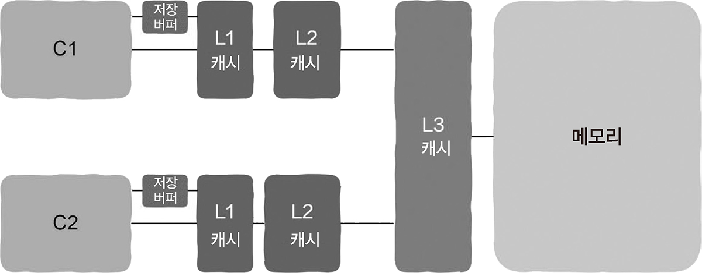
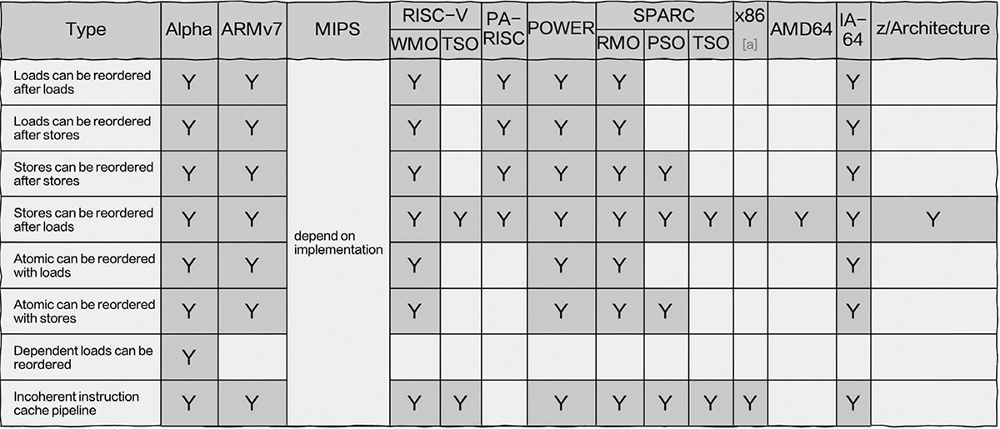

# 5.4 봉화희제후와 메모리 장벽

## 5.4.1 명령어의 비순차적 실행: 컴파일러와 OoOE

> CPU는 반드시 엄격하게 프로그래머가 코드를 작성한 순서대로 기계 명령어를 실행하지 않는다.

**비순차적 실행**
1. 기계 명령어를 생성하는 단계: 컴파일 중에 명령어를 재정렬한다.
2. CPU가 명령어를 실행하는 단계: 실행 중에 명령어가 비순차적으로 실행된다.

=> 컴파일러는 프로그래머가 작성한 코드를 CPU가 실행할 수 있는 기계 명령어로 변환하는 역할을 하는데, 이 때 순서가 변경될 수 있다. (1)

```c
// 예제 코드

int a;
int b;

void main()
{
    a = b + 100;
    b = 200;
}
```
gcc의 기본 컴파일 옵션으로 컴파일한 후 objdump를 사용해 컴파일된 기계 명령어를 확인한다.
```assembly
mov    0x200b54(%rip),%eax  # %eax = b
add    $0x64,%eax           # %eax = %eax + 100
mov    %eax,0x200b4f(%rip)  # a = %eax
movl   $0xc8,0x200b41(%rip) # b = 200
```
-O2 옵션을 주어 컴파일러가 코드를 최적화할 수 있도록 컴파일한다.
```assembly
mov    0x200c4e(%rip),%eax  # %eax = b
movl   $0xc8,0x200c44(%rip) # b = 200
add    $0x64,%eax           # %eax = %eax + 100
mov    %eax,0x200c3f(%rip)  # a = %eax
```
컴파일 하는 동안 명령어가 재정렬된 것을 확인할 수 있다.

```
asm volatile("" ::: "memory");
```
해당 코드를 추가하여 컴파일러에 명령어를 재정렬하지 않도록 지시할 수 있다.

=> CPU가 명령어를 실행할 때도 명령어의 비순차적 실행으로 실행 순서가 변경될 수 있다. (2)

**지금까지의 가정한 CPU 작업 과정 (비효율적)**
1. 기계 명령어(opcode)를 가져온다.
2. 준비 완료 상태라면 명령어는 실행 단계에 들어간다. 준비가 완료되지 않았다면, CPU는 피연산자가 메모리에서 레지스터로 저장될 때까지 기다린다.
3. 준비되었다면 명령어가 실행되기 시작한다.
4. 실행 결과를 다시 기록한다.

**이제부터의 CPU 작업 과정 (효율적)**

> 비순차적 명령어 처리(Out of Order Execution, OoOE)

1. 기계 명령어를 가져온다.
2. 명령어를 대기열(reservation station)에 넣고 명령어에 필요한 피연산자를 읽는다.
3. 명령어는 대기열에서 피연산자의 준비가 완료될 때까지 대기한다. 이때 이미 준비가 완료된 명령어가 먼저 실행 단계에 들어갈 수 있다.
4. 기계 명령어를 실행하면 실행 결과를 대기열에 넣는다.
5. 이전 명령어의 실행 결과가 기록될 때까지 기다렸다가 현재 명령어의 실행 결과를 기록한다. 명령어의 원래 실행 순서에 따라 유효한 결과를 얻기 위한 것이다.

> 이유

- CPU와 메모리 사이의 속도 차이 크다. → 엄격한 순서대로 실행하면 명령어가 의존하는 피연산자를 기다리는 동안 파이프라인 내부에 ‘빈 공간’인 슬롯(slot)이 생긴다.
- 준비 완료된 다른 명령어로 빈 공간을 메꿀 수 있다면, 명령어의 실행 속도를 높일 수 있다.

=> 파이프라인을 최대한 활용할 수 있으며, 명령어가 순서대로 실행된 것과 같은 결과를 얻는다.

> 모든 CPU가 이 기능을 가지고 있지는 않다.


## 5.4.2 캐시도 고려해야 한다

> 어떻게 캐시를 갱신하고 캐시의 일관성을 유지시키느냐는 문제가 발생한다.

비교적 시간을 많이 소모하고, 이 작업 전에 CPU는 반드시 대기 상태를 중지해야 한다. 최적화하기 위해 저장 버퍼(store buffer) 등 대기열을 추가한다. 기록 작업이 있을 때 대기열에 직접 기록하기 때문에 캐시는 즉시 갱신되지 않는다.

> 기록 작업은 비동기 과정이다.

<br>

```c
// a 변수의 초깃값은 0이고 y 변수의 초깃값은 100
a = 1;
b = y;
```
- 코어 A가 `a = 1` 코드 줄을 실행할 때, 1이라는 데이터는 캐시에는 갱신되지 않았지만 저장 버퍼에 있어 갱신을 기다릴 필요 없이 다음 줄인 `b = y`를 실행할 수 있다.
- 코어 B 입장에서는 b 값이 100임을 인지하는 시점에, 캐시와 메모리가 갱신되지 않았기 때문에 a 값은 여전히 초깃값이 0일 가능성이 있다.
- 따라서, 2번째 줄이 먼저, 1번째 줄이 나중에 실행된 것처럼 보일 수 있다.
- 단, 해당 스레드 내부에서는 비순차적 실행을 볼 수 없다. CPU 설계가 이를 보장하기 때문. 따라서 코드를 실행하고 `print(a)`를 하는 경우 올바르게 출력된다.

> 따라서 비순차적 실행은 자기 자신 이외의 또 다른 코어가 해당 코어를 바라볼 때만 나타나는 현상이다.

> 단일 스레드 내에서는 비순차적 실행을 볼 수 없으며, 다른 스레드 역시 해당 공유 데이터에 접근해야만 비순차적 실행을 볼 수 있다. = 단일 스레드 환경에서는 신경 쓸 필요 없다.

**잠금 없는 프로그래밍(lock-free programming)**
- 잠금을 통한 보호를 사용하지 않는 상태에서 다중 스레드의 공유 리소스를 처리
- 잠금이 반드시 필요한 것은 아니며, 잠금이 없어도 공유 리소스에 접근할 수 있다. 비교와 교환(compare-and-swap), CAS 알고리즘 같은 원자성 작업을 사용한다.
- 실행되거나 되지 않는 두 가지 상태만 존재하며, 중간 상태는 존재하지 않는다.


## 5.4.3 네 가지 메모리 장벽 유형

> 메모리 장벽의 목적은 특정 코어를 다른 코어가 보았을 때 언행이 일치하도록 하는 것이다.

> 비순차적 실행(Out-of-Order Execution) = 부정 출발
> 결과가 확정되기도 전에 미리 짐작해서 실행해버린다는 의미

**LoadLoad**
- Load 명령어를 실행할 때 다음에 오는 Load 명령어가 *부정 출발* 형태로 먼저 실행되는 것을 방지

**StoreStore**
- CPU가 Store 명령어를 실행할 때 다음에 오는 Store 명령어가 부정 출발 형태로 먼저 실행되는 것을 방지
- 다른 코어에서 보기에 변수의 갱신 순서와 코드 순서가 일치하게 된다.
- 갱신 순서와 코드 순서가 일치하는 것만 보장하고, 다른 코어가 즉시 최신 값을 확인하는 것은 보장해 주지 않는다.

**LoadStore**
- CPU가 Load 명령어를 실행할 때 다음에 오는 Store 명령어가 부정 출발 형태로 먼저 실행되는 것을 방지
- Load 명령어가 캐시에 적중하지 못하면 일부 CPU에서는 다음에 오는 Store 명령어가 먼저 실행될 수 있다.

**StoreLoad**
- 쓰기 명령어를 실행할 때 CPU가 부정 출발 형식으로 읽기 명령어를 먼저 실행하는 것을 방지
- 4가지 장벽 중에서 가장 무겁다.
- 다른 코어가 해당 장벽 이후에 변수를 읽으면 그 값은 반드시 최신 값이라는 것을 보장할 수 있다.
- 동기 작업이다.

## 5.4.4 획득-해제 의미론

**다중 스레드 프로그래밍에서 발생하는 문제**

1. 공유 데이터에 대한 상호 배타적인 접근
2. 스레드 간 동기화 문제 => 획득-해제 의미론으로 해결

**획득(acquire) 의미론**
- 메모리 읽기 작업에 대한 것
- Load 뒤에 있는 모든 메모리 작업은 이 Load 작업 이전에는 실행 불가능
- LoadLoad와 LoadStore 조합

**해제(release) 의미론**
- 메모리 쓰기 작업에 대한 것
- Store 앞에 있는 모든 메모리 작업은 이 Store 작업 이후에는 실행 불가능
- StoreStore와 LoadStore 조합

> 획득-해제 의미론을 얻기 위해 StoreLoad처럼 매우 무거운 메모리 장벽이 필요하지 않고, 나머지 3종류만 사용하면 된다.

## 5.4.5 C++에서 제공하는 인터페이스

> 이식성이 높은 잠금 없는 프로그래밍을 하고 싶다면 언어 수준에서 제공하는 획득-해제 의미론을 사용해야 한다.

```c++
#include <atomic>

std::atomic_thread_fence(std::memory_order_acquire);
std::atomic_thread_fence(std::memory_order_release);
```
획득-해제 의미론을 얻을 수 있고, 해당 코드는 거의 모든 유형의 CPU에서 정확하게 동작한다.

## 5.4.6 다른 CPU, 다른 천성

> 아키텍처별 명령어 재정렬
<br>

> 모든 유형의 CPU가 StoreLoad 재정렬을 가지고 있다.

**약한 메모리 모델(weak memory model)**
- 거의 모든 유형의 명령어 재정렬을 볼 수 있다.
- Alpha, ARMv7, POWER 등 CPU

**강한 메모리 모델(strong memory model)**
- CPU가 하드웨어 차원에서 명령어의 실행 순서를 상당히 엄격하게 보장해주는 모델
  - x86은 StoreLoad 재정렬 하나만 있다.
  - 자체적인 획득-해제 의미론이 있다

## 5.4.7 누가 명령어 재정렬에 관심을 가져야 하는가: 잠금 없는 프로그래밍

> 잠금 없는 프로그래밍을 해야 할 때만 명령어 재정렬에 신경 쓰면 된다. 공유 변수가 잠금 보호 없이 여러 스레드에서 사용될 때 발생한다.

일반적으로 잠금은 공유 변수를 보호하는 데 사용된다. 잠금을 유지하는 스레드가 운영 체제에 의해 일시 중지된 상황이라면, 잠금이 필요한 모든 다른 스레드 진행이 불가능하다.

하지만, 잠금 없는 프로그래밍은 운영 체제가 어떻게 순서 스케줄링을 하든 스레드 하나는 실행가능하다. 운영 체제가 이런 특징을 가지고 있으면 이를 **잠금 없음(lock-free)** 이라고 한다.

> 잠금을 사용하여 프로그래밍을 할 때 잠금이 명령어 재정렬 문제를 자동으로 처리한다.

잠금은 코드가 임계 영역 외부에서 실행되지 않도록 한다.

## 5.4.8 잠금 프로그래밍과 잠금 없는 프로그래밍

> 잠금을 이용한 프로그래밍의 가장 큰 특징은 잠금을 사용하고 있을 때, 잠금을 요청하는 다른 스레드는 반드시 그 자리에서 대기해야 한다.

> 잠금(lock)

다중 스레드 프로그래밍에서 일반적으로 사용되는 상호 배제(mutual exclusion, mutex)는 공유 리소스를 보호하는 데 사용된다. 동시에 최대 스레드 하나만 뮤텍스를 보유할 수 있으며, 해당 잠금이 사용되면 해당 잠금을 요청하는 다른 스레드는 운영 체제에 의해 대기 상태가 된다. 잠금을 사용한 스레드가 잠금을 해제할 때까지 계속된다.

> 스핀 잠금(spinlock)

잠금이 사용된 후 잠금을 요청하는 스레드는 잠금이 해제되었는지 여부를 계속 확인한다. 잠금을 요청하는 다른 스레드는 운영 체제에 의해 대기 상태로 진입하지 않는다.

> 잠금 없는 프로그래밍

어떤 스레드가 공유 자원을 사용하고 있을 때, 다른 스레드도 해당 공유 자원의 사용이 필요하더라도 대기 상태가 되지 않으며, 순환 대기하지 않는다.

리소스가 사용되는 것을 감지(일반적으로 원자성 작업으로 감지)하면 일단 다른 필요한 작업으로 넘어간다. 잠금 프로그래밍과 잠금 없는 프로그래밍의 가장 큰 차이다.

스레드가 항상 대기 없이 어떤 일을 하도록 하는 것에 가치를 둔다. 실시간 요구 사항이 높은 시스템에는 좋지만, 리소스 경쟁 문제와 ABA 문제를 처리해야 하며 코드 구현이 훨씬 복잡하다.

그러나 매우 간단한 특정 상황에서는 적은 수의 원자적 작업으로 구현 가능하며, 이 경우 잠금 없는 프로그래밍 성능이 더 나을 수 있다.

> 따라서 대부분의 경우, 간단한 잠금 프로그래밍을 선택한다. 잠금으로 보호해야 하는 임계 영역이 너무 커서는 안 되므로 주의해야 하고, 또 경쟁이 치열할 때는 상호 배제(mutex)로 상황 정보 전환 부담 역시 증가할 수 있다는 것을 염두해야 한다.

## 5.4.9 명령어 재정렬에 대한 논쟁

1. 성능을 위해, CPU는 반드시 프로그래머가 코드를 작성한 순서대로 엄격하게 기계 명령어를 실행할 필요가 없다.

2. 프로그램이 단일 스레드인 경우 프로그래머는 명령어의 비순차적 실행을 볼 수 없으므로, 단일 스레드 프로그램은 명령어 재정렬에 신경 쓸 필요가 없다.

3. 메모리 장벽의 목적은 특정 코어가 명령어를 실행하는 순서와 다른 코어에서 보이는 순서가 코드 순서와 일치하도록 만드는 것이다.

4. 멀티 스레드 잠금 없는 프로그래밍을 사용할 필요가 없다면 명령어 재정렬을 걱정할 필요가 없다.

