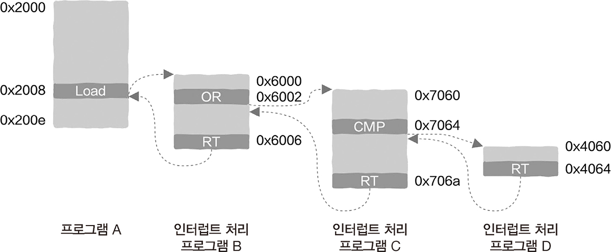

> 상호 작용이란 컴퓨팅 장치의 입력과 출력(input and output, I/O)이다.

> 저수준 계층에서 시작하여 하드웨어에서 소프트웨어 순으로 CPU, 운영 체제, 프로세스와 입출력 관계를 이해해보자.

# 6.1 CPU는 어떻게 입출력 작업을 처리할까?

> 장치에도 자체적인 레지스터인 장치 레지스터(device register)가 있다. 장치는 저수준 계층의 레지스터를 한데 묶은 것.

장치 레지스터는 주로 장치에 관련된 일부 정보를 저장한다.

1. 데이터를 저장하는 레지스터: 예를 들어 사용자가 키보드의 키를 누르면 그 정보는 이런 레지스터에 저장된다.

2. 제어 정보와 상태 정보를 저장하는 레지스터: 레지스터를 읽고 쓰는 작업을 이용하여 장치를 제어하거나 장치 상태를 볼 수 있다.

## 6.1.1 전문적으로 처리하기: 입출력 기계 명령어

> 입출력 구현 방법 첫 번째, 특정 입출력 기계 명령어 사용한다.

CPU처럼, 전문적으로 장치 레지스터를 읽고 쓰는 특정한 기계 명령어가 있다. 이 특정한 기계 명령어를 **입출력 명령어(input and output instruction)** 라고 하고, x86의 IN과 OUT 기계 명령어가 이에 해당한다.

> 어떤 장치 레지스터를 읽고 써야 하는지 어떻게 알 수 있을까?

메모리를 읽고 쓰는 것처럼 간단하게 장치 레지스터도 LOAD, STORE 명령어로 읽고 쓸 수 있을 것 같지만, 실행 시, 메모리인지 장치 레지스터를 읽고 쓰는 것인지 알 수 없다.

## 6.1.2 메모리 사상 입출력

> 입출력 구현 방법 두 번째, 메모리의 읽기와 쓰기 명령어를 함께 사용하지만 주소 공간의 일부분을 장치에 할당한다.

LOAD와 STORE 명령어는 메모리 주소 공간(memory address space)을 전달한다. 메모리 주소 공간과 실제 메모리 주소는 다른 개념이라는 점에 유의하자. 

CPU는 해당 주소의 데이터가 어디에서 오는지 관심을 가질 필요가 없다. 때문에 주소 공간의 일부분을 장치에 할당할 수 있다.

**실행 순서**

> 예. 주소 공간이 8비트일 때 주소 범위는 00000000~11111111 범위에 해당한다. 00000000~11101111 메모리 할당, 11110000~11111111 장치 할당

1. 내부의 하드웨어 논리가 해당 명령어가 전달하는 정보를 감지한다.
2. 주소 0xf2에서 데이터를 읽어오고자 한다.
3. 2진법으로 11110010이므로 입출력 명령어에 해당한다.

주소 공간의 일부분을 장치에 할당하여, 메모리를 읽고 쓰는 것처럼 장치를 제어하는 방법을 **메모리 사상 입출력(memory mapping input and output)** 이라고 한다.

## 6.1.3 CPU가 키보드를 읽고 쓰는 것의 본질

> 키보드는 데이터를 언제 읽어야 할지 어떻게 알 수 있을까?

CPU 동작 규칙과 외부 장치는 매우 다르며, 대다수 장치는 사람이 조작하기 때문에 언제 마우스를 움직이고 키보드를 누를지 알 수 없다. 따라서 CPU는 특정한 방법을 사용하여 장치의 작업 상태를 얻어야 한다.

> => CPU는 장치의 작업 상태를 어떻게 알 수 있을까?

장치 상태 레지스터가 이 역할을 수행한다. 레지스터 값을 읽음으로써 CPU는 장치를 읽을 수 있는지 쓸 수 있는지 알 수 있다.

1. 폴링
2. 인터셉트

## 6.1.4 폴링: 계속 검사하기

작업이 들어오면 바로 진행되며, 들어오지 않은 경우에는 계속 검사를 반복한다. 이 경우 CPU는 항상 불필요하게 순환하며 대기하게 된다.

**폴링(polling)** 은 동기식 설계 방식이고, CPU를 계속 대기하는 것은 비효율적이다. 동기를 비동기로 바꾸는 것이 일반적인 최적화 방법이다.

## 6.1.5 배달 음식 주문과 중단 처리

**인터럽트 처리 과정**
> CPU가 특정 프로세스의 기계 명령어를 실행하고 있을 때 새로운 이벤트가 발생을 가정한다.

1. (가정: 네트워크 카드에 새로운 데이터가 들어오면) 외부 장치가 인터럽트 신호를 보낸다.
2. CPU는 실행 중인 현재 작업의 우선순위가 인터럽트 요청보다 높은지 판단한다.
3. 인터럽트가 더 높다면 현재 작업 실행을 일시 중지하고 인터럽트를 처리한다.
4. 인터럽트 처리를 끝낸 후에 다시 현재 작업으로 돌아온다.

=> 프로그램은 장치에 의해 실행이 중단될 수 있고, 이 과정은 프로그래머에게 드러나지 않는다. 인터럽트 처리와 반환 작동 방식은 운영 체제와 협조하여 프로그램이 중단 없이 실행되고 있는 것처럼 보인다.

## 6.1.6 인터럽트 구동식 입출력

입출력을 비동기로 처리하는 방법이 **인터럽트 구동식 입출력(interrupt driven input and output)** 이다.

인터럽트 방식으로 처리하면, CPU는 다른 유용한 작업을 실행하기 때문에 이는 폴링 방식보다 훨씬 효율적이다. 하지만 약간의 시간이 낭비되는데, 주로 **프로그램의 실행 상태를 저장하고 복원** 하는 데 사용된다.

실행 상태를 저장하고 복원하는 동안은 시스템의 어떤 작업도 계속 진행되지 않지만, 이 두 가지 작업은 프로그램 A가 중단된 후 실행을 다시 시작할 수 있도록 하는 데 반드시 필요하다.

## 6.1.7 CPU는 어떻게 인터럽트 신호를 감지할까?

CPU가 기계 명령어를 실행하는 과정은

1. 명령어 인출(instruction fetch)
2. 명령어 해독(instruction decode)
3. 실행(execute)
4. 다시 쓰기(writeback)

같은 몇 가지 전형적인 단계로 나눌 수 있다. 여기에 CPU가 하드웨어의 인터럽트 신호를 감지하는 단계가 추가되어야 한다.

신호가 감지되는 것은 어떤 하나의 장치에서 CPU 처리가 필요한 이벤트가 나타났음을 의미하는데 이 이벤트를 처리할지 여부를 결정 → 우선순위 문제

인터럽트 신호의 우선순위 등급이 실행 중인 프로그램보다 높으면 인터럽트를 처리해야 한다. 하지만 반대라면 처리하지 않는 걸 선택할 수도 있다.

## 6.1.8 인터럽트 처리와 함수 호출의 차이

인터럽트 처리는 일반 함수의 호출과 비교했을 때 점프와 반환을 포함하고 있다는 점에서 매우 유사하다. 단, 여기에서는 사용자 상태의 함수 호출만을 고려한다.

함수 호출은 *단일 스레드 내부에서만 발생* 하기 때문이고, 동일한 실행 흐름 내에 존재한다. 반면, 인터럽트 처리 점프는 서로 다른 두 실행 흐름을 포함하므로 훨씬 많은 정보를 저장해야 한다.

## 6.1.9 중단된 프로그램의 실행 상태 저장과 복원

> 상태 저장과 복원의 순서에 유의해야 한다.

상태가 먼저 저장될수록 상태 복원은 더 나중에 이루어진다. 스택을 사용해 이를 구현할 수 있으므로, 프로그램 실행 상태를 저장하는 전용 스택을 만들면 된다. 이 스택은 반드시 커널에 있어야 하며, 일반적인 프로그램은 이 스택을 보거나 수정할 수 없다. 따라서 CPU가 커널 상태에 진입했을 때만 이 스택을 사용할 수 있다.

 

프로그램 D의 명령어를 실행 후, 마지막 명령인 RT 명령어(중단된 프로그램으로 다시 점프해서 돌아가는 것) 실행한다. 스택에서 가장 위의 데이터를 pop해서 PC 레지스터와 상응하는 상태 레지스터를 복원한다. → CPU가 프로그램 D의 RT 명령어를 실행하고 나면 PC 레지스터 값이 0x7065가 되며, 이것은 프로그램 C에서 다음에 실행할 명령어에 해당한다. 이렇게 실행하고 돌아가기는 반복한다.