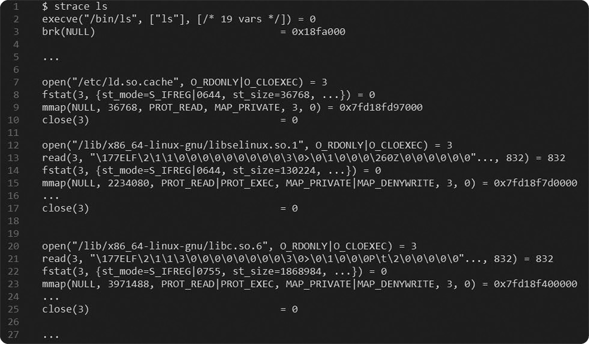

# 6.5 mmap: 메모리 읽기와 쓰기 방식으로 파일 처리하기

> 디스크의 파일을 읽고 쓰는 작업은 사실 매우 번거로운 일이다.

> 디스크에서 특정 주소를 지정(addressing)하는 방법과 메모리에서 특정 주소를 지정하는 방법이 다르고, CPU와 외부 장치 간 속도에 차이가 있기 때문이다.

메모리는 바이트 단위로 직접 주소를 지정할 수 있지만 디스크에 저장된 파일은 불가능하다. 일반적으로 디스크에 저장되는 파일은 조각(block) 밀도에 따라 주소가 지정되고, 조각 크기는 n Byte ~ nn KB로 다를 수 있다.

이외에도 CPU와 디스크의 속도 차이가 너무 커서 디스크의 파일은 반드시 먼저 메모리에 저장한 후 메모리에서 바이트 단위로 파일 내용을 처리한다.

## 6.5.1 파일과 가상 메모리

> 가상 메모리를 이용해서 디스크에 저장된 파일과 메모리를 연관짓는다.

가상 메모리의 목적은 모든 프로세스가 각자 독점적으로 메모리를 소유하고 있다고 생각하게 하는 것이다. 가상 메모리를 지원하는 시스템에서 기계 명령어는 가상 주소를 전달하지만, 가상 주소는 메모리에 도달하기 전에 실제 물리 메모리 주소로 변환된다.

파일은 개념적으로 연속된 디스크 공간에 저장되어 있다고 생각할 수 있으므로 이 공간을 프로세스 주소 공간에 직접 사상할 수 있다.

## 6.5.2 마술사 운영 체제

주소 공간을 읽을 때, 대응하는 파일이 아직 메모리에 적재되지 않아 페이지 누락(page fault) 인터럽트가 하면, CPU가 운영 체제의 인터럽트 처리 함수를 실행한다. 파일을 메모리로 읽고 가상 메모리와 실제 메모리가 연결되면 프로그램에서 메모리를 읽고 쓰듯이 직접 디스크의 내용을 사용할 수 있다.

쓸 때도 응용 프로그램은 메모리 조각을 직접 수정할 수 있으며, 운영 체제는 뒤에서 디스크에 해당 내용을 다시 기록한다.

mmap을 사용하더라도 여전히 실제로 디스크를 읽고 써야 하기는 하지만, 이 과정은 운영 체제가 진행하기 때문에 일반 메모리를 읽고 쓰는 것처럼 디스크 파일을 직접 읽고 쓸 수 있는 것처럼 느껴진다.

## 6.5.3 mmap 대 전통적인 read/write 함수

read/write 함수 같은 입출력 함수는 저수준 계층의 시스템 호출을 사용한다. read/write는 커널에서 사용자 상태로, 또는 그 반대로 복사해야 하기 때문에 큰 부담을 수반한다.

mmap으로 디스크의 파일을 읽고 쓸 때는 시스템 호출과 데이터 복사가 주는 부담이 없다. 그러나 mmap도 완벽하지는 않다. (1) 커널은 프로세스 주소 공간과 파일의 사상 관계를 유지하기 위해 특정 데이터 구조를 사용해야 하며, 이 역시 성능에 부담을 가져온다. (2) 페이지 누락 문제가 발생한다.

페이지 누락 인터럽트에도 부담이 걸리고 커널마다 구현 방식이 다르기 때문에 mmap이 성능 면에서 항상 read/write 함수보다 더 낫다고 할 수는 없다. 따라서 상황에 맞는 걸 사용해야 한다.

## 6.5.4 큰 파일 처리

큰 파일이란 물리 메모리 용량을 초과할 정도의 파일을 의미한다.

read/write 함수를 사용하면 파일을 조금씩 나누어 메모리에 적재해야 하며, 파일의 일부분에 대한 처리가 끝나면 다시 다음 부분에 대한 처리를 하는 방식을 사용해야 한다. 너무 많은 메모리를 요청하게 되면 메모리 부족 강제 종료(out of memory killer)를 일으킬 수도 있다.

반면에, mmap을 사용하면, 가상 메모리의 도움하에 프로세스 주소 공간이 충분하다면 큰 파일 전체를 프로세스 주소 공간에 직접 사상할 수 있다.

매개변수가 MAP_SHARED라면 사상된 영역의 변경 내용은 디스크의 파일에 직접 기록된다. MAP_PRIVATE을 사용하면 시스템이 실제로 메모리를 할당하는데, 이때 물리 메모리의 크기에 교환 영역(swap area)의 크기를 더한 크기가 기준이 되고 넘는다면 메모리 부족 오류가 발생한다.

mmap을 사용하면 특히 임의 위치에서 읽거나 써야 할 때 코드 설계를 단순화할 수 있다는 장점이 있다.

단, 주의할 점은 처리할 파일이 나머지 사용자 영역의 주소 공간보다 클 때는 해당 파일을 사상할 연속된 주소 공간을 찾으려고 하지만 공간 자체가 부족하므로 mmap 호출이 실패할 수 있다. 64비트 시스템에서는 걱정할 필요가 없다.

## 6.5.5 동적 링크 라이브러리와 공유 메모리

많은 파일에서 참조하는 정적 라이브러리를 모두 적재하면 그만큼 메모리의 저장 공간이 낭비되는데, 이는 동적 링크 라이브러리로 해결할 수 있다.

동적 라이브러리를 참조하는 프로그램이 많더라도 실행 파일에는 라이브러리의 코드와 데이터가 포함되지 않는다. 라이브러리를 참조하는 모든 프로그램이 메모리에 적재되더라도 동일한 동적 라이브러리를 공유하므로 디스크와 메모리의 공간을 절약할 수 있고, 제한된 메모리에서 더 많은 프로세스를 실행할 수 있다.

많은 프로세스가 동일한 동적 링크 라이브러리에 의존하므로, mmap으로 해당 라이브러리를 사용하는 모든 프로세스의 주소 공간에 직접 사상할 수 있다.

## 6.5.6 mmap 직접 조작하기

 

strace 명령어를 사용하면 프로그램 실행 과정과 관련된 모든 시스템 호출을 출력한다.